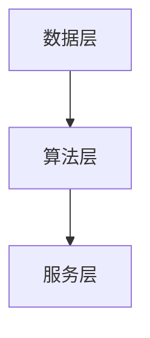

# 正式公文章节模板工作流

本仓库的默认工作流已经从“长 Prompt + Skill 总调度”切换为“按章节 Prompt 模板逐章生成”。

唯一结构基准是 [产业链项目指南/完整科研项目模板.docx](产业链项目指南/完整科研项目模板.docx)。一级章命名和顺序必须服从该 DOCX，不再按截图里的通用章名替换。

## 当前主流程

1. 先读本文件。
2. 将项目输入资料放到 `reference-materials/<project-slug>/`。
3. 运行 `scripts/init_generation_tree.ps1 -ProjectSlug <project-slug>` 初始化输出目录。
4. 读取 `writing-rules/` 下的通用规则和对应章节规则。
5. 读取 `chapter-prompts/` 下对应章节 Prompt。
6. 按 Prompt 要求逐章写入 `generated-drafts/<project-slug>/` 同路径文件。
7. 需要整稿时，运行 `scripts/assemble_generated_markdown.ps1 -ProjectSlug <project-slug>`。

短提示词现在只负责说明：

- 项目主题或项目名称
- `project-slug`
- 要生成的目标章节
- 额外约束，例如字数、风格、是否允许外部调研

短提示词不再承担整份长 Prompt 的全部上下文。

如果目标是整本生成，短提示词通常只需要额外说明：

- 主要参考资料路径
- 要求生成“完整公文”
- 如需特殊限制，再补充 1 至 2 条额外约束

如果用户在本轮提示词中明确给出总字数、重点章节字数或最低字数，这些要求属于硬约束，不需要再拆到别的文件里；仓库规则应直接按用户提示词执行。

## 标记语法

`chapter-prompts/` 里的模板只允许使用三类 XML 标签：

- `<fixed>`：不可改的章名、编号、骨架、硬约束。
- `<write>`：必须生成正式正文的内容要求。
- `<research>`：必须先核对资料或补充调研，再写入对应正文。

正式输出写入 `generated-drafts/` 时必须满足：

- 不得保留任何 `<fixed>`、`<write>`、`<research>` 标签。
- 不得保留“请写”“请调研”“按此处补充”等提示语。
- 不得改章名，不得改编号，不得新增计划外节次。
- 资料缺失时可保留“待补充”或保守表述，不得编造金额、周期、团队、指标和验收口径。

## 整本生成默认规则

当用户要求“一次生成完整公文”时，默认不需要在外部提示词重复以下内容，因为仓库规则已经固定：

- 必须先读 `README.md`
- 必须同时遵守 `writing-rules/` 和 `chapter-prompts/`
- 必须按章节顺序逐章生成
- 第四章必须按子目录拆分生成
- 图用 Mermaid，表用 Markdown 表格
- 正式输出不得保留 XML 标签
- 不得改章名、编号和计划外节次
- 资料不足时不得编造
- 全部章节完成后应装配为 `generated-drafts/<project-slug>/完整文稿.md`

因此，外部提示词只需要补充“这次写哪个项目、参考资料在哪、是整本还是单章、有没有额外限制”。

如果“额外限制”里包含字数要求，建议直接写成清晰的硬门槛句式，例如：

- `全文总字数控制在 6 万至 8 万中文字符左右`
- `第一章建议 9000 至 12000 中文字符，最低不得少于 8000 中文字符`
- `第四章建议 26000 至 35000 中文字符，最低不得少于 24000 中文字符`

对于这种写法，默认理解为必须遵守，而不是“仅供参考”。

## 图表格式

新流程中的图表直接写在 `generated-drafts/<project-slug>/` 对应章节文件里，不再拆到单独目录。

- 图示：统一使用内联 Mermaid 代码块。
- 表格：统一使用普通 Markdown 表格。
- 图前必须有引图句，图后必须有解释段。
- 表前必须有引表句，表标题单独写成 `**表X-Y 表名**`，必要时表后补解释段。

示意：

````md
项目总体技术路线如图4-5所示。



项目总投资估算见表8-1。

**表8-1 项目总投资估算表**

| 科目 | 金额 | 备注 |
|------|------|------|
| 设备费 | 待补充 | 以正式批复为准 |
````

## 固定结构中的可变槽位

部分 `<fixed>` 骨架中会出现以下表达：

- `按项目实际命名`
- `按实际单位展开`
- `按实际任务数量继续展开`

这些表达不是让你把字面文本输出到正式稿，而是在说明：

- 该层级必须保留。
- 该层级的标题文本、单位名称、任务名称或条目数量，必须依据 `reference-materials/<project-slug>/` 落地。
- 如果资料不足以确定具体名称，可先在输出中保留“待补充”，但不能删除这个槽位。

## 参考资料重组原则

- `reference-materials/<project-slug>/` 中的材料是事实来源，不是最终结构模板。
- 如果参考资料本身已有完整章节结构，也不得直接沿用其章次输出。
- 最终正式稿必须按 `产业链项目指南/完整科研项目模板.docx` 与 `chapter-prompts/` 的结构重组。
- 可以提取、改写、归并和重排参考资料内容，但不能把原始材料当成“直接复制模板”。

## 极简整本提示词

以下是一版可直接复用的整本生成短提示词：

```text
请按仓库 README.md 的默认工作流执行。

project-slug: zs-test
任务：基于 `reference-materials/zs-test/ZS-项目可行性报告.docx`，生成完整正式公文，按模板分别写入 `generated-drafts/zs-test/`，全部完成后装配 `generated-drafts/zs-test/完整文稿.md`。

补充要求：
- 以当前模板结构重组内容，不要照抄原文结构。
- 缺失信息不得编造。
```

## 目录树

以下目录树对新主流程文件完整展开；对 legacy 样稿和 legacy 脚本只做折叠展示。

```text
.
├─ README.md
├─ CLAUDE.md
├─ NOTES.md
├─ 产业链项目指南/
│  ├─ 完整科研项目模板.docx                  # 一级章结构唯一基准
│  └─ 其他样稿与参考模板                       # legacy 参考样稿，不是主流程输入
├─ chapter-prompts/
│  ├─ ch01-项目背景及必要性.md
│  ├─ ch02-项目单位基本情况.md
│  ├─ ch03-项目团队工作基础.md
│  ├─ ch04-项目建设方案/
│  │  ├─ README.md
│  │  ├─ 01-总体目标.md
│  │  ├─ 02-项目解决的主要问题.md
│  │  ├─ 03-项目研发内容.md
│  │  ├─ 04-预期成果与产业链供应链韧性及安全保障.md
│  │  ├─ 05-技术路线.md
│  │  ├─ 06-应用推广方案.md
│  │  ├─ 07-联合研发与平台集成方式.md
│  │  └─ 08-成果管理与内部受控复用策略.md
│  ├─ ch05-项目任务设置.md
│  ├─ ch06-联合体成员单位任务分工情况.md
│  ├─ ch07-项目组织及实施管理.md
│  ├─ ch08-资金筹措及投资估算.md
│  ├─ ch09-财务经济效益测算.md
│  └─ ch10-项目综合风险因素分析.md
├─ writing-rules/
│  ├─ 00-总流程与资料边界.md
│  ├─ 01-公文文风与句式规则.md
│  ├─ 02-编号与结构规则.md
│  ├─ 03-深度写作与证据消费规则.md
│  ├─ ch01-项目背景及必要性.md
│  ├─ ch02-项目单位基本情况.md
│  ├─ ch03-项目团队工作基础.md
│  ├─ ch04-项目建设方案-总则.md
│  ├─ ch04-01-总体目标.md
│  ├─ ch04-02-项目解决的主要问题.md
│  ├─ ch04-03-项目研发内容.md
│  ├─ ch04-04-预期成果与产业链供应链韧性及安全保障.md
│  ├─ ch04-05-技术路线.md
│  ├─ ch04-06-应用推广方案.md
│  ├─ ch04-07-联合研发与平台集成方式.md
│  ├─ ch04-08-成果管理与内部受控复用策略.md
│  ├─ ch05-项目任务设置.md
│  ├─ ch06-联合体成员单位任务分工情况.md
│  ├─ ch07-项目组织及实施管理.md
│  ├─ ch08-资金筹措及投资估算.md
│  ├─ ch09-财务经济效益测算.md
│  └─ ch10-项目综合风险因素分析.md
├─ reference-materials/
│  └─ .gitkeep                                  # 占位文件，实际资料放在 reference-materials/<project-slug>/
├─ generated-drafts/
│  └─ .gitkeep                                  # 占位文件，正式输出放在 generated-drafts/<project-slug>/
├─ scripts/
│  ├─ init_generation_tree.ps1                  # 根据chapter-prompts镜像初始化生成目录
│  ├─ assemble_generated_markdown.ps1           # 按模板顺序装配整稿 Markdown
│  ├─ init_workspace.ps1                        # legacy 脚本，服务旧 workspace 流程
│  └─ 其他校验脚本
├─ .claude/skills/                              # legacy skill 体系
├─ workspace/                                   # legacy 产物目录
├─ plan-template/                               # legacy 台账模板
├─ prompt.txt                                   # legacy 长 Prompt 示例
├─ prompt2.md                                   # legacy 长 Prompt 示例
└─ prompt3.txt                                  # legacy 长 Prompt 示例
```

## 目录职责

### `chapter-prompts/`

这里存放的是章节级 Prompt 模板，不是正式内容。

每个模板都必须写清：

- 该文件负责生成什么章节
- 正文结构基准来自哪个模板
- 参考资料从哪里读
- 正式输出写到哪里
- 哪些标题和结构不能动
- 哪些部分需要 AI 写
- 哪些部分需要深度调研
- 本章有哪些强制图表、条件性图表、分别放在哪个位置
- 进入本章前必须先读取哪些 `writing-rules/` 文件

### `writing-rules/`

这里存放的是显式写法约束，用来替代旧 `official-doc-*` skill 中隐式生效的写作能力。

分为两层：

- 通用规则：适用于所有章节，例如文风、编号、深度、证据消费
- 章节规则：只约束某一章或第四章某个子文件的写法

使用原则：

- `chapter-prompts` 决定写什么、写到哪里、结构怎么排
- `writing-rules` 决定怎么写、按什么句式写、论证深度到什么程度
- 正式生成时，两类文件必须一起读，不能只读其一

### `reference-materials/`

这是输入区。每个项目单独建一个子目录：

```text
reference-materials/<project-slug>/
```

建议把以下内容都放在这里：

- 用户短提示词整理稿
- 项目简介
- 单位介绍
- 预算材料
- 时间计划
- 既有成果
- 外部政策或行业资料

### `generated-drafts/`

这是正式输出区。每个项目单独建一个镜像目录：

```text
generated-drafts/<project-slug>/
```

这里的目录结构必须与 `chapter-prompts/` 同构。第四章是目录型章节，因此输出时也必须保持：

```text
generated-drafts/<project-slug>/ch04-项目建设方案/
```

注意：

- `generated-drafts/` 里放的是正式内容，不是提示词。
- `chapter-prompts/ch04-项目建设方案/README.md` 会被镜像到输出目录，但它只承担结构说明，不参与正式装配。

## 第四章拆分规则

第四章 `项目建设方案` 是本仓库 V1 唯一拆成子目录的一级章。

拆分原因：

- 第四章篇幅最长。
- 第四章内部包含“总体目标”和“项目建设方案”两层结构。
- 单文件容易导致上下文过长，模型偷懒或遗漏论证链。

当前拆分顺序固定为：

1. `01-总体目标.md`
2. `02-项目解决的主要问题.md`
3. `03-项目研发内容.md`
4. `04-预期成果与产业链供应链韧性及安全保障.md`
5. `05-技术路线.md`
6. `06-应用推广方案.md`
7. `07-联合研发与平台集成方式.md`
8. `08-成果管理与内部受控复用策略.md`

装配整稿时也按上述顺序拼接。

## 脚本用法

### 初始化输出目录

```powershell
powershell -ExecutionPolicy Bypass -File scripts/init_generation_tree.ps1 -ProjectSlug your-project
```

作用：

- 在 `generated-drafts/your-project/` 下创建与 `chapter-prompts/` 同构的目录。
- 为每个章节输出位置创建空 Markdown 文件。
- 将模板中的目录级 README 同步到输出目录，方便按章节装配。

### 装配整稿 Markdown

```powershell
powershell -ExecutionPolicy Bypass -File scripts/assemble_generated_markdown.ps1 -ProjectSlug your-project
```

默认输出：

```text
generated-drafts/your-project/完整文稿.md
```

装配规则：

- 以 `chapter-prompts/` 的文件顺序为准。
- 自动跳过所有 `README.md`。
- 第四章按子文件编号顺序拼接。
- 发现空文件时会给出警告，但不会把提示模板内容混入正式稿。

## Legacy 说明

以下内容保留，仅用于兼容历史任务、回看旧流程或迁移旧产物：

- `.claude/skills/`
- `workspace/`
- `plan-template/`
- `scripts/init_workspace.ps1`
- `prompt.txt`
- `prompt2.md`
- `prompt3.txt`

默认新任务不再从 skill 总调度入口启动，而是从本 README、`writing-rules/` 和 `chapter-prompts/` 启动。
