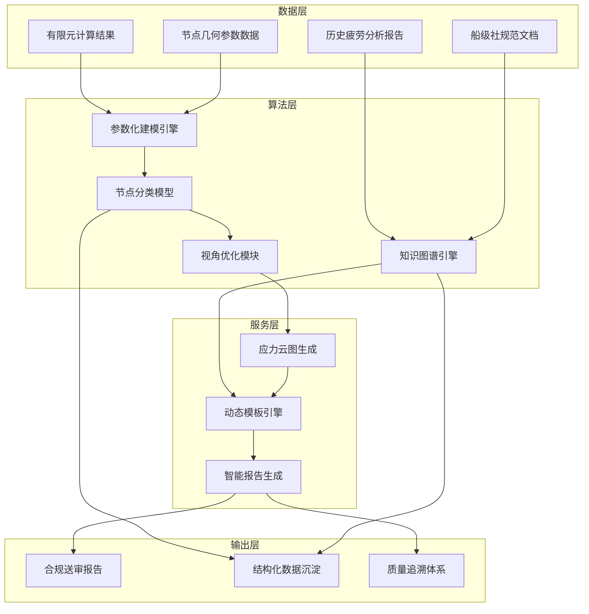

# 一、项目背景及必要性

## （一）建设背景

当前，全球人工智能技术正在经历从单模态分析向多模态融合和智能体协作驱动的深刻转型。以 GPT-4 为代表的生成式大模型和自主智能体技术已成为全球科技竞争的核心战场，多模态大模型已开始进入工业设计、工程分析等高复杂度场景。国务院国资委将"人工智能+"列为 2025 年核心攻坚方向，明确要求中央企业围绕产业链关键环节打造标杆应用场景，推动多模态大模型、强推理技术与实体经济深度融合。

招商局集团作为中央直接管理的国有骨干企业，已将"人工智能+物流"和"人工智能+金融"列为战略升级的核心方向，正在依托"商道"行业大模型技术平台推进智能化场景从单点探索走向规模化、全员化升级。在船舶行业，集团基于"1+3+5+N"智能化建设框架，将安全生产与设备管理列为重点攻坚领域，其中船舶结构疲劳分析被视为航运、港口等核心业务安全管理的生命线，其智能化升级与集团"人工智能+物流"战略目标形成直接呼应。

船舶结构疲劳分析是船舶设计、船级社送审和航运安全管理中的关键环节。传统疲劳分析依赖人工提取有限元模型节点数据、手工分类、手工计算损伤值并人工编写报告，单个疲劳敏感区域约耗时 100 工时，全船累计约 400 至 500 工时，且包含约 30% 的返工修正。人工编写报告容易出现数据误判和转录错误，送审退审原因中大量涉及云图标注不规范或计算结果格式偏差。与此同时，海量点云数据与损伤计算结果没有结构化沉淀，无法有效支撑预测性维护与设计优化。这些现实痛点使得船舶结构疲劳分析的智能化升级成为集团智能化建设进程中亟待突破的关键瓶颈。

面对上述技术瓶颈和业务需求，亟须围绕船舶结构疲劳分析报告自动生成这一核心场景，开展系统研究和技术攻关，通过融合有限元分析技术、机器学习分类技术与大语言模型技术，构建从数据识别到报告生成的全流程自动化能力，实现从单点效率提升向系统性流程再造的战略转型。

项目总体技术架构如图 1-1 所示。

图 1-1 展示了船舶结构疲劳分析报告自动生成系统的整体架构。系统从有限元计算结果、历史报告、规范文档和节点参数等数据资源出发，经由参数化建模引擎和节点分类模型完成特征提取与智能分类，再通过视角优化模块生成标准化应力云图，最后依托知识图谱引擎和动态模板引擎，由大语言模型智能体完成合规报告的自动生成。底层同步实现结构化数据的沉淀与质量追溯体系的建立，形成数据驱动的持续优化闭环。

## （二）建设意义

### 1. 技术层面

在技术层面，本项目旨在突破船舶结构疲劳分析领域的若干核心技术瓶颈，构建具有自主知识产权的端到端自动化解决方案。

当前，船舶结构疲劳分析涉及复杂的有限元建模、节点分类、应力计算和报告编制等多个技术环节，各环节相对独立、缺乏有效衔接，导致整体效率低下。本项目将通过建立参数化建模引擎，实现疲劳节点几何特征和拓扑结构的标准化描述与自动化生成；通过研发混合式节点分类模型，融合监督学习、无监督学习和半监督学习等多种方法，提升节点识别的准确性和泛化能力；通过构建规范知识图谱和动态模板引擎，将行业规范和历史经验转化为可计算、可调用的知识资源；通过大语言模型智能体，实现报告初稿的自动生成和语义级合规校验。

上述技术突破不仅能够显著提升船舶疲劳分析的设计效率和质量水平，还将为中国船舶工业积累一批可复用的核心算法、模型和工具链，形成从数据处理到智能分析的技术体系沉淀，为后续向结构强度评估、工艺仿真等相邻领域扩展奠定坚实基础。

### 2. 产业层面

在产业层面，本项目直接服务于船舶设计、建造和运营维护的数字化升级需求，有望产生显著的效率提升和成本节约效益。

根据项目预期目标，自动化报告生成可使传统人工流程效率提升 70% 以上，每型船的报告编写周期从 500+ 小时压缩到 100 小时以内，人工数据转录错误率从 8% 降低到 1% 以下。这一效率跃升意味着船舶设计企业能够在更短周期内完成更多船型的疲劳分析任务，从而加快新船研发节奏、缩短上市时间，在激烈的国际竞争中赢得先机。

与此同时，效率提升和错误率降低还将有效减少因退审、返工导致的时间损耗和人力浪费，显著降低单位设计成本。项目所沉淀的疲劳节点分类与损伤计算数据还能够形成行业特色数据集，为后续预测性维护、设计优化和机器学习模型训练提供高质量数据资源，产生可持续增值的"数据飞轮"效应，推动船舶工业从传统经验驱动向数据驱动转型。

### 3. 生态层面

在生态层面，本项目依托招商局集团内部丰富的业务场景和资源禀赋，有望构建起政产学研用深度融合的协同创新生态。

从平台生态角度看，项目将深度对接集团知识语料管理平台和"商道"行业大模型平台，通过高质量行业语料的持续积累和垂直领域模型的迭代优化，形成面向船舶行业的专业化智能分析能力，并可向集团内其他业务场景和外部行业伙伴输出能力覆盖。从标准生态角度看，项目实施过程中形成的方法论、算法规范、模板体系和验收标准，有望沉淀为行业认可的团体标准或企业标准，为全行业智能化升级提供可参照的实践范式。从知识生态角度看，船舶疲劳分析领域长期依赖个人经验的局面将因知识图谱和结构化数据资产的建立而得到根本性改变，行业知识的传承和复用将变得更加系统、透明和高效。

## （三）国内外发展现状及前景

### 1. 国内发展现状

在国内市场，生成式人工智能的应用正处于规模化推广的加速阶段。根据行业研究数据，约 55% 的企业正在大规模投资生成式人工智能，34% 的企业处于概念验证阶段，亚太地区相关比例更高达 95%。这一趋势表明，人工智能技术在中国企业端的渗透速度已经走在全球前列，为本项目提供了良好的技术应用土壤和市场认知基础。

从技术演进路径看，国内人工智能发展正呈现两条并行趋势：一方面，通用大模型的参数规模持续扩张，在文本生成、代码编写等通用任务上展现出强大能力；另一方面，垂直领域模型正在快速崛起，越来越多的企业转向高精度、强行业知识的专家模型，以解决通用大模型在企业场景中"通识能力过剩、专业精度不足"的突出问题。船舶结构疲劳分析恰恰属于专业门槛高、精度要求严、数据来源专的垂直领域，与垂直模型的发展方向高度契合。

在船舶行业，国内主要船舶设计院和研究机构已在有限元分析、结构强度校核等领域积累了大量基础数据和工程经验。部分领先企业已开始尝试将人工智能技术引入船舶设计流程，如将图表与经验总结结构化并结合检索增强生成技术后，模型表现在特定任务上已接近或超过普通设计员水平。然而，总体而言，国内船舶行业的人工智能应用仍处于单点探索阶段，尚未形成覆盖全流程的系统性解决方案，特别是在疲劳分析报告自动生成这一细分领域，尚缺乏成熟的技术和产品。

### 2. 国外发展与应用现状

在国际市场，欧美发达国家在工业软件和工程智能化领域长期保持领先地位。以疲劳分析相关软件为例，DNV 的 Nauticus Hull 系统偏向规范校核，能够辅助完成部分结构安全评估工作，但并不覆盖有限元分析的全过程，也无法覆盖全部疲劳校核节点；Siemens 的 Teamcenter 报告模块侧重于制造业通用标准的文档化管理，未能针对船舶规范的具体要求进行定制优化。通用大模型虽然可以辅助编写技术文档，但对工程专业术语的理解存在偏差，且缺乏高质量的工程训练数据作为支撑，导致在专业任务上的表现难以满足实际工程需求。

与此同时，国际船舶行业正加速向数字化、智能化转型，主要船级社和船舶设计公司纷纷加大对智能船舶、智能航运的技术投入，争夺行业标准制定权和话语权。这一竞争态势对中国船舶工业形成了显著的外部压力，迫切需要加快自主创新步伐，构建具有国际竞争力的核心技术能力。

### 3. 痛点分析

经过深入调研和分析，当前船舶结构疲劳分析面临以下主要痛点问题：

**效率瓶颈问题**。传统疲劳分析高度依赖人工操作，单个疲劳敏感区域约需 100 工时，全船累计约 400 至 500 工时，且其中约 30% 的工作量用于返工修正。人工效率的天花板效应严重制约了设计产能的进一步释放，无法满足日益增长的新船研发需求。

**质量稳定性问题**。人工编写报告容易出现数据误判、转录错误和不规范标注，退审现象时有发生。退审原因主要集中在云图标注不规范、计算结果格式偏差等可避免的质量缺陷，根源在于人工操作缺乏统一的质量标准和校验机制。

**数据资产流失问题**。船舶疲劳分析过程中产生的海量点云数据、应力计算结果和损伤评估记录主要以非结构化形式存在，缺乏系统性的数据治理和沉淀机制，无法有效支撑后续的设计优化、预测性维护和机器学习模型训练。

**知识传承困难问题**。船舶疲劳分析高度依赖分析人员的个人经验和专业判断，新入职人员培养周期长，知识传承主要依靠师徒帮带和项目历练，效率低下且风险较高，不利于行业整体技术水平的提升。

**规范合规管理问题**。船舶疲劳分析涉及 DNV、RINA 等多个国际主流船级社的规范要求，不同船级社的规范条款存在差异且持续更新，人工跟踪和准确应用规范的难度较大，合规风险不容忽视。

上述痛点相互交织、彼此强化，形成了制约船舶结构疲劳分析效率和质量提升的系统性障碍，亟须通过技术创新和流程再造加以解决。

### 4. 发展前景

展望未来 3 至 5 年，船舶结构疲劳分析领域将呈现以下发展趋势：

**技术架构向"通用底座+行业插件"演进**。通用大模型将继续发挥其强大的语言理解和生成能力，但针对专业任务的精度提升将更多依赖高质量行业语料、领域知识图谱和专业插件的加持。这一技术路径已在多个垂直领域得到验证，是本项目技术方案的重要参考。

**技术竞争焦点从"拼参数"转向"拼语料"**。随着大模型技术的逐步成熟，参数规模的边际收益递减趋势日益明显，差异化竞争将更多取决于训练语料的质量、覆盖度和更新频率。船舶行业拥有丰富的历史报告、规范文档和技术标准，是构建高质量行业语料库的天然优势资源。

**应用需求从"成本敏感"转向"效果优先"**。企业在引入人工智能技术时，越来越关注模型在专业任务上的精准度和规范合规性，而非单纯追求成本节约。这一趋势有利于本项目所聚焦的高精度、高合规性的专业解决方案。

**数据闭环能力成为核心竞争力**。从数据采集、模型训练、智能分析到结果应用的全流程闭环能力，将成为衡量解决方案价值的关键指标。本项目所构建的端到端自动化工作流程和结构化数据资产体系，高度契合这一发展方向。

## （四）预期解决重大问题

### 1. 重点工作方向一：疲劳敏感节点的参数化建模与训练数据生成能力

船舶结构疲劳分析的首要任务是识别和分类疲劳敏感节点，这些节点的几何参数复杂多样，包括腹板加筋型十字节点、自由边型节点、焊接趾端型节点等多种形态，传统的建模方法依赖人工定义，效率低下且难以覆盖全部变体。

针对这一问题，项目将构建一套完整的疲劳节点参数化建模体系。通过对节点几何特征和拓扑结构进行标准化定义，建立覆盖板厚、角度、圆角半径、加劲肋长度等关键参数的描述框架；通过 CAD 系统或脚本实现自动化建模、特征面划分和统一格式导出；通过数据增强技术扩充训练样本规模。项目目标是通过参数化技术覆盖 95% 以上的节点变体，从根本上解决训练数据不足和质量参差的核心瓶颈。

### 2. 重点工作方向二：复杂网格条件下的节点识别、特征提取与分类精度提升

有限元模型中的疲劳节点分布在复杂网格环境下，节点之间存在遮挡、对称和相似特征干扰，给自动识别和分类带来严峻挑战。传统方法在均匀网格或对称结构下容易出现视角定位不稳定、分类精度下降等问题。

针对这一问题，项目将研发混合式节点分类架构，融合几何特征、拓扑特征和力学特征的统一描述体系，采用"区域初筛+节点精细分类"的分层分类策略，综合运用随机森林、支持向量机、多层感知器、图神经网络以及 K-means、DBSCAN、GraphSAGE、半监督图卷积网络等多种算法，根据数据特点自适应选择最优分类方案。项目目标是将节点分类准确率提升至行业领先水平，为后续应力计算和报告生成奠定基础。

### 3. 重点工作方向三：端到端自动化报告生成与合规保障体系建设

从有限元结果到符合船级社规范要求的送审报告，中间涉及结果解析、应力云图生成、模板填充和语义校验等多个环节，目前各环节之间缺乏有效衔接，自动化程度低，人工介入比重大。

针对这一问题，项目将构建一套完整的端到端自动化报告生成体系：开发有限元结果解析模块，支持 bdf、dat、nas、op2 等主流格式的自动读取和数据提取；研发基于主成分分析的视角优化算法，实现应力云图的最佳视角自动选取和标准化输出；构建融合船舶行业规范和疲劳分析指南的动态知识图谱，提供准确、实时的规范条款引用和合规校验；搭建支持条件分支和动态表格的智能模板引擎，实现报告结构的自适应组装；利用大语言模型自动生成报告初稿，并结合语义修正与单位校验机制保障报告规范性。最终实现从节点分类结果和有限元计算数据到符合船级社规范要求的送审报告的全流程自动化输出。

## （五）对产业链供应链韧性及安全的意义

### 1. 安全风险应对

船舶结构疲劳分析直接关系到船舶结构安全和航行安全，分析结果的准确性和可靠性是保障船舶安全运营的生命线。传统的疲劳分析高度依赖分析人员的个人经验和操作质量，不同人员之间的分析结果可能存在差异，个别环节的疏漏甚至可能酿成安全隐患。

本项目通过构建标准化的参数化建模体系、精准的节点分类模型和严格的合规校验机制，将行业最佳实践固化为可复制、可验证的技术方案，最大限度减少人工判断带来的不确定性，从根本上降低安全风险。同时，结构化的知识图谱和历史数据资产的建立，使得过往积累的安全分析经验和规范理解得以系统化保存和传承，避免因人员流动造成的技术断档，为船舶结构安全分析能力的持续稳定提供保障。

### 2. 协同韧性提升

船舶设计是一项复杂的系统工程，涉及船东、船级社、设计院、船厂等多个主体的高频协同。疲劳分析报告作为设计评审和船级社认证的关键文件，其编制质量和效率直接影响整个协同链条的运转效率。

本项目所构建的端到端自动化报告生成体系，能够实现从有限元数据到合规报告的秒级输出，大幅缩短设计评审周期，加快船东与船级社之间的信息流转速度。标准化的报告格式和自动化的质量校验机制，还能够减少因格式偏差、规范理解差异导致的反复沟通，提升多方协同的顺畅度。项目所形成的数据资产和知识图谱，可通过集团知识语料管理平台向产业链上下游合作伙伴开放共享，进一步提升整个产业生态的协同效率。

### 3. 创新能力增强

当前，中国船舶工业正处于从跟跑向并跑、领跑转型的关键时期，在智能船舶、深海装备、绿色航运等前沿领域加速布局。船舶结构疲劳分析作为连接设计、建造和运维的核心技术环节，其智能化升级将为行业创新能力提升提供重要驱动力。

本项目所积累的高质量训练数据集、经过工程验证的核心算法、以及可复用的端到端解决方案，能够显著降低后续研发项目的技术门槛和实施成本。知识图谱和动态模板引擎的构建，还将为新船型开发、规范版本更新和特殊场景分析提供灵活、高效的技术支撑，使船舶设计单位能够更快速地响应市场变化和技术迭代。更为重要的是，项目所形成的技术架构可复用于结构强度评估、工艺仿真等其他工程场景，具备向更广泛领域扩展的潜力，为中国船舶工业的持续创新提供坚实的技术底座。
