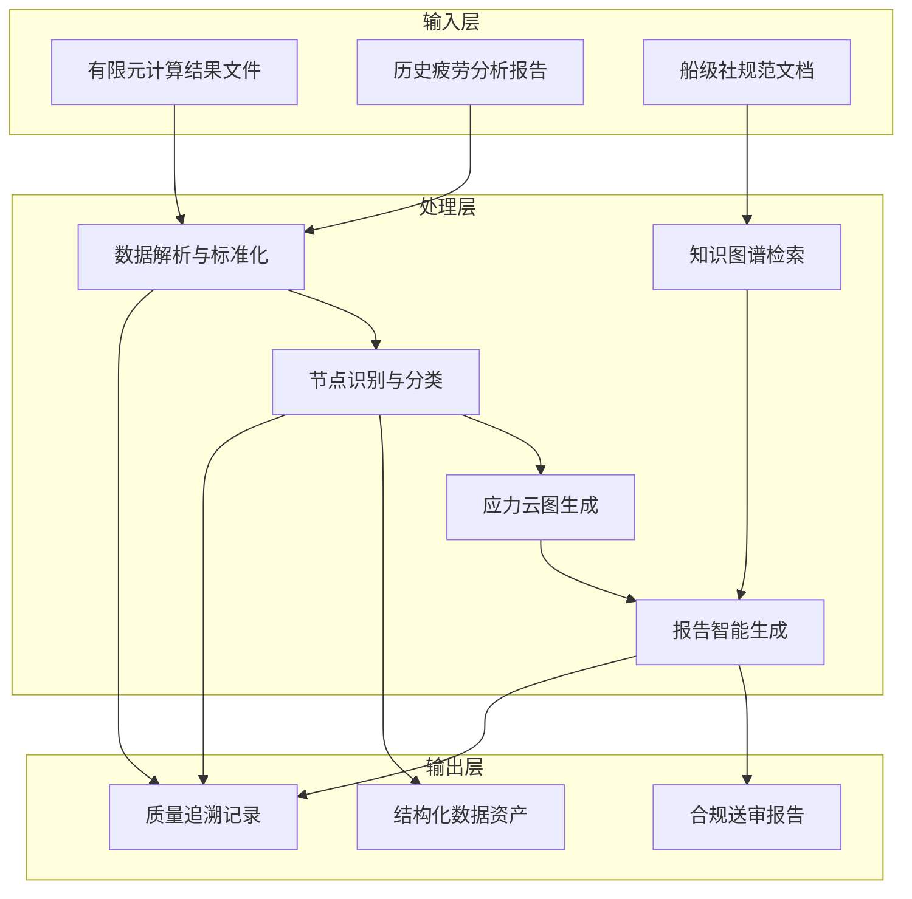

# 四、项目建设方案

## （一）总体目标

### 1. 建设目标

本项目旨在开发一套船体结构疲劳分析报告自动生成系统，通过深度融合有限元分析技术、机器学习分类技术与大语言模型技术，构建从有限元计算结果提取到符合船级社规范要求的送审报告生成的端到端自动化工作流程，实现船舶结构疲劳分析从数据识别、节点分类、云图生成到报告编制的全流程智能化，显著提升分析效率和质量水平，为船舶设计数字化转型提供核心技术支撑。

**项目定位与建设对象**。本项目的核心建设对象为船体结构疲劳分析报告自动生成系统及其所依赖的算法模型、知识图谱和软件工具集。系统以有限元软件计算结果和历史报告数据为输入，以符合船级社规范要求的送审疲劳分析报告为输出，覆盖从数据解析、节点分类、应力计算到报告生成的全业务流程。系统建成后将在招商局集团内部率先应用，并逐步向其他船舶设计单位和行业伙伴推广。

**目标能力边界**。在功能边界方面，系统应实现以下核心能力：自动解析 Nastran 等主流有限元软件的结果文件并提取关键数据；自动识别和分类疲劳敏感节点，分类准确率应满足工程应用要求；自动生成标准化的应力分布云图，支持批量处理；自动构建船舶疲劳分析领域知识图谱，支持规范条款的智能检索和合规校验；自动生成符合船级社格式要求的送审报告，支持 Word 和 PDF 格式输出。在性能边界方面，单个疲劳敏感区域的报告生成时间应显著短于传统人工方式，系统整体处理效率应达到工程可接受水平。

**应用验证场景**。系统的验证场景包括：基于上海研究院积累的客滚船、PCTC 等多种船型的历史数据进行模型训练和离线测试；在项目验证阶段，选取 1 至 2 个典型船型开展全流程集成验证；在项目试运行阶段，在实际船舶设计项目中进行生产环境验证；在项目正式上线后，逐步扩展至更多船型和更多设计场景。

**量化指标与预期水平**。根据项目可行性论证，预期达到以下量化指标：每型船的报告编写周期从 500+ 小时压缩到 100 小时以内，效率提升 70% 以上；人工数据转录错误率从 8% 降低到 1% 以下；节点分类准确率达到行业领先水平；报告合规性校验通过率显著提升。具体指标以项目实际验证结果为准。

项目建设总体目标概念如图 4-1 所示。

图 4-1 展示了项目从多源异构输入出发，经由数据解析、节点分类、云图生成和报告生成等核心处理环节，最终输出合规报告、结构化数据和质量追溯记录的完整链路，体现了端到端自动化的建设目标。
