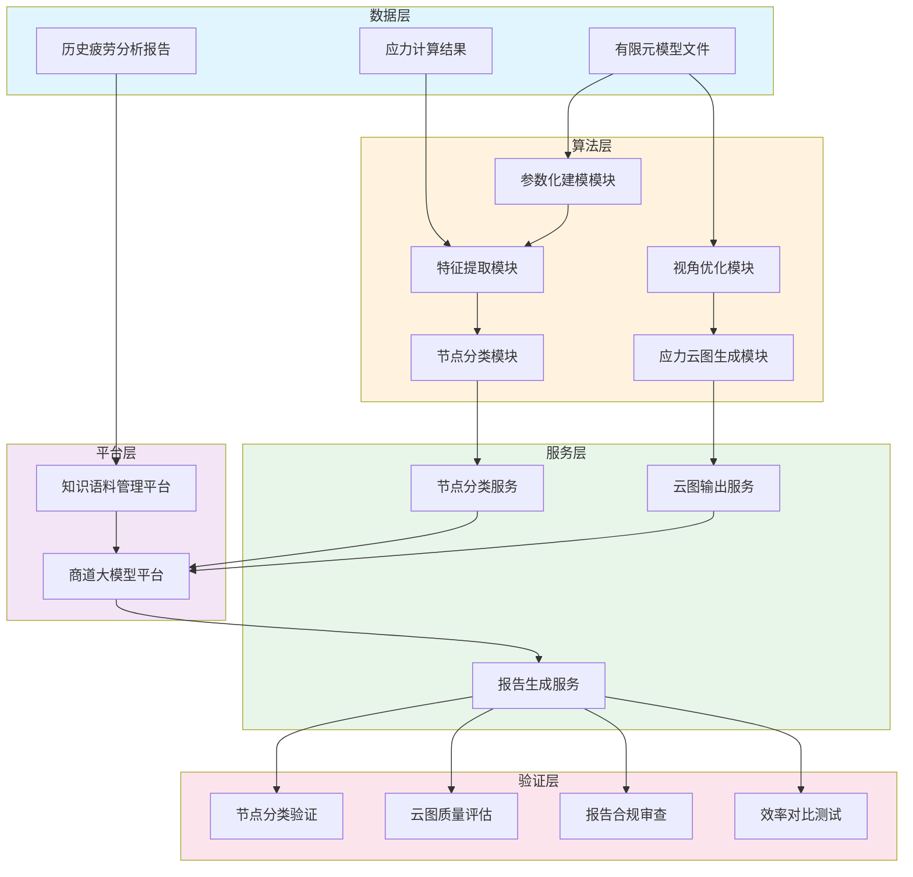

# 四、项目建设方案

## （一）总体目标

### 1. 建设目标

本项目旨在开发"船体结构疲劳分析报告自动生成"系统，通过深度融合有限元分析技术、机器学习分类技术与大语言模型，构建从有限元计算结果提取到船级社合规报告输出的端到端自动化工作流程，实现船舶结构疲劳分析领域的智能化升级。

项目建设对象为面向招商局集团内部船舶设计企业的疲劳分析报告自动生成系统，系统包括三大核心模块：基于机器学习算法的船体有限元模型特征抓取模块、有限元分析结果自动化输出模块、基于大语言模型的报告生成模块。系统部署于集团内部私有化环境，依托"商道"大模型平台和集团知识语料管理平台运行。

目标能力主要包括：一是疲劳节点智能识别与分类能力，能够自动识别腹板加筋型十字节点、自由边型节点、焊接趾端型节点等典型疲劳节点类型，分类准确率达到行业领先水平；二是有限元结果自动化处理能力，能够自动完成节点定位、视角优化、应力云图生成和批量处理，实现从单模型到多模型的自动化扩展；三是船级社合规报告自动生成能力，能够根据结构化数据和模板自动生成符合DNV、LR、RINA等主流船级社规范的疲劳分析报告，目标问答准确率达到95%以上。

项目验证场景为招商局工业科技（上海）有限公司承担的集团内部船舶设计项目，涵盖客滚船、PCTC（汽车运输船）等多种船型，验证内容包括：节点分类精度测试、应力云图质量评估、报告合规性审查和全流程效率对比。

项目目标指标包括：每型船的报告编写周期从500小时以上压缩至100小时以内，人工数据转录错误率从8%降低至1%以下，节点识别准确率达到行业领先水平，报告合规性满足船级社送审要求，系统支持多船型、多项目并行处理能力。

项目建设总体目标概念如图4-1所示。

图4-1展示了项目从数据整备、算法研发到服务封装和验证应用的完整链路。数据层提供有限元原始数据和历史报告输入；算法层通过参数化建模、特征提取、节点分类等模块完成智能化分析；服务层将算法能力封装为可调用的接口；平台层依托商道大模型和知识语料平台实现知识管理和智能体调度；验证层在真实项目中开展系统性能评估和迭代优化。

## 2. 阶段目标

第一阶段（2025年6月至2025年9月）完成节点分类能力建设，实现疲劳节点参数化建模方法和数据集生成，训练完成混合式分类模型，形成节点智能识别能力。

第二阶段（2025年9月至2025年12月）完成有限元自动化处理能力建设，实现节点定位、视角优化和应力云图批量生成，形成自动化后处理能力。

第三阶段（2025年12月至2026年4月）完成报告智能生成能力建设，实现知识图谱构建、动态模板引擎开发和报告生成智能体上线，形成端到端自动化能力。

第四阶段（2026年4月至2026年6月）完成系统集成验证和项目总结，在真实项目中开展全流程验证，形成可推广的系统成果。
