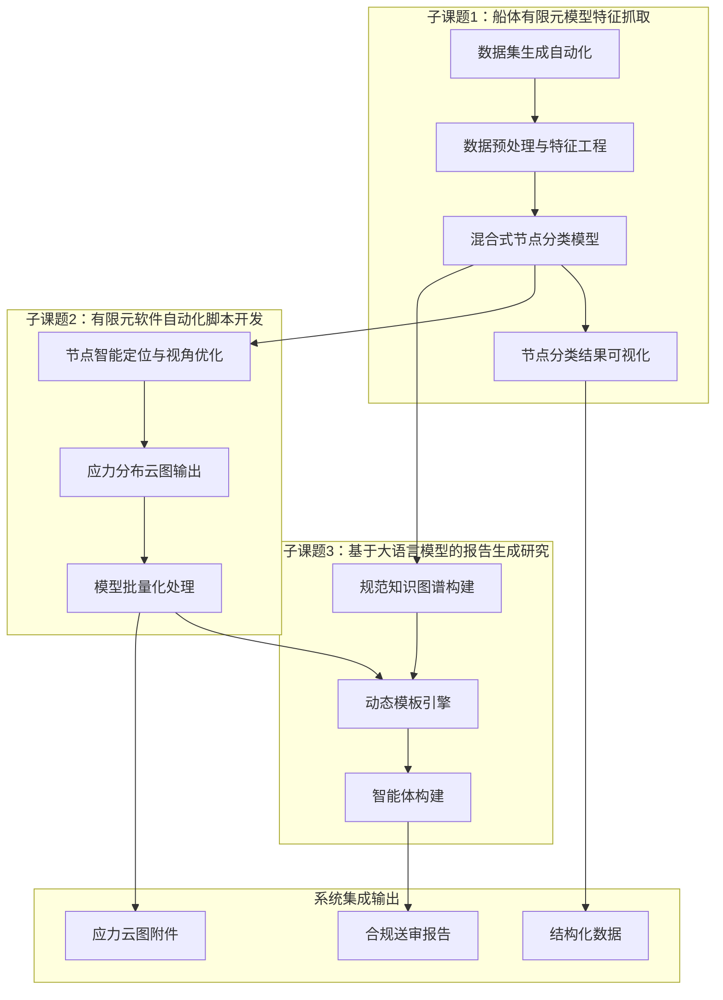

### 3. 项目研发内容

#### （1）总体说明

本项目围绕船体结构疲劳分析报告自动生成这一核心目标，按照"数据层-算法层-服务层-输出层"的技术架构体系，将研发内容划分为三个子课题，分别聚焦节点分类与数据处理、有限元自动化输出和知识图谱与报告生成三个关键环节。各子课题既相对独立又相互衔接，共同构成端到端自动化的完整技术链条。

项目主要建设任务分解如图 4-2 所示。

图 4-2 展示了三个子课题之间的任务分解与依赖关系。子课题1为整个系统提供节点识别和分类能力，其输出同时支撑子课题2的节点定位和子课题3的知识图谱检索；子课题2完成有限元结果的自动化处理和云图输出，为子课题3的报告生成提供图像附件；子课题3整合结构化数据和应力云图，通过知识图谱和智能模板最终生成合规报告。

#### （2）子课题一：基于机器学习算法的船体有限元模型特征抓取

**① 子课题1.1 数据集生成的自动化方法**

本子课题的首要任务是建立疲劳节点参数化建模体系，实现训练数据的自动化、规模化生成。研究内容包括：识别腹板加筋型十字节点、自由边型节点、焊接趾端型节点等三类常见疲劳敏感节点，进行参数化定义，覆盖板厚、角度、圆角半径、加劲肋长度等参数和拓扑约束；通过 CAD 系统或脚本实现自动化建模、特征面划分、自动网格划分和统一格式导出；建立结构化特征规则库，支撑参数化建模方法的自动化执行；通过数据增强技术扩充样本规模，确保训练数据集的多样性和代表性。

预期输出：疲劳节点参数化建模方法文档和软件工具；覆盖多种节点类型的训练数据集。

**② 子课题1.2 数据预处理与特征工程**

为支撑后续节点分类算法的高效运行，需要建立统一的数据预处理和特征提取体系。研究内容包括：开发支持 bdf、dat、nas 等多源异构数据格式的统一转换模块；建立 KD-Tree 或 Octree 空间索引，实现节点查重与合并；开展网格质量诊断，提取几何特征、拓扑特征、力学特征等多维特征；构建特征描述体系，为后续分类模型提供统一输入。

预期输出：数据预处理工具集；多维特征描述体系文档。

**③ 子课题1.3 混合式节点分类模型**

本子课题是节点识别能力的核心，直接决定系统的整体分类精度。研究内容包括：构建几何特征、拓扑特征、力学特征统一描述体系；设计"区域初筛+节点精细分类"的分层分类架构；综合运用随机森林、支持向量机、多层感知器、图神经网络等监督学习方法；融合 K-means、DBSCAN、GraphSAGE、半监督图卷积网络等无监督和半监督学习方法；根据数据特点自适应选择最优分类方案；以历史疲劳分析报告标注数据为基础开展模型训练和验证。

预期输出：混合式节点分类算法模型；模型训练和验证报告。

**④ 子课题1.4 节点分类结果可视化**

为便于人工复核和结果展示，需要将分类结果以直观方式呈现。研究内容包括：将分类结果映射回三维网格模型；实现不同类型节点的颜色高亮显示；支持节点 ID、单元 ID、分类标签等信息的叠加展示；提供交互式查看工具，支撑人工校验和结果确认。

预期输出：节点分类可视化软件工具。

#### （3）子课题二：有限元软件的自动化脚本开发

**① 子课题2.1 节点智能定位与视角优化**

基于子课题1提供的节点分类结果，本子课题实现目标单元的自动定位和最优视角计算。研究内容包括：根据节点分类模型返回的节点信息，在有限元模型中自动定位目标单元；通过主成分分析计算最优观察视角；对包围盒对角线长度进行自适应分析，确定最佳视距；处理均匀网格或对称结构下主成分方向不唯一的问题，采用加权主成分分析方法解决视角跳变。

预期输出：节点智能定位与视角优化算法模块；算法测试验证报告。

**② 子课题2.2 应力分布云图输出**

实现从有限元结果数据到标准化应力分布云图的自动化生成。研究内容包括：解析 op2 文件并读取应力计算数据；自动确定色彩映射范围和渲染参数；生成主应力分布云图并保存为图像文件；确保云图格式和分辨率满足送审要求。

预期输出：应力云图生成软件模块；云图质量验证报告。

**③ 子课题2.3 模型批量化处理**

为提升处理效率，需要建立面向多模型、多节点的批量处理能力。研究内容包括：设计批量处理工作流程，支持多节点任务的自动排队和调度；实现目标节点自动定位、视角自动优化、应力云图自动生成的全链路贯通；提供批量处理结果汇总和报告导出功能。

预期输出：批量处理脚本工具集；批量处理能力验证报告。

#### （4）子课题三：基于大语言模型的报告生成研究

**① 子课题3.1 规范知识图谱构建**

建立船舶疲劳分析领域的结构化知识库，为报告生成提供规范支撑。研究内容包括：对船舶行业规范、疲劳分析指南和历史报告进行多模态解析、语义分割和标签化；通过规则引擎和数值校验机制保障规范合规性；建立规范条款与报告各章节的映射关系；构建面向查询的检索增强能力。

预期输出：船舶疲劳分析领域知识图谱；知识图谱构建方法文档。

**② 子课题3.2 动态模板引擎**

设计支持灵活定制的报告模板系统，适配不同船型和船级社的要求。研究内容包括：设计支持目录索引、条件分支和动态表格的结构化模板；建立模板变量与系统输出数据的绑定机制；实现分析结果、应力云图等素材到模板占位位置的自适应填充；支持模板版本管理和多规范适配。

预期输出：动态模板引擎软件模块；模板设计规范文档。

**③ 子课题3.3 智能体构建**

利用大语言模型实现报告初稿的自动生成和质量校验。研究内容包括：设计面向疲劳分析报告场景的智能体架构；利用大语言模型自动生成报告初稿；通过语义修正机制保障报告文字规范性；通过单位校验机制保障数据准确性；支持 Word、PDF 格式输出，实现图表插入、编号和交叉引用的自动化。

预期输出：报告生成智能体；系统集成测试报告。
