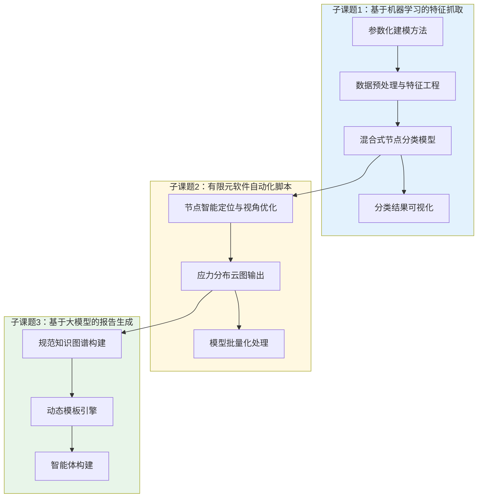

## 3. 项目研发内容

### 总体说明

本项目研发内容按照"机器学习特征抓取→有限元自动化处理→大模型报告生成"的技术链路展开，划分为三个子课题，分别对应节点识别、结果输出和报告生成三个核心环节。各环节之间形成单向依赖关系，共同构成端到端自动化工作流程。

项目主要建设任务分解如图4-2所示。

图4-2展示了三个子课题之间的任务分解和依赖关系。子课题1为后续环节提供节点分类数据，子课题2基于分类结果生成应力云图，子课题3整合节点数据、应力结果和领域知识生成最终报告。

### 子课题1：基于机器学习算法的船体有限元模型特征抓取

#### 1.1 数据集生成的自动化方法

针对船体结构疲劳敏感节点形式多样、特征复杂的问题，项目建立参数化建模方法，实现训练数据的自动化批量生成。

首先，对腹板加筋型十字节点、自由边型节点、焊接趾端型节点进行系统解构，识别关键几何参数（板厚、角度、圆角半径、加劲肋长度等）和拓扑约束规则。以标准立方体为初始几何体，通过布尔操作或切割构建具有单一特征面的模型。对模型表面进行分类标注，划分为四类特征面：腹板加筋型十字节点特征面、自由边型节点特征面、焊接趾端型节点特征面和其他普通结构面。

采用"单一特征嵌入体"方式构建训练数据集，每个模型仅包含一种分类面，以降低数据复杂度，提高模型识别稳定性。调用自动网格划分模块进行网格密度控制，保证关键特征区域的解析度。最终将模型转换为统一格式的有限元输入文件（Nastran .bdf文件）。

为增强模型泛化能力，进一步构建多特征组合模型，引入不同类型特征面的共存情形，并通过噪声扰动（几何扰动、随机缺口）模拟实际制造与服役过程中的不确定性。

#### 1.2 数据预处理与特征工程

针对CAE网格模型的标准化处理需求，开发Nastran数据标准化处理模块。支持bdf/dat/nas等格式的统一转换，提取节点坐标、单元连接关系、边界条件等原始数据。建立空间KD-Tree或Octree索引结构，实现基于0.01mm容差的高效节点查重与合并，确保网格拓扑一致性。

基于五项质量指标（雅可比行列式、翘曲度、最大/最小角度、面积比、单元厚度比）对模型中的畸形单元进行识别与标注。

多维度特征提取包括：几何特征（表面法向量、曲率、几何特征线）、拓扑特征（单元尺寸、节点连接度、单元类型分布、节点-单元关系图谱）、力学特征（应力梯度、主应力方向）。

#### 1.3 混合式节点分类模型

建立目标节点特征体系，分别梳理三类关键节点的判别性特征，形成覆盖几何特征+拓扑特征+力学特征的统一节点描述体系，构建多模态节点特征向量。

分层分类架构采用：第一层为区域初筛，基于网格加密程度或应力集中区域快速筛选出可能存在疲劳敏感节点的候选区域；第二层为节点精细分类，对筛选区域内节点进行逐点特征提取与分类。

建立基于机器学习的节点分类策略：无监督/半监督学习节点聚类模块，在标签缺失或样本不足情况下使用K-means、谱聚类、DBSCAN等算法；监督学习节点分类模块，基于已标注数据集训练决策树、随机森林、SVM、MLP、图神经网络等分类模型。采用交叉验证、网格搜索等策略优化模型超参数。

#### 1.4 节点分类结果可视化

构建可视化交互模块，将分类结果映射回原始三维网格模型。对不同类型节点进行着色高亮，标注节点ID、所在单元ID、所属分类标签等信息，支持交互式查看和结果导出。

### 子课题2：有限元软件的自动化脚本开发

#### 2.1 节点智能定位与视角优化

基于机器学习分类模型返回的节点信息，在有限元软件中定位节点并显示目标单元。针对不同节点类型展示相应视角：腹板加筋型十字节点展示Flange视角和Web视角，自由边型节点展示单元法向视角，焊接趾端型节点展示单元方向法向视角。

基于主成分分析（PCA）进行视角优化，对目标单元几何点云进行协方差矩阵分析，计算特征向量，确定最优观察视角。具体步骤包括：定义点云矩阵、数据去中心化、协方差矩阵计算、特征值分解、视角方向确定。

动态视距调整基于包围盒对角线长度动态计算，确保目标区域占画面70%以上。

#### 2.2 应力分布云图输出

解析op2文件，读取应力计算数据，生成应力分布云图。读取每个单元的应力数据，分别显示单元σ_xx、σ_yy以及τ_xy计算结果，计算并显示主应力。将应力云图保存为标准图片文件，带数值标注。

#### 2.3 模型批量化处理

开发具备批量处理能力的自动化脚本，能够同时处理多个疲劳分析模型。自动完成节点定位、视角优化、应力云图生成和结果输出，实现批量任务的自动化处理。

### 子课题3：基于大语言模型的报告生成研究

#### 3.1 规范知识图谱构建

将非结构化的船舶行业规范、上海研究院积累的船舶疲劳分析指南文件以及历史有限元疲劳分析报告转化为结构化知识。进行多模态解析，对不同类型文件进行文本、图像等多模态数据的解析；通过语义分割技术对内容进行拆分并打标签。

开发规则引擎来校验报告中的关键参数（如应力值是否小于规范许可值），确保报告内容符合行业规范；设置数值校验机制，保证报告中的计算结果和数值范围在允许的规范范围内。

#### 3.2 动态模板引擎

设计具有自适应能力的有限元疲劳分析报告结构化模板，支持目录索引（自适应目录结构，自动更新章节和内容）、条件分支（根据不同数据条件生成不同报告内容）、动态表格（自动化生成和填充表格数据）。

通过自动化技术将计算数据、图表等内容与模板中的占位符进行绑定，实现自动填充。

#### 3.3 智能体构建

结合生成式大语言模型和结构化模板，构建从数据识别到报告生成的全流程自动化系统。

初稿生成：将有限元分析结果、相关数据输入模型，结合知识图谱上下文信息，生成符合技术文档风格的报告初稿。

语义修正：对生成的报告进行语法和标点修正，数值单位校验（如"MPa"或"kN"的正确使用）。

报告生成：完成最终报告的生成，支持Word/PDF格式自动输出，图表插入与编号及交叉引用。
