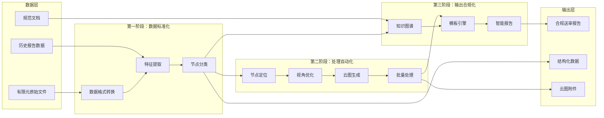

## （二）项目建设方案

### 1. 技术路线

#### （1）总体路线说明

本项目技术路线遵循"数据标准化->特征智能化->处理自动化->输出合规化"的整体逻辑，按照三阶段推进实施：

第一阶段聚焦基于机器学习的特征识别与抓取模型研究，完成数据集生成自动化、数据预处理与特征工程、混合式节点分类模型构建和节点分类结果可视化，实现从原始有限元数据到智能分类结果的能力突破。

第二阶段聚焦基于软件二次开发的自动化图像输出方法研究，完成节点智能定位与视角优化、应力分布云图输出和模型批量处理，打通从分类结果到标准化云图附件的自动化链路。

第三阶段聚焦基于商道大模型智能体搭建和微调的报告生成研究，完成规范知识图谱构建、动态模板引擎开发和智能体构建，实现从结构化数据到合规送审报告的端到端贯通。

三阶段技术路线相互衔接、层层递进，最终形成完整的端到端自动化工作流程。

项目整体技术路线如图 4-5 所示。

图 4-5 展示了项目从数据输入到合规输出的完整技术路线。第一阶段完成数据的标准化处理和智能分类；第二阶段基于分类结果完成节点定位、视角优化和云图生成的自动化处理；第三阶段整合结构化数据和知识图谱，通过模板引擎和智能体完成报告生成。三阶段路线在数据流上相互衔接，最终输出合规报告、结构化数据和云图附件三类成果。

#### （2）技术架构

项目技术架构分为数据层、处理层、服务层和输出层四个层次，各层职责明确、接口清晰。

数据层负责接收和解析来自不同来源的输入数据。有限元原始文件经由数据格式转换模块统一处理，转换为标准化中间格式；历史报告数据经清洗和结构化处理后入库管理；船级社规范文档经知识抽取后存入知识图谱。

处理层负责核心算法的执行和数据的智能处理。特征提取模块对标准化有限元数据进行多维特征计算；节点分类模块基于混合式算法实现疲劳敏感节点的智能识别；节点定位模块根据分类结果在有限元模型中精确定位目标单元；视角优化模块计算最佳观察方向和距离；云图生成模块基于有限元结果数据渲染应力分布图像。

服务层负责业务逻辑的处理和知识的调用。知识图谱服务提供规范条款的检索、合规校验和智能问答；模板引擎服务实现报告结构的组装和内容的填充；智能体服务调用大语言模型完成报告初稿生成和语义修正。

输出层负责最终成果的封装和交付。报告生成模块将结构化数据、应力云图和模板填充内容整合为完整的送审报告；数据归档模块将处理过程数据和质量追溯记录持久化存储；结果展示模块提供分类结果和云图的可视化呈现。

#### （3）数据流与业务流

项目的数据流和业务流遵循"输入->处理->输出->归档"的闭环逻辑。

数据流从有限元计算结果文件、历史疲劳分析报告和船级社规范文档三类输入数据源出发，经数据解析和格式转换后进入处理层。处理层中，节点分类模型输出分类标签和特征向量，应力云图生成模块输出图像文件，知识图谱提供规范条款引用。最终，处理层的各类输出在服务层整合，经报告生成模块封装为合规报告后输出。

业务流从项目任务分解和阶段计划出发，各子课题按计划推进研发工作，按节点开展联调测试，分阶段完成集成验证。项目管理层对各阶段的进展和质量进行跟踪监控，确保业务流按计划推进。

数据流与业务流在项目全生命周期中相互交织：业务流的阶段里程碑定义了数据流的处理目标，数据流的处理质量影响业务流的阶段验收。

#### （4）关键模块与接口

项目关键技术模块及其接口关系如下：

数据解析模块接收有限元原始文件，输出标准化中间数据。输入接口支持 bdf、dat、nas、op2 等主流格式，输出接口采用统一 JSON 格式与其他模块对接。

特征提取模块接收标准化数据，输出多维特征向量。输入接口接收标准化中间数据，输出接口包括几何特征、拓扑特征和力学特征三个通道。

节点分类模块接收特征向量，输出分类标签和置信度。输入接口接收特征提取模块的输出，输出接口包括分类结果、可视化数据和结构化标签三类。

节点定位模块接收分类结果，输出目标单元的空间位置和属性信息。输入接口接收节点分类结果和原始有限元模型，输出接口包括单元 ID、节点坐标和网格拓扑信息。

视角优化模块接收节点定位结果，输出最优视角参数。输入接口接收空间位置信息，输出接口包括视角方向、视距和渲染参数。

云图生成模块接收视角参数和有限元结果数据，输出应力分布图像。输入接口接收视角优化参数和 op2 文件数据，输出接口为标准图像文件。

知识图谱模块接收规范文档输入，提供知识检索和合规校验服务。输入接口为原始规范文档，输出接口为查询结果和校验报告。

模板引擎模块接收结构化数据和云图图像，输出填充后的报告文档。输入接口包括数据绑定接口和图像插入接口，输出接口为中间格式文档。

智能体模块接收中间文档，输出符合规范要求的送审报告。输入接口接收模板引擎输出，输出接口支持 Word 和 PDF 格式。

#### （5）测试验证安排

项目测试验证工作按照单元测试、集成测试和系统测试三个层次展开。

单元测试针对各算法模块和软件单元进行独立验证，确保每个模块的功能正确性。特征提取模块的测试覆盖不同格式文件的解析正确性和特征计算准确性；节点分类模型的测试覆盖多种节点类型的识别准确率和误分类样本分析；云图生成模块的测试覆盖不同应力分布类型的渲染效果评估。

集成测试针对多模块联合运行进行验证，确保模块间接口对接正确、数据流转顺畅。节点分类与节点定位的集成测试验证分类结果到定位信息的正确传递；节点定位与云图生成的集成测试验证定位精度对云图质量的影响；知识图谱与模板引擎的集成测试验证规范条款引用和内容填充的准确性。

系统测试针对完整业务流程进行端到端验证，确保系统整体满足功能和非功能需求。基于典型船型的全流程测试验证端到端处理能力和输出质量；基于多种船型的批量测试验证系统的稳定性和处理效率；基于历史报告的对比测试验证系统输出与人工编制的质量一致性。

#### （6）工程应用路径

项目采用分阶段推进、逐步扩展的工程应用策略。

第一阶段以单一典型船型为对象，完成系统的全流程开发和验证，在受控环境下检验系统的功能完整性和输出质量。

第二阶段以多船型为对象开展扩展验证，检验系统对不同船型、不同节点类型的适应能力，根据验证反馈进行算法调优和系统完善。

第三阶段进入实际项目应用，在真实设计项目中试运行，逐步替代人工编制成为主要报告生成方式。

第四阶段实现常态化运营，系统成为船舶设计流程的标准配置，持续积累运行数据和改进建议，推动系统迭代升级。
