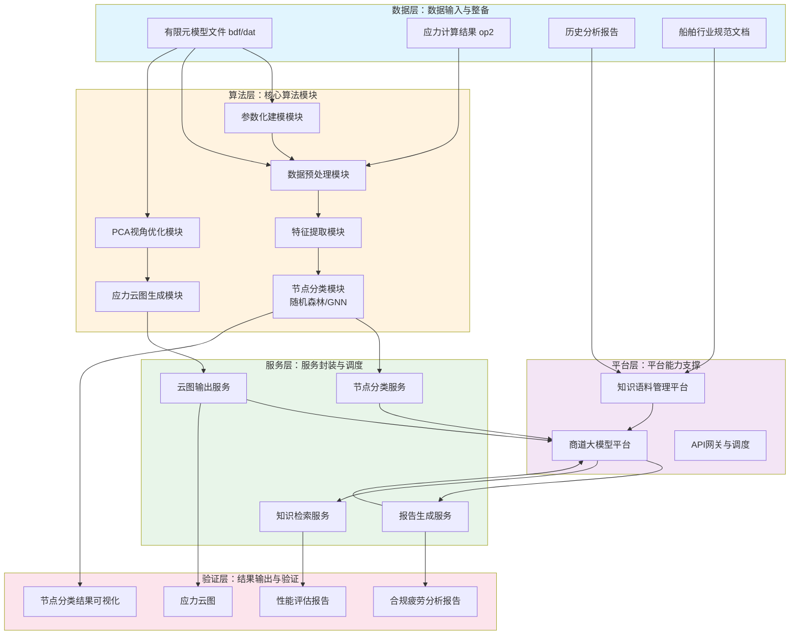

## （二）项目建设方案

### 1. 技术路线

#### 总体技术路线

本项目技术路线遵循"数据层→算法层→服务层→平台层→验证层"五层架构，通过模块化设计和标准化接口，实现从有限元原始数据到船级社合规报告的端到端自动化处理。

项目整体技术路线如图4-5所示。

图4-5展示了项目的整体技术架构。数据层负责接收有限元原始数据和历史报告等输入；算法层通过六个核心模块完成从数据预处理到节点分类、视角优化和应力云图生成的处理；服务层将算法能力封装为可调用的标准化服务；平台层依托商道大模型和知识语料平台实现知识管理和智能调度；输出验证层生成合规报告并对系统性能进行评估。

#### 数据流与业务流

数据流沿"有限元模型→特征提取→节点分类→应力计算→报告生成"主链路流转。各模块之间通过标准化JSON格式进行数据交换，节点分类结果包含节点ID、分类标签和置信度；应力云图通过标准化图像格式和数值表进行传递。

业务流沿"任务配置→自动执行→结果审核→报告输出"主链路管理。用户通过界面提交分析任务，配置节点类型和船级社规范；系统自动执行全流程处理；结果通过可视化界面展示供用户审核；审核通过后自动生成合规报告。

#### 关键接口关系

算法层内部接口：参数化建模模块向特征提取模块提供标准化几何模型；特征提取模块向节点分类模块提供多维度特征向量；节点分类模块同时向服务层输出分类结果、向视角优化模块输出节点位置信息。

服务层与平台层接口：节点分类服务、应力云图服务、报告生成服务均通过API网关与商道大模型平台交互；知识检索服务对接知识语料管理平台获取领域知识支撑。

#### 测试验证安排

系统测试验证分为三个层次：单元测试针对各算法模块分别进行功能验证；集成测试针对端到端全流程进行数据流转验证；用户验收测试在真实船舶设计项目中开展，验证系统在实际工作场景中的性能和可用性。性能指标包括：节点分类准确率、应力云图生成效率、报告生成正确率、全流程处理耗时等。

#### 工程应用路径

系统按照"内部验证→内部推广→外部复制"三阶段路径推广应用。第一阶段（2026年4月至2026年5月）在上海研究院内部项目开展全流程验证；第二阶段（2026年下半年）在招商局集团内部其他船舶设计企业推广应用；第三阶段根据应用效果考虑向集团外部船舶企业推广复制。
