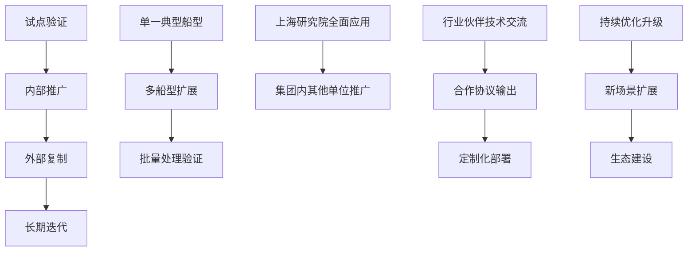
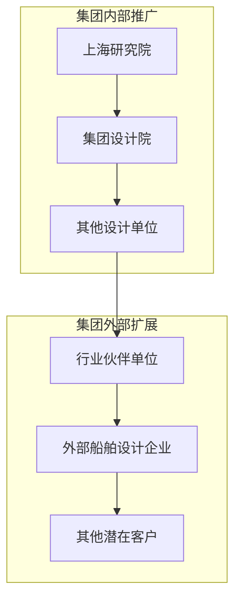

### 2. 应用推广方案

#### （1）试点验证

试点验证是应用推广的起步阶段，目的是在受控环境下验证系统功能和性能，积累运行经验，完善系统能力。

**试点对象选择**。试点验证阶段优先选择上海研究院已积累完整数据的典型船型作为验证对象，包括已建立完整有限元模型和历史报告的客滚船和 PCTC 船型。选点原则为：数据类型完整、历史报告质量可靠、有专业人员配合验证评估。

**试点内容安排**。试点验证工作包括：基于单一船型的全流程功能验证，覆盖从数据输入到报告输出的完整业务流程；多节点类型的分类准确率验证，对比系统分类结果与人工标注结果的差异；云图输出质量验证，评估系统生成云图与人工制图的符合度；报告合规性验证，由专业审图人员审核系统输出报告是否符合船级社要求；处理效率评估，记录系统处理时间与人工处理时间的对比数据。

**试点时间安排**。试点验证工作安排在 2026 年 4 月至 2026 年 5 月期间进行，与项目验证和试运行阶段同步。

项目应用推广路径如图 4-6 所示。

图 4-6 展示了项目应用推广的阶段性路径，从试点验证起步，经内部推广扩展，最终实现外部复制和长期迭代。各阶段目标明确、相互衔接，形成完整的推广应用体系。

#### （2）内部推广

内部推广阶段的目标是将系统从试点验证环境扩展到招商局集团内部的多个业务单位，实现系统的规模化应用。

**推广范围**。内部推广阶段的覆盖范围从上海研究院逐步扩展至集团内其他从事船舶设计业务的单位。推广单位需具备以下条件：拥有一定规模的船舶设计业务需求；配备专业人员能够操作系统和维护系统；具备与系统对接的设计平台和数据管理环境。

**推广路径**。内部推广采用"培训先行、试点跟进、全面铺开"的路径。首先对目标单位的业务骨干进行系统操作培训，使其熟悉系统功能和业务流程；其次在目标单位选择 1 至 2 个实际项目开展试点应用，积累使用经验；最后在试点成功后逐步扩大应用规模，实现常态化运行。

**支撑保障**。内部推广阶段需要建立完善的培训体系和技术支持机制，包括：编制系统操作手册和培训教材；组织定期培训和技术交流活动；建立线上技术支持渠道，及时响应用户问题；定期收集用户反馈，推动系统迭代优化。

项目应用推广范围示意如图 4-7 所示。

图 4-7 展示了项目的推广应用范围和扩展路径。在集团内部从上海研究院逐步向其他设计单位延伸；在集团外部通过行业交流和技术合作，逐步向行业伙伴和其他潜在客户扩展，形成辐射全国的推广应用网络。

#### （3）外部复制

外部复制阶段的目标是将项目成果推广至招商局集团外部的行业单位，实现技术能力的社会化输出。

**推广对象**。外部复制的目标对象包括：国内其他船舶设计企业和研究院所；船舶行业相关的技术服务商；有意向引入智能分析能力的企业和机构。

**合作模式**。针对不同目标对象，采用差异化的合作模式。对于行业伙伴单位，可通过技术交流、联合研发等方式开展合作；对于有定制化需求的企业，可提供系统定制开发和部署服务；对于潜在客户，可通过技术演示和试用体验促进合作转化。

**推广条件**。外部复制需要满足以下条件：系统已在集团内部实现稳定运行，具备对外输出的能力基础；建立了成熟的培训体系和技术支持体系；形成了可复制的部署方案和运维流程。

#### （4）长期迭代与运维反馈

长期迭代与运维反馈是保障系统持续演进的关键机制。

**运维反馈机制**。系统上线后建立常态化的用户反馈收集机制，通过系统日志分析、用户满意度调查和专题座谈等方式，收集系统运行中的问题和改进建议。用户反馈的问题和建议按严重程度和优先级分类处理，重大问题及时响应解决，优化建议纳入后续迭代计划。

**持续优化升级**。根据运维反馈和技术发展，制定年度优化计划，持续提升系统能力。算法优化方面，根据积累的新样本持续提升分类模型精度，根据新的规范要求更新合规校验规则；功能完善方面，根据用户需求新增或优化功能模块；性能提升方面，根据批量处理场景的需求优化系统吞吐量和响应速度。

**新场景扩展**。在系统稳定运行的基础上，逐步向相邻领域扩展。项目形成的技术架构可复用于结构强度评估、工艺仿真等其他工程场景，可作为标准化验证案例向更多领域推广，推动集团智能制造能力的持续扩展。
