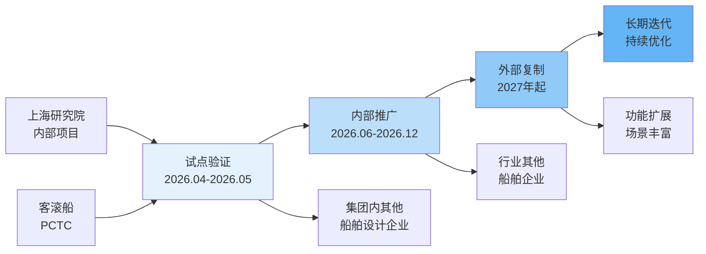
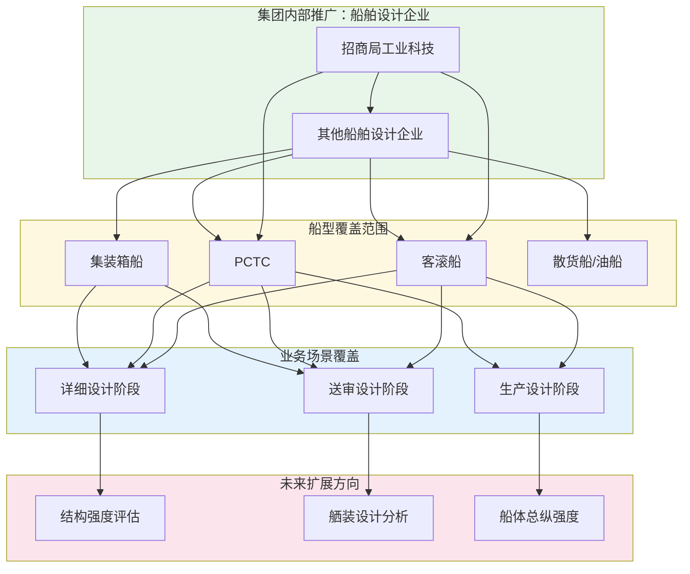

### 2. 应用推广方案

#### 推广总体路径

项目成果的推广应用遵循"试点验证→内部推广→外部复制→长期迭代"的阶段性路径。项目周期内（2025年6月至2026年6月）主要完成试点验证和内部推广准备工作，项目结题后进入规模化推广阶段。

项目应用推广路径如图4-6所示。

#### 推广对象与场景

推广对象主要包括三类：一是招商局集团内部船舶设计企业，作为首批推广应用单位，具备成熟的有限元分析业务场景和明确的智能化升级需求；二是国内其他船舶设计企业，在船舶设计智能化转型过程中面临同样的效率瓶颈和人才短缺问题；三是船舶科研院所和高校，在科研和教学工作中需要大量疲劳分析支撑，具备应用该系统的需求基础。

推广场景覆盖多种船型，包括但不限于：客滚船（Passenger/Crew Ro-Pax）、PCTC（汽车运输船）、集装箱船、散货船、油船等。不同船型的疲劳分析场景存在差异，系统通过参数配置和模板选择适应不同场景需求。

项目应用推广范围示意如图4-7所示。

#### 试点验证阶段

在项目第四阶段（2026年4月至2026年5月），系统在上海研究院内部承担的船舶设计项目中开展试点验证。选择2至3个真实项目作为试点，覆盖客滚船和PCTC等代表性船型。试点内容包括：节点分类功能测试、应力云图生成质量评估、报告合规性审查、全流程效率对比分析。试点期间安排专人跟踪记录系统性能和用户反馈，形成试点验证报告。

#### 内部推广阶段

项目结题后（2026年下半年起），向招商局集团内部其他船舶设计企业推广应用。推广措施包括：组织技术培训，让相关工程师掌握系统使用方法；提供技术支持，协助完成系统部署和配置；建立用户反馈渠道，收集使用过程中的问题和建议。推广目标为一年内完成集团内部主要船舶设计企业的覆盖。

#### 反馈迭代机制

建立用户反馈收集和分析机制，通过使用日志、用户调研和定期访谈等方式收集反馈意见。根据反馈识别系统改进方向，形成迭代优化任务清单。重大功能改进通过版本升级方式发布，确保所有用户同步获得最新功能。

#### 长期迭代方向

基于用户反馈和技术发展趋势，持续拓展系统功能和应用场景。功能扩展方向包括：支持更多船型和分析类型、扩展到结构强度评估等相近领域、增加与更多有限元软件的数据兼容。场景丰富方向包括：开发移动端查看功能、支持团队协作和知识共享、提供个性化报告模板定制能力。
