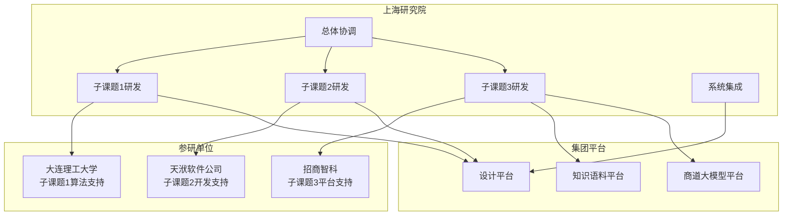

### 3. 联合研发与平台集成方式

#### （1）合作模式

本项目采用"牵头单位统筹、参研单位分工、平台对接支撑"的联合研发合作模式。

**牵头单位统筹**。上海研究院作为项目牵头单位，负责项目的整体技术方案设计、进度统筹管理和质量控制，组织各参研单位按计划推进研发工作，定期召开技术对接会和阶段评审会，对关键里程碑进行把关验收。

**参研单位分工**。各参研单位根据自身技术优势承担相应专题的研发任务。高校团队侧重算法研究和理论创新，企业团队侧重工程实现和产品转化。参研单位按月向牵头单位汇报研发进展，及时反馈问题和风险。

**平台对接支撑**。项目研发成果通过集团内部平台进行集成对接。集团知识语料管理平台提供知识存储和检索服务，"商道"大模型平台提供语言模型调用能力，设计平台提供数据输入和结果输出接口。

#### （2）任务分工

项目三个子课题的任务分工及责任主体安排如下：

**表4-5 联合研发与平台集成分工表**

| 专题 | 任务内容 | 牵头单位 | 参研单位 |
|------|----------|----------|----------|
| 子课题1 | 数据集生成自动化 | 上海研究院 | 大连理工大学 |
| 子课题1 | 数据预处理与特征工程 | 上海研究院 | 大连理工大学 |
| 子课题1 | 混合式节点分类模型 | 上海研究院 | 大连理工大学 |
| 子课题1 | 节点分类结果可视化 | 上海研究院 | — |
| 子课题2 | 节点智能定位与视角优化 | 上海研究院 | 天洑软件公司 |
| 子课题2 | 应力分布云图输出 | 上海研究院 | 天洑软件公司 |
| 子课题2 | 模型批量化处理 | 上海研究院 | 天洑软件公司 |
| 子课题3 | 规范知识图谱构建 | 上海研究院 | 招商智科 |
| 子课题3 | 动态模板引擎 | 上海研究院 | 招商智科 |
| 子课题3 | 智能体构建 | 上海研究院 | 招商智科 |

#### （3）平台集成关系

项目系统与集团现有平台的集成关系如下：

**与集团知识语料管理平台的集成**。项目构建的船舶疲劳分析知识图谱对接集团知识语料管理平台，实现规范知识、历史报告和技术标准等信息的统一存储和管理。平台提供知识检索、语义匹配和智能问答等接口，供报告生成模块调用。

**与"商道"大模型平台的集成**。项目的报告生成智能体对接"商道"平台的大语言模型能力，实现报告初稿的自动生成和语义校验。平台提供模型调用、微调和部署等能力支撑。

**与设计平台的集成**。项目系统通过标准接口与船舶设计单位的现有设计平台对接，实现有限元计算结果的自动获取和报告输出结果的自动回传，减少人工操作环节。

联合研发协同机制如图 4-8 所示。

图 4-8 展示了联合研发各参与方的协同关系。上海研究院作为牵头单位统筹各子课题研发，与参研单位按专题分工协作，同时对接集团知识语料平台、商道大模型平台和设计平台，实现技术能力的整合与复用。

#### （4）协同机制与联调验收

**技术对接机制**。各参研单位按约定接口规范开发各自负责的模块，定期开展接口对接测试，确保数据格式和调用方式符合要求。接口规范文档由牵头单位统一编制和维护。

**联合评审机制**。项目关键里程碑节点组织联合评审，邀请各参研单位技术负责人和外部专家对阶段成果进行评审，评审意见作为后续工作调整的依据。

**联调验收机制**。各子课题完成后开展集成联调，按顺序完成模块间对接测试、子系统集成测试和系统整体测试，验证各模块协同工作的正确性和效率。

**质量保障机制**。建立代码审查、版本管理和配置管理等质量保障制度，确保项目资产的可追溯性和可维护性。
