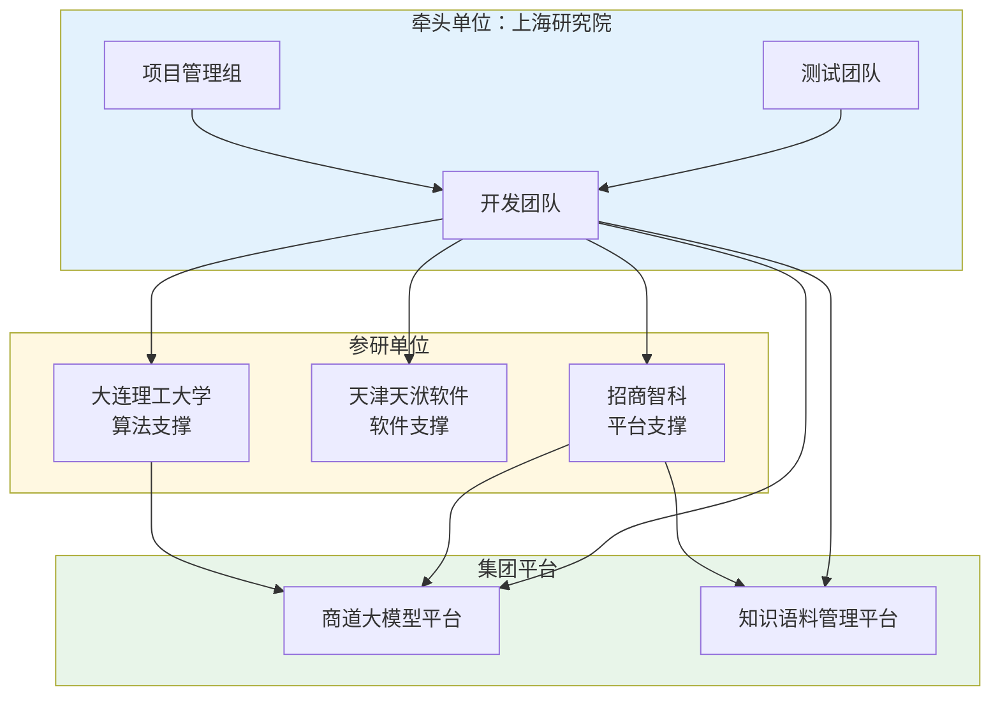

### 3. 联合研发与平台集成方式

#### 合作模式

本项目采用"产学研用"深度融合的联合研发模式。招商局工业科技（上海）有限公司作为牵头单位和技术需求方，负责项目规划、技术决策和工程验证；大连理工大学作为算法研发支撑方，提供机器学习领域的理论指导和算法优化支持；天津天洑软件有限公司作为软件工程支撑方，提供有限元软件二次开发的技术咨询；招商智科作为平台支撑方，提供商道大模型平台接入和运维支持。

#### 任务分工

**表4-5 联合研发与平台集成分工表**

| 责任主体 | 承担内容 | 交付物 | 集成边界 |
|----------|----------|--------|----------|
| 上海研究院 | 系统整体架构设计与集成 | 系统整体方案、技术架构文档 | 负责各模块接口定义和集成测试 |
| 大连理工大学 | 机器学习算法研发支撑 | 算法模型、训练方案、验证报告 | 提供分类算法API接口 |
| 天津天洑软件 | 有限元自动化脚本支撑 | API调用方案、开发文档 | 提供脚本调用接口 |
| 招商智科 | 大模型平台对接支撑 | 平台对接方案、部署文档 | 提供模型调用API和知识检索接口 |

#### 平台集成关系

本项目系统依托集团内部两大平台构建：

与"商道"大模型平台的集成：报告生成智能体通过API网关调用商道平台的生成式大语言模型能力，接收结构化数据和知识图谱上下文，输出报告文本。平台提供模型调度、负载均衡和日志审计等运维支撑。

与集团知识语料管理平台的集成：系统通过知识检索接口访问平台存储的船舶行业规范、历史报告和专家知识，用于知识图谱查询和合规校验。平台提供知识标注、检索和更新等管理功能。

联合研发协同机制如图4-8所示。

#### 协同机制

建立定期技术交流机制，牵头单位每月组织技术研讨会，各参研单位汇报研发进展并讨论技术问题。建立问题跟踪机制，通过项目管理工具记录和跟踪研发过程中发现的问题，确保问题及时解决。建立版本同步机制，各单位按时提交交付物，由牵头单位进行集成和版本发布。

#### 联调验证方式

在项目第三阶段末（2026年4月）组织系统集成联调。各参研单位按照集成接口规范提供各自模块，牵头单位负责集成部署和功能验证。联调测试覆盖：数据接口连通性、算法模块正确性、服务调用稳定性、全流程端到端功能。通过联调验证后进入项目验证阶段。
