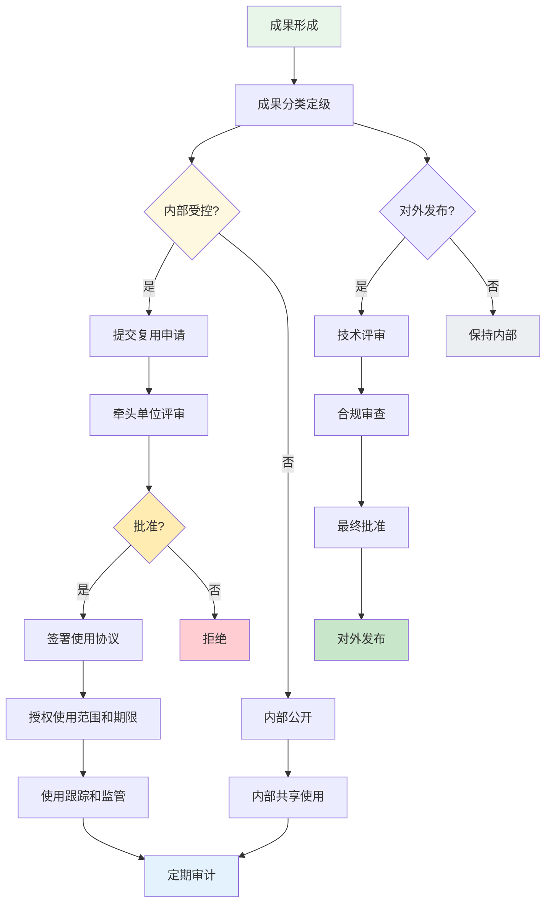

### 4. 成果管理与内部受控复用策略

#### 成果分类管理

项目成果按照敏感程度和适用范围分为三类进行分级管理：

第一类为内部受控成果，包括节点分类算法模型、训练数据集、应力分析参数等核心技术资产，这类成果仅限集团内部使用，对外发布需经过技术评审和审批。

第二类为内部公开成果，包括软件工具使用手册、一般性技术文档、非核心算法代码等，这类成果可在集团内部无限制使用和共享。

第三类为开放共享成果，包括行业通用算法研究成果、技术标准规范建议、公共数据集等，这类成果可根据管理需要向行业合作伙伴或学术机构有限度共享。

#### 内部受控复用边界

集团内部复用需遵循以下边界：使用方需提出复用申请并说明用途；牵头单位对复用申请进行评估并决定是否批准；获批后仅授权特定范围和期限的使用；使用方需遵守数据安全和保密要求，不得将核心资产用于约定以外的目的。

#### 知识产权与保密

项目产生的知识产权归招商局集团所有，各参研单位按合同约定享有共同署名权和有限使用权。项目技术资料按照集团保密制度进行管理，核心技术资料标注密级并限制传播范围。参与项目的外协单位人员需签署保密协议。

#### 对外发布规则

对外发布项目成果需经过以下审批流程：提交成果发布申请，说明发布内容、形式和范围；由项目负责人和技术总监进行技术评审；由集团相关部门进行合规审查；批准后方可按照批准内容进行发布。公开发表学术论文或参加学术会议需提前报批。

成果管理与内部受控复用流程如图4-9所示。

图4-9展示了成果从形成、分类、复用审批到使用跟踪的完整管理闭环。成果分类定级后，根据敏感程度决定不同的管理流程：内部受控成果需经过严格审批方可授权使用，内部公开成果可直接共享，对外发布需经过技术评审和合规审查。

#### 管理闭环

建立成果管理的长效机制，包括：定期开展成果资产梳理和更新，确保资产台账完整准确；每年开展一次知识产权盘点，评估保护策略是否需要调整；持续跟踪技术发展趋势，及时调整成果分类和管理策略。
