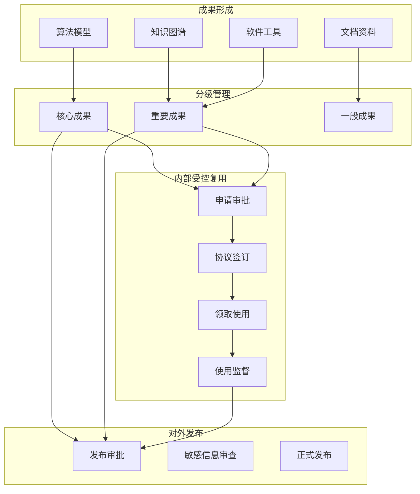

### 4. 成果管理与内部受控复用策略

#### （1）成果分级管理

本项目形成的成果按照重要程度和敏感程度分为三个管理级别：

**核心成果**。包括混合式节点分类算法模型、疲劳节点参数化建模方法、报告生成智能体等核心算法和技术方案，作为项目的关键知识产权予以重点保护，实施严格的保密管理和访问控制。

**重要成果**。包括知识图谱、动态模板引擎、批量处理脚本等支撑性技术资产，作为项目的重要交付物予以规范管理，实施必要的保密措施和使用审批。

**一般成果**。包括技术文档、操作手册、培训教材等辅助性成果，作为项目的配套资料予以备案管理，按照内部资料管理规定进行存储和使用。

#### （2）内部受控复用边界

项目成果的内部复用遵循"受控使用、安全优先"的原则，明确复用边界和审批流程。

**集团内部复用**。项目成果在招商局集团内部单位之间可按需申请使用，但需遵守以下规定：核心成果的复用需经牵头单位审批，明确复用范围和使用目的；重要成果的复用需在项目管理平台备案，签订内部使用协议；一般成果的复用按内部资料调用流程办理。

**复用申请流程**。需要使用项目成果的集团内部单位，应向上海研究院提交书面申请，说明使用目的、范围和方式，经审批同意后方可获取相应成果。成果使用单位应遵守保密要求，不得向第三方披露或转让。

**使用监督机制**。项目管理团队对成果内部复用情况进行跟踪监督，定期核查使用情况，确保成果使用符合申请约定和安全要求。

#### （3）知识产权与保密

**知识产权归属**。项目实施过程中产生的知识产权归项目联合体成员共同所有，具体权益分配按联合体合作协议执行。各成员的贡献比例和权益份额在合作协议中明确约定。

**保密管理要求**。项目属于招商局集团内部研发项目，项目文档标注"保密文件，仅限内部交流，未经公司授权不得复制和传播"。项目参与人员须签署保密协议，承诺不向第三方透露项目技术和商业秘密。

**数据安全保护**。项目涉及的历史报告、规范文档和有限元数据等均属于敏感数据，严格按照集团数据安全管理规定进行分类分级保护，采取必要的加密存储、访问控制和审计追踪措施。

成果管理与受控复用流程如图 4-9 所示。

图 4-9 展示了成果从形成到分级管理、内部复用和对外发布的完整管理闭环。成果按重要程度分级管理，内部复用需经过申请审批和协议签订等流程，对外发布需经过发布审批和敏感信息审查等环节，确保成果在安全可控的前提下实现价值最大化。

#### （4）对外发布规则

项目成果的对外发布遵循"依规审批、安全审查"的原则，严格控制敏感信息的传播范围。

**发布内容审查**。对外发布前须对发布内容进行安全审查，确保不包含核心技术参数、商业敏感信息、个人隐私数据等受限内容。涉及核心算法和技术方案的内容，原则上不对外发布。

**发布审批流程**。对外发布需经牵头单位审批，重大发布需报集团主管部门备案。未经批准，任何单位和个人不得以任何形式对外披露项目成果。

**合作输出管理**。向外部合作伙伴输出项目成果时，须签订正式的合作协议或技术转让合同，明确双方的权利义务、保密责任和使用边界，禁止受让方再次转让或泄露。

#### （5）管理闭环

项目成果管理形成"形成->分类->审批->共享->发布->归档追踪"的完整闭环。

**形成阶段**。各子课题研发过程中产生的算法、代码、文档等成果，按照统一规范进行整理和归档，形成项目成果清单。

**分类阶段**。根据成果的重要程度和敏感程度，对照分级管理标准确定成果的保密级别和管控要求。

**审批阶段**。成果的内部共享和对外发布均需经过相应级别的审批，未经批准不得实施。

**共享阶段**。经审批的成果在集团内部按约定方式共享使用，使用单位须遵守使用协议和保密要求。

**发布阶段**。经审批的成果可面向外部进行技术交流、学术发表或商业推广，但须严格控制发布内容和范围。

**归档追踪阶段**。对成果的全生命周期进行记录追踪，包括形成时间、归属变更、使用记录和发布情况等，支持成果的追溯查询和审计核查。
