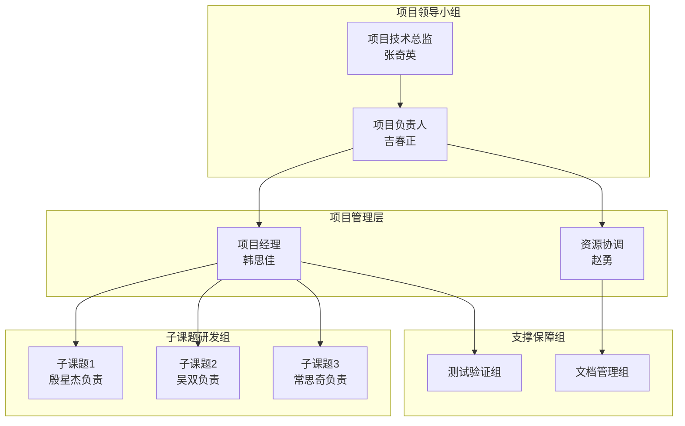

# 七、项目组织及实施管理

## （一）项目管理模式

### 1. 各级管理责任制度

项目建立"项目负责人-项目经理-子课题负责人-主研人员"四级管理责任体系，明确各级职责和决策权限。

项目负责人吉春正作为项目总体负责人，承担以下管理责任：负责项目重大事项决策，包括技术路线调整、预算变更和里程碑变更等；对外协调集团相关部门和领导，对内统筹各参研单位资源；定期向项目领导小组汇报项目进展。

项目经理韩思佳作为项目日常管理负责人，承担以下管理责任：负责项目计划制定、任务分解和进度跟踪；组织项目例会和专题会议，协调解决日常问题；编制项目进展报告和文档材料。

子课题负责人殷星杰、吴双、常思奇分别承担三个子课题的管理责任：负责子课题内部的任务分配、进度管控和质量把关；组织子课题内部的技术讨论和问题解决；向项目经理汇报子课题进展。

主研人员按照分工承担具体研发任务，对子课题负责人负责。

### 2. 例会制度

项目建立分层分类的例会制度，保障信息畅通和问题及时响应。

周例会每周召开一次，由项目经理主持，各子课题负责人和主研人员参加，议题包括：上周工作完成情况汇报；本周工作计划和问题清单；需要协调的资源和支持事项。

月度例会每月召开一次，由项目负责人主持，全体项目成员参加，议题包括：项目整体进展通报；关键技术问题讨论和决策；里程碑进度评估和调整；下阶段重点工作计划。

专题会议根据需要随时召开，针对特定技术问题、管理事项或外部协调事项进行专题讨论和决策。

### 3. 项目里程碑管控制度

项目设置明确的关键里程碑节点，建立里程碑管控机制保障项目按期完成。

里程碑设置。项目共设置以下关键里程碑：2025 年 6 月完成项目启动和方案评审；2025 年 12 月完成三个子课题核心算法研发；2026 年 4 月完成系统集成和内部测试；2026 年 5 月完成项目验证和试运行；2026 年 6 月完成项目验收和总结。

进度监控。各子课题按周填报进度报告，汇报任务完成情况、存在问题和下步计划；项目经理按月编制里程碑进度评估报告，对照计划检查偏差并提出纠偏建议。

偏差处理。当里程碑进度偏差超过预定阈值时，启动偏差分析程序，由项目负责人组织制定纠偏措施，必要时调整后续计划或资源投入。

### 4. 重要研究方案评审制度

项目建立重要研究方案评审制度，保障技术决策的科学性和可行性。

评审范围。需要评审的重要方案包括：项目总体技术方案和各子课题技术方案；关键算法和技术路线变更；系统架构和接口规范；集成测试方案和验收方案。

评审程序。方案编制完成后由子课题负责人或项目经理提出评审申请，由项目技术总监张奇英主持评审会议，邀请相关技术专家和管理人员参加评审。评审意见形成会议纪要，作为方案修改和实施的依据。

评审标准。评审重点关注方案的先进性、可行性、经济性和风险可控性，评审结论分为通过、修改后通过和不通过三类。

## （二）项目运行保障机制

### 1. 组织管理措施

项目建立高效的的组织管理措施，保障项目顺畅运行。

资源协调机制。建立项目资源需求快速响应通道，由内部资源协调赵勇负责对接集团和各单位资源需求，确保计算资源、数据资源和平台资源及时到位。

沟通协作机制。建立项目微信群和协同工作平台，确保日常沟通畅通；重要事项通过正式邮件确认，避免信息遗漏；建立问题升级机制，日常工作问题由项目经理协调，重大问题提交项目负责人决策。

文档管理机制。建立项目文档统一管理平台，对技术文档、会议纪要、进度报告等资料集中存储和版本管理，确保项目资产可追溯。

### 2. 软件质量管理及控制措施

项目建立软件质量管理和控制措施，保障系统质量。

代码审查制度。所有代码提交前须经过同组人员审查，审查重点包括代码规范性、功能正确性和性能影响；核心模块代码须经过技术负责人专项审查。

版本管理制度。采用 Git 等版本管理工具进行代码管理，明确分支策略和合并流程；重要版本发布须经过测试验证和评审确认。

测试覆盖制度。单元测试覆盖所有核心算法模块和关键函数，测试覆盖率不低于 80%；集成测试覆盖所有模块接口和数据流转路径；系统测试覆盖完整业务流程和典型使用场景。

### 3. 任务考核奖惩措施

项目建立任务考核奖惩措施，激励团队高效执行。

考核内容。考核内容包括：任务完成情况，包括按计划完成任务、质量达标等；技术贡献情况，包括算法创新、问题解决等；协作配合情况，包括团队协作、沟通效率等。

考核方式。采用季度考核方式，由项目经理根据任务完成情况和日常观察进行评分，子课题负责人和项目负责人进行复核。考核结果与绩效奖励挂钩。

奖惩规则。对按计划高质量完成任务的团队和个人给予表彰和奖励；对进度延误或质量问题的，视情况给予提醒、警告或扣减绩效等处理。

### 4. 技术风险保障措施

项目建立技术风险预警和应对机制，降低技术不确定性影响。

风险识别。定期开展技术风险识别和评估，梳理关键技术难点和风险点，建立风险清单并动态更新。

风险监控。对关键技术风险点建立监控指标，设置预警阈值，及时发现异常情况。

风险应对。针对识别的技术风险制定应对预案，包括技术备选方案、资源备份计划等；当风险发生时迅速启动应对预案，必要时调整技术路线或任务分工。

## （三）项目人才团队及设备设施保障

### 1. 人才团队保障措施

项目建立多层次的人才团队保障措施，确保人力资源充足。

核心人员稳定性保障。项目核心人员通过任务书和绩效协议明确责任，项目实施期间原则上不调离本项目；建立核心人员备份机制，关键岗位配备副手或接班人。

专业能力提升计划。针对项目需要组织专项技术培训，包括机器学习算法、有限元软件操作、大模型应用等专题；鼓励团队成员参加行业技术交流和学术会议。

外部专家支持。建立技术顾问机制，邀请外部专家为项目提供技术指导；必要时可聘请临时专家咨询或评审。

### 2. 设备设施保障措施

项目建立设备设施保障措施，确保研发条件具备。

计算资源保障。协调集团高性能计算服务器，确保模型训练和仿真计算资源充足；建立计算资源使用预约和分配机制，提高资源利用效率。

软件工具保障。统一配置项目所需软件授权，包括有限元软件、机器学习框架和开发工具等；建立软件授权使用管理台账，确保合规使用。

平台资源保障。对接集团知识语料管理平台和"商道"大模型平台，确保平台调用能力稳定可靠；建立平台接口调用监控和异常告警机制。

项目组织管理架构如图 7-1 所示。

图 7-1 展示了项目组织管理架构。项目领导小组负责技术决策和重大事项协调；项目管理层负责日常管理和资源协调；子课题研发组按分工负责各专题研发；支撑保障组提供测试验证和文档管理支持。

## （四）项目成果应用管理

### 1. 面向动态化市场的运营管理

项目成果运营管理以用户需求为导向，建立需求收集、分析和响应机制。

需求收集机制。通过用户调研、使用反馈和行业动态跟踪等方式持续收集市场需求信息，建立需求池进行统一管理。

需求分析机制。定期对收集的需求进行分类、分析和优先级评估，区分功能性需求、性能需求和改进建议，形成需求分析报告。

需求响应机制。根据需求优先级和资源情况，制定功能迭代计划；紧急需求建立快速响应通道，确保及时处理。

### 2. 客户支持与反馈管理

项目建立客户支持与反馈管理机制，提升用户满意度。

支持渠道建设。建立线上支持渠道，包括技术支持邮箱、用户交流群等；明确响应时限，一般问题 24 小时内回复，紧急问题 4 小时内响应。

反馈处理机制。用户反馈问题按严重程度分类处理：严重问题立即响应并组织排查；一般问题纳入迭代计划；建议类反馈纳入需求池管理。

用户满意度跟踪。定期开展用户满意度调查，了解用户对系统功能和服务的评价，针对性改进提升。

### 3. 项目成果动态价格管理

项目成果的价格管理遵循价值导向原则，建立灵活的价格调整机制。

定价原则。根据系统功能复杂度、使用范围和服务内容等因素确定基础价格，体现项目成果的应用价值。

价格调整机制。根据市场变化、用户规模和服务等级等因素动态调整价格，重大价格调整须经审批后执行。

收费模式。可根据用户需求采用一次性授权或年度服务费等灵活收费模式。

### 4. 成果数据安全与保密管理

项目成果涉及大量敏感数据，建立严格的数据安全与保密管理机制。

数据分类分级。对项目涉及的数据进行分类分级，区分公开数据、内部数据和保密数据，制定相应的保护措施。

访问控制。实施基于角色的访问控制，用户按权限访问相应数据；敏感数据访问须经过审批并记录日志。

数据备份与恢复。建立数据定期备份机制，确保数据可恢复；制定数据安全事件应急预案，快速响应和处置安全事件。

## （五）知识产权及权益分配

### 1. 知识产权所有权

项目实施过程中产生的知识产权归项目联合体成员共同所有。知识产权包括：算法模型、软件代码、技术文档、专利、软件著作权等。

### 2. 知识产权使用权

联合体成员有权在内部范围内使用项目知识产权，用于科研、生产和教学等目的。使用须注明知识产权归属，不得损害其他成员的使用权益。

### 3. 知识产权转让

项目知识产权向外部转让须经全体联合体成员协商一致，并签订正式转让协议。转让收益按权益分配约定执行。

### 4. 权益分配

联合体成员按合作协议约定的比例分享项目产生的收益，包括技术转让收入、授权使用收入等。权益分配方案由各方协商并在合作协议中明确。

### 5. 奖励制度

对项目做出突出贡献的团队和个人给予奖励。奖励包括物质奖励和精神奖励，具体办法另行制定。

## （六）项目成果应用推广与迭代策略

### 1. 持续改进和更新

项目建立持续改进机制，推动系统不断优化升级。

技术迭代。根据算法研究和工程实践的最新进展，持续优化节点分类模型、云图生成算法和报告生成质量；跟踪大模型技术发展，适时引入新技术提升系统能力。

功能完善。根据用户反馈和市场需求，持续完善系统功能，提升用户体验；定期发布系统新版本，做好版本管理和升级服务。

规范更新。跟踪船级社规范更新变化，及时调整知识图谱和报告模板，确保系统输出的合规性。

### 2. 用户支持和客户服务

项目建立用户支持和客户服务机制，保障用户使用顺畅。

培训服务。为新用户提供系统操作培训，编制培训教材和视频教程；组织定期培训和技术交流活动。

技术支持。提供持续的技术支持服务，帮助用户解决使用中遇到的问题；建立知识库积累常见问题解答。

### 3. 市场推广和用户增长

项目建立市场推广和用户增长策略，扩大系统应用范围。

品牌建设。通过行业会议、技术论文和案例分享等方式提升项目成果的行业影响力；树立技术先进、应用成熟的市场形象。

渠道拓展。通过集团内部推广、行业合作和技术交流等方式拓展用户群体；建立合作伙伴网络，扩大市场覆盖。

### 4. 合作关系

项目建立和维护良好的合作关系，推动共赢发展。

集团内部合作。与集团内其他单位建立紧密合作关系，推动系统推广应用；探索多种形式的合作模式。

行业合作伙伴。与行业伙伴建立技术合作关系，开展联合研发和市场推广；通过合作伙伴网络扩大市场影响力。

### 5. 盈利模式和可持续发展

项目探索可持续的盈利模式，保障长期运营发展。

主要盈利来源。系统授权使用费、技术服务费、定制开发费和培训收入等构成主要盈利来源。

成本控制。通过优化研发流程、提高复用率、降低运维成本等方式控制运营成本，提升盈利能力。

再投入机制。将部分盈利再投入技术研发和团队建设，保障可持续发展能力。

### 6. 软件代码的开源或受控开放策略

项目成果采用受控开放的策略，在保障知识产权和安全合规的前提下扩大应用范围。

受控开放原则。在集团内部按需共享使用，对外输出需经过审批；核心算法和技术方案原则上不对外开放。

开放范围界定。一般性技术成果和辅助工具可在合作伙伴间按协议共享使用；核心技术和关键模块采用授权使用方式。

审批流程。对外开放需提交申请，说明使用目的、范围和方式，经审批后签订正式协议。
