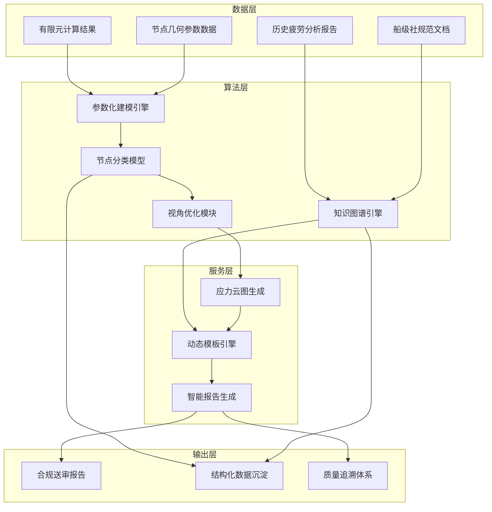
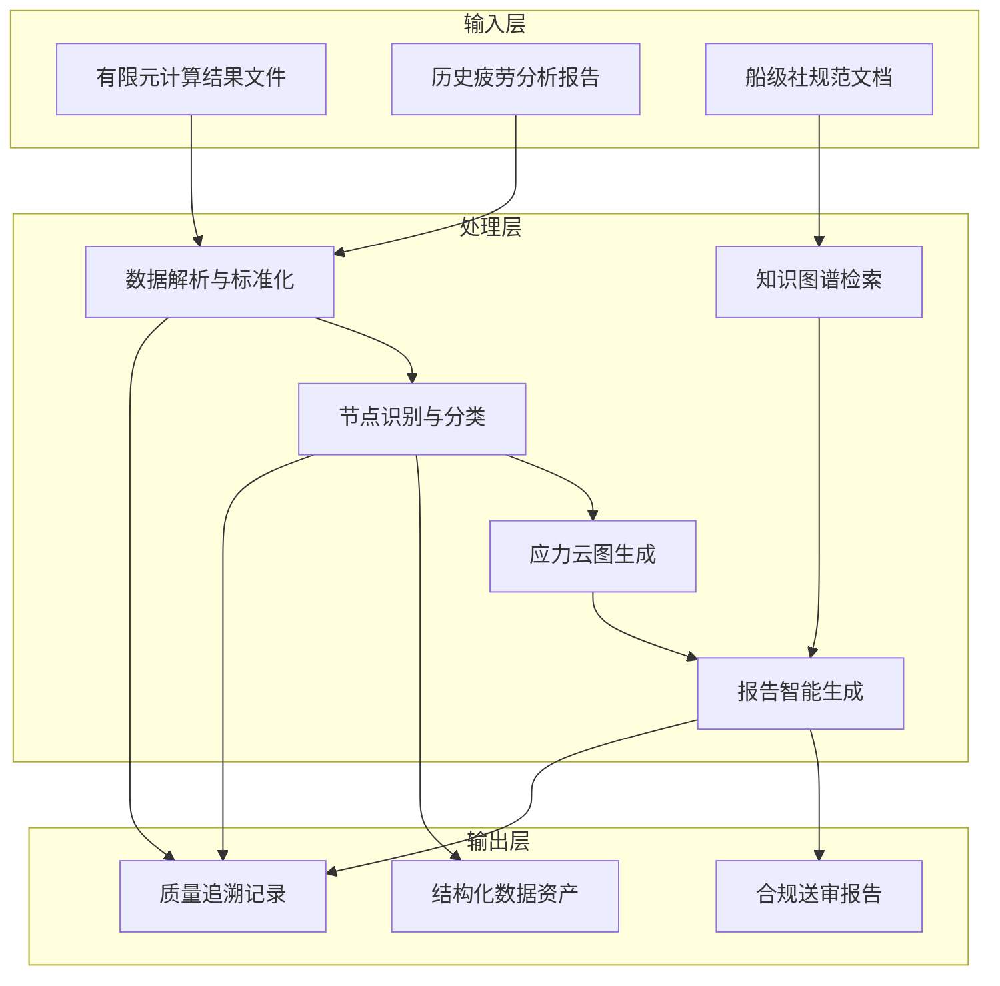
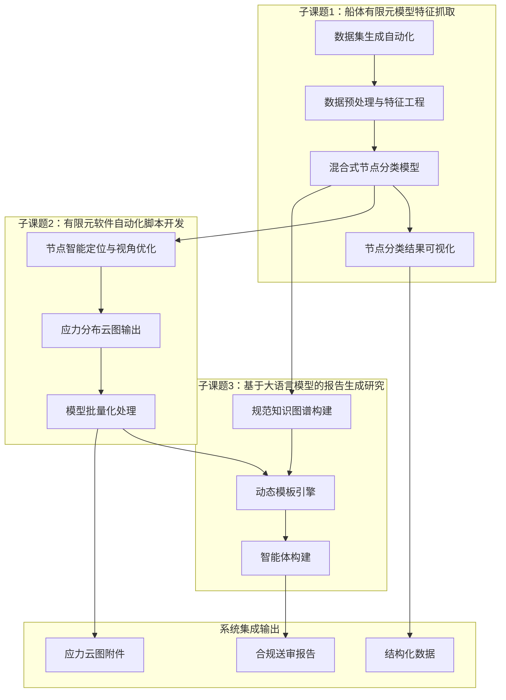
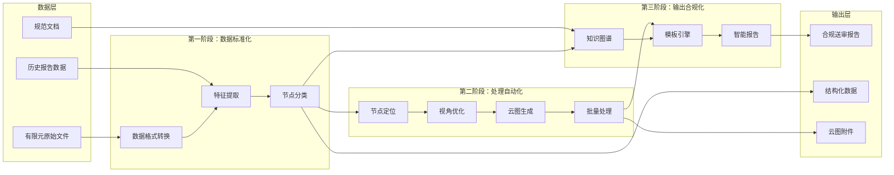
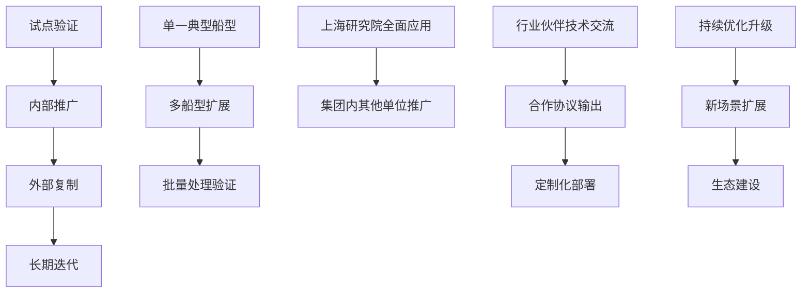
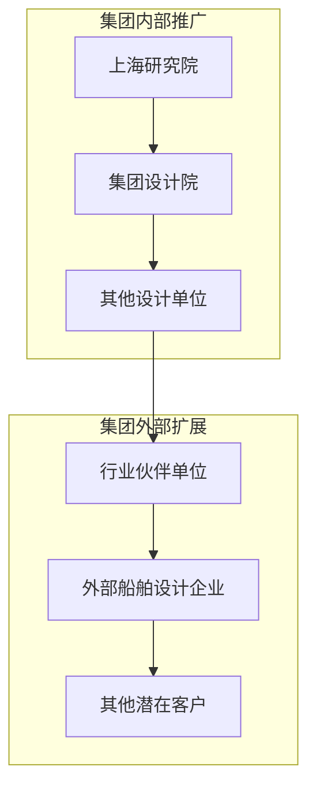
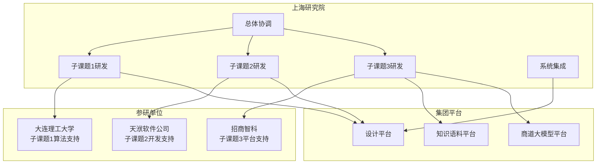
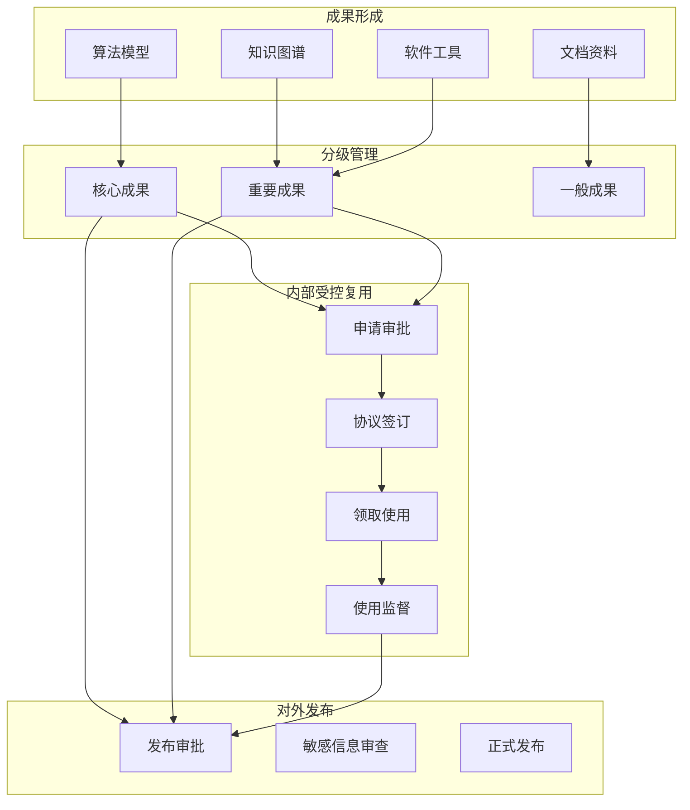
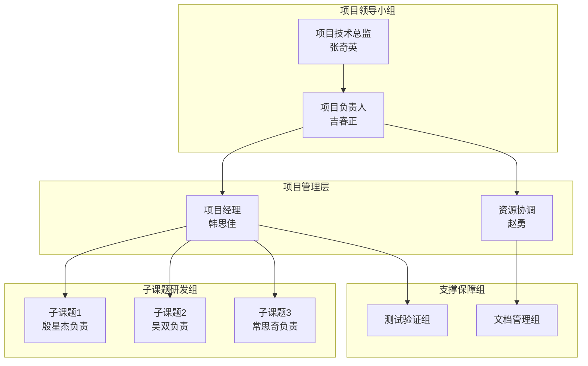

# 一、项目背景及必要性

## （一）建设背景

当前，全球人工智能技术正在经历从单模态分析向多模态融合和智能体协作驱动的深刻转型。以 GPT-4 为代表的生成式大模型和自主智能体技术已成为全球科技竞争的核心战场，多模态大模型已开始进入工业设计、工程分析等高复杂度场景。国务院国资委将"人工智能+"列为 2025 年核心攻坚方向，明确要求中央企业围绕产业链关键环节打造标杆应用场景，推动多模态大模型、强推理技术与实体经济深度融合。

招商局集团作为中央直接管理的国有骨干企业，已将"人工智能+物流"和"人工智能+金融"列为战略升级的核心方向，正在依托"商道"行业大模型技术平台推进智能化场景从单点探索走向规模化、全员化升级。在船舶行业，集团基于"1+3+5+N"智能化建设框架，将安全生产与设备管理列为重点攻坚领域，其中船舶结构疲劳分析被视为航运、港口等核心业务安全管理的生命线，其智能化升级与集团"人工智能+物流"战略目标形成直接呼应。

船舶结构疲劳分析是船舶设计、船级社送审和航运安全管理中的关键环节。传统疲劳分析依赖人工提取有限元模型节点数据、手工分类、手工计算损伤值并人工编写报告，单个疲劳敏感区域约耗时 100 工时，全船累计约 400 至 500 工时，且包含约 30% 的返工修正。人工编写报告容易出现数据误判和转录错误，送审退审原因中大量涉及云图标注不规范或计算结果格式偏差。与此同时，海量点云数据与损伤计算结果没有结构化沉淀，无法有效支撑预测性维护与设计优化。这些现实痛点使得船舶结构疲劳分析的智能化升级成为集团智能化建设进程中亟待突破的关键瓶颈。

面对上述技术瓶颈和业务需求，亟须围绕船舶结构疲劳分析报告自动生成这一核心场景，开展系统研究和技术攻关，通过融合有限元分析技术、机器学习分类技术与大语言模型技术，构建从数据识别到报告生成的全流程自动化能力，实现从单点效率提升向系统性流程再造的战略转型。

项目总体技术架构如图 1-1 所示。

图 1-1 展示了船舶结构疲劳分析报告自动生成系统的整体架构。系统从有限元计算结果、历史报告、规范文档和节点参数等数据资源出发，经由参数化建模引擎和节点分类模型完成特征提取与智能分类，再通过视角优化模块生成标准化应力云图，最后依托知识图谱引擎和动态模板引擎，由大语言模型智能体完成合规报告的自动生成。底层同步实现结构化数据的沉淀与质量追溯体系的建立，形成数据驱动的持续优化闭环。

## （二）建设意义

### 1. 技术层面

在技术层面，本项目旨在突破船舶结构疲劳分析领域的若干核心技术瓶颈，构建具有自主知识产权的端到端自动化解决方案。

当前，船舶结构疲劳分析涉及复杂的有限元建模、节点分类、应力计算和报告编制等多个技术环节，各环节相对独立、缺乏有效衔接，导致整体效率低下。本项目将通过建立参数化建模引擎，实现疲劳节点几何特征和拓扑结构的标准化描述与自动化生成；通过研发混合式节点分类模型，融合监督学习、无监督学习和半监督学习等多种方法，提升节点识别的准确性和泛化能力；通过构建规范知识图谱和动态模板引擎，将行业规范和历史经验转化为可计算、可调用的知识资源；通过大语言模型智能体，实现报告初稿的自动生成和语义级合规校验。

上述技术突破不仅能够显著提升船舶疲劳分析的设计效率和质量水平，还将为中国船舶工业积累一批可复用的核心算法、模型和工具链，形成从数据处理到智能分析的技术体系沉淀，为后续向结构强度评估、工艺仿真等相邻领域扩展奠定坚实基础。

### 2. 产业层面

在产业层面，本项目直接服务于船舶设计、建造和运营维护的数字化升级需求，有望产生显著的效率提升和成本节约效益。

根据项目预期目标，自动化报告生成可使传统人工流程效率提升 70% 以上，每型船的报告编写周期从 500+ 小时压缩到 100 小时以内，人工数据转录错误率从 8% 降低到 1% 以下。这一效率跃升意味着船舶设计企业能够在更短周期内完成更多船型的疲劳分析任务，从而加快新船研发节奏、缩短上市时间，在激烈的国际竞争中赢得先机。

与此同时，效率提升和错误率降低还将有效减少因退审、返工导致的时间损耗和人力浪费，显著降低单位设计成本。项目所沉淀的疲劳节点分类与损伤计算数据还能够形成行业特色数据集，为后续预测性维护、设计优化和机器学习模型训练提供高质量数据资源，产生可持续增值的"数据飞轮"效应，推动船舶工业从传统经验驱动向数据驱动转型。

### 3. 生态层面

在生态层面，本项目依托招商局集团内部丰富的业务场景和资源禀赋，有望构建起政产学研用深度融合的协同创新生态。

从平台生态角度看，项目将深度对接集团知识语料管理平台和"商道"行业大模型平台，通过高质量行业语料的持续积累和垂直领域模型的迭代优化，形成面向船舶行业的专业化智能分析能力，并可向集团内其他业务场景和外部行业伙伴输出能力覆盖。从标准生态角度看，项目实施过程中形成的方法论、算法规范、模板体系和验收标准，有望沉淀为行业认可的团体标准或企业标准，为全行业智能化升级提供可参照的实践范式。从知识生态角度看，船舶疲劳分析领域长期依赖个人经验的局面将因知识图谱和结构化数据资产的建立而得到根本性改变，行业知识的传承和复用将变得更加系统、透明和高效。

## （三）国内外发展现状及前景

### 1. 国内发展现状

在国内市场，生成式人工智能的应用正处于规模化推广的加速阶段。根据行业研究数据，约 55% 的企业正在大规模投资生成式人工智能，34% 的企业处于概念验证阶段，亚太地区相关比例更高达 95%。这一趋势表明，人工智能技术在中国企业端的渗透速度已经走在全球前列，为本项目提供了良好的技术应用土壤和市场认知基础。

从技术演进路径看，国内人工智能发展正呈现两条并行趋势：一方面，通用大模型的参数规模持续扩张，在文本生成、代码编写等通用任务上展现出强大能力；另一方面，垂直领域模型正在快速崛起，越来越多的企业转向高精度、强行业知识的专家模型，以解决通用大模型在企业场景中"通识能力过剩、专业精度不足"的突出问题。船舶结构疲劳分析恰恰属于专业门槛高、精度要求严、数据来源专的垂直领域，与垂直模型的发展方向高度契合。

在船舶行业，国内主要船舶设计院和研究机构已在有限元分析、结构强度校核等领域积累了大量基础数据和工程经验。部分领先企业已开始尝试将人工智能技术引入船舶设计流程，如将图表与经验总结结构化并结合检索增强生成技术后，模型表现在特定任务上已接近或超过普通设计员水平。然而，总体而言，国内船舶行业的人工智能应用仍处于单点探索阶段，尚未形成覆盖全流程的系统性解决方案，特别是在疲劳分析报告自动生成这一细分领域，尚缺乏成熟的技术和产品。

### 2. 国外发展与应用现状

在国际市场，欧美发达国家在工业软件和工程智能化领域长期保持领先地位。以疲劳分析相关软件为例，DNV 的 Nauticus Hull 系统偏向规范校核，能够辅助完成部分结构安全评估工作，但并不覆盖有限元分析的全过程，也无法覆盖全部疲劳校核节点；Siemens 的 Teamcenter 报告模块侧重于制造业通用标准的文档化管理，未能针对船舶规范的具体要求进行定制优化。通用大模型虽然可以辅助编写技术文档，但对工程专业术语的理解存在偏差，且缺乏高质量的工程训练数据作为支撑，导致在专业任务上的表现难以满足实际工程需求。

与此同时，国际船舶行业正加速向数字化、智能化转型，主要船级社和船舶设计公司纷纷加大对智能船舶、智能航运的技术投入，争夺行业标准制定权和话语权。这一竞争态势对中国船舶工业形成了显著的外部压力，迫切需要加快自主创新步伐，构建具有国际竞争力的核心技术能力。

### 3. 痛点分析

经过深入调研和分析，当前船舶结构疲劳分析面临以下主要痛点问题：

**效率瓶颈问题**。传统疲劳分析高度依赖人工操作，单个疲劳敏感区域约需 100 工时，全船累计约 400 至 500 工时，且其中约 30% 的工作量用于返工修正。人工效率的天花板效应严重制约了设计产能的进一步释放，无法满足日益增长的新船研发需求。

**质量稳定性问题**。人工编写报告容易出现数据误判、转录错误和不规范标注，退审现象时有发生。退审原因主要集中在云图标注不规范、计算结果格式偏差等可避免的质量缺陷，根源在于人工操作缺乏统一的质量标准和校验机制。

**数据资产流失问题**。船舶疲劳分析过程中产生的海量点云数据、应力计算结果和损伤评估记录主要以非结构化形式存在，缺乏系统性的数据治理和沉淀机制，无法有效支撑后续的设计优化、预测性维护和机器学习模型训练。

**知识传承困难问题**。船舶疲劳分析高度依赖分析人员的个人经验和专业判断，新入职人员培养周期长，知识传承主要依靠师徒帮带和项目历练，效率低下且风险较高，不利于行业整体技术水平的提升。

**规范合规管理问题**。船舶疲劳分析涉及 DNV、RINA 等多个国际主流船级社的规范要求，不同船级社的规范条款存在差异且持续更新，人工跟踪和准确应用规范的难度较大，合规风险不容忽视。

上述痛点相互交织、彼此强化，形成了制约船舶结构疲劳分析效率和质量提升的系统性障碍，亟须通过技术创新和流程再造加以解决。

### 4. 发展前景

展望未来 3 至 5 年，船舶结构疲劳分析领域将呈现以下发展趋势：

**技术架构向"通用底座+行业插件"演进**。通用大模型将继续发挥其强大的语言理解和生成能力，但针对专业任务的精度提升将更多依赖高质量行业语料、领域知识图谱和专业插件的加持。这一技术路径已在多个垂直领域得到验证，是本项目技术方案的重要参考。

**技术竞争焦点从"拼参数"转向"拼语料"**。随着大模型技术的逐步成熟，参数规模的边际收益递减趋势日益明显，差异化竞争将更多取决于训练语料的质量、覆盖度和更新频率。船舶行业拥有丰富的历史报告、规范文档和技术标准，是构建高质量行业语料库的天然优势资源。

**应用需求从"成本敏感"转向"效果优先"**。企业在引入人工智能技术时，越来越关注模型在专业任务上的精准度和规范合规性，而非单纯追求成本节约。这一趋势有利于本项目所聚焦的高精度、高合规性的专业解决方案。

**数据闭环能力成为核心竞争力**。从数据采集、模型训练、智能分析到结果应用的全流程闭环能力，将成为衡量解决方案价值的关键指标。本项目所构建的端到端自动化工作流程和结构化数据资产体系，高度契合这一发展方向。

## （四）预期解决重大问题

### 1. 重点工作方向一：疲劳敏感节点的参数化建模与训练数据生成能力

船舶结构疲劳分析的首要任务是识别和分类疲劳敏感节点，这些节点的几何参数复杂多样，包括腹板加筋型十字节点、自由边型节点、焊接趾端型节点等多种形态，传统的建模方法依赖人工定义，效率低下且难以覆盖全部变体。

针对这一问题，项目将构建一套完整的疲劳节点参数化建模体系。通过对节点几何特征和拓扑结构进行标准化定义，建立覆盖板厚、角度、圆角半径、加劲肋长度等关键参数的描述框架；通过 CAD 系统或脚本实现自动化建模、特征面划分和统一格式导出；通过数据增强技术扩充训练样本规模。项目目标是通过参数化技术覆盖 95% 以上的节点变体，从根本上解决训练数据不足和质量参差的核心瓶颈。

### 2. 重点工作方向二：复杂网格条件下的节点识别、特征提取与分类精度提升

有限元模型中的疲劳节点分布在复杂网格环境下，节点之间存在遮挡、对称和相似特征干扰，给自动识别和分类带来严峻挑战。传统方法在均匀网格或对称结构下容易出现视角定位不稳定、分类精度下降等问题。

针对这一问题，项目将研发混合式节点分类架构，融合几何特征、拓扑特征和力学特征的统一描述体系，采用"区域初筛+节点精细分类"的分层分类策略，综合运用随机森林、支持向量机、多层感知器、图神经网络以及 K-means、DBSCAN、GraphSAGE、半监督图卷积网络等多种算法，根据数据特点自适应选择最优分类方案。项目目标是将节点分类准确率提升至行业领先水平，为后续应力计算和报告生成奠定基础。

### 3. 重点工作方向三：端到端自动化报告生成与合规保障体系建设

从有限元结果到符合船级社规范要求的送审报告，中间涉及结果解析、应力云图生成、模板填充和语义校验等多个环节，目前各环节之间缺乏有效衔接，自动化程度低，人工介入比重大。

针对这一问题，项目将构建一套完整的端到端自动化报告生成体系：开发有限元结果解析模块，支持 bdf、dat、nas、op2 等主流格式的自动读取和数据提取；研发基于主成分分析的视角优化算法，实现应力云图的最佳视角自动选取和标准化输出；构建融合船舶行业规范和疲劳分析指南的动态知识图谱，提供准确、实时的规范条款引用和合规校验；搭建支持条件分支和动态表格的智能模板引擎，实现报告结构的自适应组装；利用大语言模型自动生成报告初稿，并结合语义修正与单位校验机制保障报告规范性。最终实现从节点分类结果和有限元计算数据到符合船级社规范要求的送审报告的全流程自动化输出。

## （五）对产业链供应链韧性及安全的意义

### 1. 安全风险应对

船舶结构疲劳分析直接关系到船舶结构安全和航行安全，分析结果的准确性和可靠性是保障船舶安全运营的生命线。传统的疲劳分析高度依赖分析人员的个人经验和操作质量，不同人员之间的分析结果可能存在差异，个别环节的疏漏甚至可能酿成安全隐患。

本项目通过构建标准化的参数化建模体系、精准的节点分类模型和严格的合规校验机制，将行业最佳实践固化为可复制、可验证的技术方案，最大限度减少人工判断带来的不确定性，从根本上降低安全风险。同时，结构化的知识图谱和历史数据资产的建立，使得过往积累的安全分析经验和规范理解得以系统化保存和传承，避免因人员流动造成的技术断档，为船舶结构安全分析能力的持续稳定提供保障。

### 2. 协同韧性提升

船舶设计是一项复杂的系统工程，涉及船东、船级社、设计院、船厂等多个主体的高频协同。疲劳分析报告作为设计评审和船级社认证的关键文件，其编制质量和效率直接影响整个协同链条的运转效率。

本项目所构建的端到端自动化报告生成体系，能够实现从有限元数据到合规报告的秒级输出，大幅缩短设计评审周期，加快船东与船级社之间的信息流转速度。标准化的报告格式和自动化的质量校验机制，还能够减少因格式偏差、规范理解差异导致的反复沟通，提升多方协同的顺畅度。项目所形成的数据资产和知识图谱，可通过集团知识语料管理平台向产业链上下游合作伙伴开放共享，进一步提升整个产业生态的协同效率。

### 3. 创新能力增强

当前，中国船舶工业正处于从跟跑向并跑、领跑转型的关键时期，在智能船舶、深海装备、绿色航运等前沿领域加速布局。船舶结构疲劳分析作为连接设计、建造和运维的核心技术环节，其智能化升级将为行业创新能力提升提供重要驱动力。

本项目所积累的高质量训练数据集、经过工程验证的核心算法、以及可复用的端到端解决方案，能够显著降低后续研发项目的技术门槛和实施成本。知识图谱和动态模板引擎的构建，还将为新船型开发、规范版本更新和特殊场景分析提供灵活、高效的技术支撑，使船舶设计单位能够更快速地响应市场变化和技术迭代。更为重要的是，项目所形成的技术架构可复用于结构强度评估、工艺仿真等其他工程场景，具备向更广泛领域扩展的潜力，为中国船舶工业的持续创新提供坚实的技术底座。

# 二、项目单位基本情况

## （一）项目申报主体及牵头单位情况

### 1. 所有制性质和主营业务

本项目由招商局工业科技（上海）有限公司作为项目申报主体和牵头单位。该公司是招商局集团旗下专注于工业科技研发与应用的专业子公司，致力于将人工智能、大数据等新一代信息技术与船舶工业深度融合，驱动传统船舶设计、建造和运维模式的智能化升级。公司主营业务包括：船舶行业智能化解决方案设计与实施、工业软件研发与系统集成、数据资产建设与知识管理服务、技术咨询与培训服务等。

作为招商局集团"人工智能+物流"战略在高端装备领域的承接主体，公司紧密围绕集团船舶工业智能化升级需求，聚焦船舶结构分析、设计优化和工程管理等核心业务场景，开展技术攻关和产品孵化，形成了一批具有自主知识产权的核心技术和产品方案。

### 2. 近三年财务状况或研发投入情况

公司高度重视研发投入，近年来研发投入占营业收入比例持续保持在较高水平，研发资金主要用于人工智能算法研究、工业软件开发和实验平台建设等方向。具体财务数据以公司年度审计报告和正式披露为准。

### 3. 股份构成及主要股东概况

公司为招商局集团全资或控股子公司，股权结构清晰，治理规范。具体股权构成以工商登记信息为准。

### 4. 组织架构及人员情况

公司建立了适应科技创新和产业化需要的组织架构，设有技术研发中心、产品事业部、市场拓展部、项目管理部、综合管理部等职能部门，拥有一支专业化、年轻化的技术和管理人才队伍。人员专业背景涵盖船舶工程、计算机科学、软件工程、人工智能和机械设计等多个学科领域，形成了一定的跨学科协同创新能力。具体人员规模和结构以公司人力资源统计为准。

### 5. 基础设施建设情况

公司在船舶结构分析和工业软件开发方面拥有较为完善的基础设施条件。技术研发平台配备有高性能计算服务器、专业工作站和主流有限元软件授权，能够支持大规模数值模拟和算法训练任务。公司还建设有专门的数据中心，用于存放和管理船舶设计历史数据、规范文档和技术标准，为知识图谱构建和模型训练提供了可靠的数据保障。具体设施清单和算力资源以实际统计为准。

### 6. 行业地位

公司在船舶结构分析智能化领域处于行业前列，是国内最早探索将人工智能技术应用于船舶疲劳分析、结构优化和设计自动化的企业之一。公司深度参与集团"1+3+5+N"智能化建设框架下的多项重点任务，与大连理工大学、招商智科等高校和企业建立了紧密的产学研合作关系，在船舶行业智能化转型中发挥着重要的引领和示范作用。

### 7. 取得成果与社会效益

公司在船舶结构分析领域已积累覆盖客滚船、PCTC 等数十艘船舶的有限元疲劳分析报告，相关历史数据融合了 DNV、RINA 等国际主流船级社规范要求，形成了宝贵的行业数据集。公司自主研发的半自动化报告生成工具已实现自动提取应力云图并插入 Word 报告指定位置，同时自动生成图表编号和交叉引用，在实际项目中得到初步应用验证，为后续全自动化、智能化升级奠定了坚实基础。

公司的技术创新成果不仅服务于集团内部，还通过技术输出和人才培养等方式，带动了船舶行业整体技术水平的提升，促进了产业链上下游企业的协同发展。

## （二）需求提出及应用验证单位情况

本项目的需求提出和应用验证单位为上海研究院。作为招商局集团船舶工业技术的核心研究机构，上海研究院承担着集团船舶工业技术发展规划、技术攻关和成果转化等重要使命，对船舶结构疲劳分析的业务流程、技术难点和升级需求有着深入理解和丰富实践经验。

上海研究院长期深耕船舶结构疲劳分析领域，积累了大量真实船型的有限元分析数据和历史报告，熟悉不同船级社的规范要求和送审标准，了解一线分析人员在实际工作中遇到的核心痛点和效率瓶颈。研究院具备完整的应用验证环境，拥有多种船型的设计数据和项目案例，能够为系统开发提供充分的训练样本和测试场景；具备专业的技术团队，能够对系统输出进行工程级验证和评估；具备完善的项目管理流程，能够组织协调多方资源推进系统验证和迭代优化。

项目全流程验证完毕后，将在研究院内部开展试运行和正式上线，逐步向集团内其他船舶设计单位推广扩展。

## （三）研发承担单位情况

本项目研发工作由上海研究院牵头，联合大连理工大学、天洑软件公司和招商智科共同承担。各研发承担单位在项目中承担职责如下：

**上海研究院**作为项目牵头单位，负责项目整体技术方案设计和统筹管理，主导核心算法研发和系统集成，牵头组织各专题的技术攻关和成果转化。上海研究院在船舶结构疲劳分析领域具有深厚的专业积累和丰富的工程经验，能够为项目提供权威的业务指导和权威的验证场景，是项目成功实施的关键保障。

**大连理工大学**作为参研单位，在数据驱动建模、机器学习和降阶建模等领域拥有较强的研究实力和技术储备，承担项目中机器学习算法研究和模型训练相关任务。高校的理论研究优势与企业的工程实践优势形成互补，有助于提升项目的创新性和可实施性。

**天洑软件公司**作为参研单位，专注于有限元软件二次开发和自动化脚本研发，在工程软件定制化开发和批量处理方面具有丰富经验，承担项目中有限元结果解析、云图生成和批量处理等任务。软件企业的工程化能力有助于将科研成果转化为可推广应用的产品。

**招商智科**作为参研单位，在知识图谱构建、大语言模型应用和智能体开发等方面具备技术积累，承担项目中规范知识图谱构建、动态模板引擎研发和大模型报告生成等任务。集团内部技术团队的参与有助于项目成果与集团现有技术平台的无缝对接。

## （四）项目负责人及主要团队情况

本项目组建了一支专业配置合理、组织架构清晰的核心团队，团队成员在船舶结构分析、人工智能算法研发和系统工程实施等方面具有丰富经验。

项目技术总监张奇英，现任职于上海研究院，长期负责船舶结构分析相关技术的研发管理和项目统筹工作，对行业技术发展趋势和工程项目实施要点有深刻理解，能够为项目提供战略性技术指导。

项目负责人吉春正，现任职于上海研究院，全面负责项目的计划制定、资源协调、进度管控和风险应对等工作，具备丰富的科研项目管理和团队协调经验，能够有效组织多方力量推进项目实施。

项目经理韩思佳，现任职于上海研究院，具体负责项目的日常管理、任务分解、进度跟踪和文档编制等工作，能够保障项目各项任务的高效执行。

内部资源协调赵勇，现任职于上海研究院，负责协调项目所需的计算资源、数据资源、平台资源和人力资源，为项目实施提供充分的后勤保障。

技术顾问刘臣，现任职于招商智科，为项目提供人工智能算法、大语言模型应用等方面的专业技术咨询和技术方案评审，确保项目技术路线的先进性和可行性。

各子课题负责人和主研人员包括：殷星杰、吴双、常思奇分别担任三个子课题的负责人，吴琼、李浩辰、孔令辉、杨孟婕等担任各子课题的主研人员。上述核心团队成员均在船舶结构分析、计算机科学、人工智能等相关领域具有扎实的专业背景和一定的项目积累，能够胜任本项目各专题的研发任务。

**表2-1 项目单位基础情况表**

| 单位名称 | 角色定位 | 主营业务 | 核心能力 |
|----------|----------|----------|----------|
| 招商局工业科技（上海）有限公司 | 申报主体、牵头单位 | 船舶行业智能化解决方案、工业软件研发 | 船舶结构分析、人工智能算法、系统集成 |
| 上海研究院 | 需求提出单位、应用验证单位 | 船舶工业技术研发、成果转化 | 船舶结构疲劳分析、工程验证、项目管理 |
| 大连理工大学 | 参研单位 | 数据驱动建模研究 | 机器学习、降阶建模、智能系统 |
| 天洑软件公司 | 参研单位 | 有限元软件二次开发 | 工程软件定制开发、批量处理 |
| 招商智科 | 参研单位 | 大语言模型应用、知识图谱构建 | 商道平台智能体、知识引擎 |

**表2-2 项目负责人及核心团队情况表**

| 姓名 | 职责 | 单位 | 专业方向 |
|------|------|------|----------|
| 张奇英 | 项目技术总监 | 上海研究院 | 船舶结构分析技术管理 |
| 吉春正 | 项目负责人 | 上海研究院 | 项目统筹管理 |
| 赵勇 | 内部资源协调 | 上海研究院 | 资源协调 |
| 韩思佳 | 项目经理 | 上海研究院 | 项目管理 |
| 刘臣 | 技术顾问 | 招商智科 | 人工智能算法 |
| 殷星杰 | 子课题1负责人 | 上海研究院 | 机器学习节点识别 |
| 吴双 | 子课题2负责人 | 上海研究院 | 有限元自动化脚本 |
| 常思奇 | 子课题3负责人 | 上海研究院 | 大模型报告生成 |
| 吴琼 | 子课题3主研 | 上海研究院 | 知识图谱 |
| 李浩辰 | 子课题2主研 | 上海研究院 | 有限元数据处理 |
| 孔令辉 | 子课题1主研 | 上海研究院 | 特征提取 |
| 杨孟婕 | 子课题1主研 | 上海研究院 | 数据集构建 |

## （五）其他支撑单位或联合体成员情况

除上述主要研发单位外，本项目还得到招商局集团内部相关单位和外部合作伙伴的支持。

集团知识语料管理平台为本项目提供高质量行业语料的存储、管理和检索服务，是项目知识图谱构建和数据资产管理的关键基础设施。集团"商道"行业大模型平台为本项目提供大语言模型的能力调用和智能体开发框架，是项目报告自动生成功能实现的重要技术支撑。

上述支撑单位通过平台对接、资源共享和技术协作等方式，为项目顺利实施提供了有力保障。

# 三、项目团队工作基础

## （一）团队情况

本项目组建了一支跨单位、跨专业的协同创新团队，团队组织架构清晰，人员配置合理，为项目顺利实施提供了可靠的组织保障。

团队采用"项目技术总监+项目负责人+项目经理+子课题负责人+主研人员"的多层级组织模式。项目技术总监张奇英负责项目技术方向把关和重大技术决策；项目负责人吉春正负责项目整体统筹和对外协调；项目经理韩思佳负责项目日常管理和任务推进；内部资源协调赵勇负责保障项目所需的计算资源、数据资源和平台资源。各子课题负责人殷星杰、吴双、常思奇分别主持三个子课题的技术研发和进度管理；主研人员吴琼、李浩辰、孔令辉、杨孟婕等承担各子课题的具体研发任务。

团队成员所在单位涵盖牵头单位上海研究院、参研高校大连理工大学和参研企业天洑软件公司、招商智科，形成了产学研用一体化的协同创新格局。各单位在项目中既相对独立承担各自专题的研发任务，又通过定期技术对接、联合评审和联调测试等方式保持紧密协作，确保项目整体目标的实现。

团队的专业构成包括：船舶结构分析专业人员，负责业务场景理解、需求对接和规范解读；机器学习算法研究人员，负责节点分类模型设计和训练优化；有限元软件工程师，负责数据解析和自动化脚本开发；知识图谱工程师，负责规范知识抽取和图谱构建；大语言模型应用专家，负责智能体设计和报告生成调优；软件测试工程师，负责系统集成测试和验证评估。上述专业配置覆盖了项目所需的主要技术环节，能够保障研发任务的顺利推进。

**表3-1 团队结构与专业分布表**

| 团队类别 | 人数规模 | 专业方向 | 角色定位 | 与本项目关系 |
|----------|----------|----------|----------|--------------|
| 项目管理层 | 4人 | 技术管理、项目管理、资源协调 | 技术决策、日常管理、资源保障 | 统筹协调 |
| 船舶结构分析组 | 3人 | 船舶结构、有限元分析 | 业务指导、需求分析、规范解读 | 场景支撑 |
| 机器学习算法组 | 4人 | 机器学习、深度学习、数据挖掘 | 节点分类模型研发 | 子课题1核心 |
| 有限元软件组 | 2人 | 有限元分析、软件工程 | 数据解析、批量处理开发 | 子课题2核心 |
| 知识图谱组 | 2人 | 知识工程、自然语言处理 | 知识图谱、模板引擎 | 子课题3核心 |
| 大模型应用组 | 2人 | 大语言模型、智能体开发 | 报告生成、智能校验 | 子课题3核心 |
| 测试验证组 | 2人 | 软件测试、质量保障 | 集成测试、性能验证 | 质量保障 |

## （二）团队实力和基础

项目团队在船舶结构疲劳分析、人工智能算法研发和系统工程实施等方面已形成较为扎实的研究基础和工程化能力。

在船舶结构疲劳分析领域，团队核心成员长期从事船舶有限元分析和结构强度评估工作，对船舶结构形式、疲劳机理和船级社规范要求有深入理解。上海研究院已积累覆盖客滚船、PCTC 等数十艘船舶的有限元疲劳分析报告，历史数据融合了 DNV、RINA 等国际主流船级社规范要求，涵盖关键节点几何参数、网格模型、应力计算结果以及不同船级社的疲劳评估条款等丰富信息。这些历史数据为本项目的机器学习模型训练和验证提供了不可替代的高质量样本资源，是项目实施的重要基础。

在算法研究方面，大连理工大学团队在数据驱动建模、机器学习和降阶建模领域有深厚的学术积累。团队主持国家自然科学基金项目"不完全可观测下俯仰翼型流体动力学系统的降阶建模研究"，承担交通部水运科学研究院项目"船舶运动响应智能评估与高精度预报方法研究"，围绕数据驱动流体建模、降维识别等方向发表学术论文二十余篇，形成了系统的理论方法和算法工具。

在系统集成方面，天洑软件公司在有限元软件二次开发和工程自动化方面有丰富的项目经验，能够将算法研究成果转化为可推广应用的产品工具，具备将科研原型转化为工程系统的能力。

在知识智能化方面，招商智科在知识图谱构建和大语言模型应用方面有技术积累，能够为项目的规范知识管理和报告自动生成提供技术支撑。

## （三）软硬件支撑条件

项目团队具备较为完善的软硬件支撑条件，能够满足系统研发和验证测试的需要。

在硬件环境方面，团队可调用高性能计算服务器和专业工作站，配备主流有限元软件授权和 GPU 计算资源，能够支持大规模数值模拟和深度学习模型训练任务。数据中心具备足够的存储容量和可靠的数据备份机制，能够安全管理船舶设计历史数据、规范文档和技术标准等核心资产。

在软件平台方面，团队具备以下主要软件工具和技术平台：Nastran 等主流有限元分析软件，用于有限元数据的读取和处理；Python 编程环境和主流机器学习框架，用于算法研发和模型训练；bdf、dat、nas、op2 等有限元结果文件格式的解析工具，用于数据标准化处理；CAD 系统或自编中间件，用于参数化建模和网格处理；HyperMesh、Ansa 等前后处理软件，用于网格质量诊断和可视化；基于 Python 脚本与 Word 的半自动化报告生成工具，用于现有流程衔接和功能参考。

在平台资源方面，项目可依托集团知识语料管理平台进行行业知识的采集、治理和检索调用；可对接"商道"平台的大语言模型能力，实现报告初稿生成和语义校验功能。

上述软硬件条件为本项目的算法研究、系统开发和集成验证提供了较为完整的支撑环境。对于部分仍在建设或需外部协同提供的条件，项目团队将积极争取资源支持，确保不影响项目总体进度。

## （四）以往业绩及承担相关项目情况

项目团队成员在相关领域积累了丰富的以往业绩，形成了较强的科研和工程实施能力。

大连理工大学张桂勇团队作为子课题1的重要参研力量，在数据驱动建模和智能系统开发方面取得了一系列代表性成果。团队主持的国家自然科学基金项目"不完全可观测下俯仰翼型流体动力学系统的降阶建模研究"，针对复杂流体系统的降阶建模问题，提出了创新的数据驱动方法，有效提升了模型的计算效率和预测精度。团队承担的交通部水运科学研究院项目"船舶运动响应智能评估与高精度预报方法研究"，面向船舶运动特性评估和航态预测需求，开发了基于机器学习的智能评估方法，为本项目的节点分类和特征提取提供了方法论参考。

该团队还开发过集成图像识别、雷达数据分析与机器学习技术的极地海冰信息处理与统计建模软件，以及数据驱动的环境-路径耦合感知与导航系统，具备实时路径规划与自主避障能力。上述成果展示了团队在多源数据融合、智能感知和自主决策等交叉领域的综合研发实力。

上海研究院团队在船舶结构疲劳分析领域深耕多年，积累了覆盖多种船型的大量有限元疲劳分析报告和工程实践经验。团队已开发的半自动化报告生成工具，实现了应力云图的自动提取、Word 报告指定位置的自动插入，以及图表编号和交叉引用的自动生成，在实际项目中得到初步应用验证。该工具的成功开发证明团队具备将人工智能技术应用于船舶工程问题解决的能力和经验，为本项目全自动化、智能化升级奠定了重要基础。

**表3-2 既有项目与本项目关联表**

| 既有项目/成果名称 | 完成时间 | 承担角色 | 形成能力 | 对本项目的支撑关系 |
|-------------------|----------|----------|----------|---------------------|
| 国家自然科学基金项目：不完全可观测下降阶建模研究 | 进行中 | 主持 | 数据驱动建模方法 | 节点分类算法参考 |
| 交通部水运科学研究院项目：船舶运动响应智能评估 | 进行中 | 主持 | 机器学习评估方法 | 特征提取方法参考 |
| 极地海冰信息处理与统计建模软件 | 已完成 | 主持 | 图像识别与雷达数据分析 | 多源数据融合参考 |
| 环境-路径耦合感知与导航系统 | 已完成 | 主持 | 实时路径规划与避障 | 系统集成经验 |
| 半自动化报告生成工具 | 已完成 | 主持 | 应力云图提取与报告自动生成 | 现有工具基础 |

## （五）专业人员资质能力情况

项目核心人员具备扎实的专业背景和与本项目任务高度匹配的技术能力。

在船舶结构分析领域，张奇英、吉春正等技术骨干长期从事船舶有限元分析和结构强度评估工作，对船舶结构形式、疲劳损伤机理、有限元分析方法有深入的理论基础和丰富的实践经验，熟悉 DNV、RINA 等国际主流船级社的规范要求，能够为项目提供权威的业务指导和技术把关。

在机器学习算法领域，大连理工大学团队在数据驱动建模、深度学习和图神经网络等方向有系统的学术积累，掌握从数据预处理、特征工程到模型训练、性能优化的全流程技术，能够为项目的节点分类算法研发提供理论指导和技术方案。

在有限元软件工程领域，上海研究院和天洑软件公司的工程师熟悉主流有限元软件的数据格式和处理流程，具备有限元软件二次开发和批量处理脚本编写的能力，能够完成有限元结果解析和云图生成等功能开发。

在知识图谱和大语言模型应用领域，招商智科团队掌握知识抽取、知识融合和知识推理的技术方法，熟悉大语言模型的微调和智能体开发框架，能够为项目的规范知识图谱构建和报告自动生成提供技术支撑。

项目团队的专业配置覆盖了船舶工程、计算机科学、人工智能、软件工程等多个学科领域，团队成员之间已建立良好的协作默契和工作流程，具备承担本项目研发任务的资质和能力基础。对于部分人员的学历、职称和执业资格等详细信息，以公司人力资源档案为准。

# 四、项目建设方案

## （一）总体目标

### 1. 建设目标

本项目旨在开发一套船体结构疲劳分析报告自动生成系统，通过深度融合有限元分析技术、机器学习分类技术与大语言模型技术，构建从有限元计算结果提取到符合船级社规范要求的送审报告生成的端到端自动化工作流程，实现船舶结构疲劳分析从数据识别、节点分类、云图生成到报告编制的全流程智能化，显著提升分析效率和质量水平，为船舶设计数字化转型提供核心技术支撑。

**项目定位与建设对象**。本项目的核心建设对象为船体结构疲劳分析报告自动生成系统及其所依赖的算法模型、知识图谱和软件工具集。系统以有限元软件计算结果和历史报告数据为输入，以符合船级社规范要求的送审疲劳分析报告为输出，覆盖从数据解析、节点分类、应力计算到报告生成的全业务流程。系统建成后将在招商局集团内部率先应用，并逐步向其他船舶设计单位和行业伙伴推广。

**目标能力边界**。在功能边界方面，系统应实现以下核心能力：自动解析 Nastran 等主流有限元软件的结果文件并提取关键数据；自动识别和分类疲劳敏感节点，分类准确率应满足工程应用要求；自动生成标准化的应力分布云图，支持批量处理；自动构建船舶疲劳分析领域知识图谱，支持规范条款的智能检索和合规校验；自动生成符合船级社格式要求的送审报告，支持 Word 和 PDF 格式输出。在性能边界方面，单个疲劳敏感区域的报告生成时间应显著短于传统人工方式，系统整体处理效率应达到工程可接受水平。

**应用验证场景**。系统的验证场景包括：基于上海研究院积累的客滚船、PCTC 等多种船型的历史数据进行模型训练和离线测试；在项目验证阶段，选取 1 至 2 个典型船型开展全流程集成验证；在项目试运行阶段，在实际船舶设计项目中进行生产环境验证；在项目正式上线后，逐步扩展至更多船型和更多设计场景。

**量化指标与预期水平**。根据项目可行性论证，预期达到以下量化指标：每型船的报告编写周期从 500+ 小时压缩到 100 小时以内，效率提升 70% 以上；人工数据转录错误率从 8% 降低到 1% 以下；节点分类准确率达到行业领先水平；报告合规性校验通过率显著提升。具体指标以项目实际验证结果为准。

项目建设总体目标概念如图 4-1 所示。

图 4-1 展示了项目从多源异构输入出发，经由数据解析、节点分类、云图生成和报告生成等核心处理环节，最终输出合规报告、结构化数据和质量追溯记录的完整链路，体现了端到端自动化的建设目标。

### 2. 项目解决的主要问题

本项目针对船舶结构疲劳分析报告自动生成过程中的关键技术瓶颈和管理痛点，围绕四个重点工作方向系统布局、逐个突破。

#### （1）问题一：疲劳敏感节点的参数化建模和训练数据生成能力不足

**问题表现**。船体结构疲劳敏感节点的几何参数复杂多样，包括腹板加筋型十字节点、自由边型节点、焊接趾端型节点等多种形态，每种形态在板厚、角度、圆角半径、加劲肋长度等维度上又存在大量变体。传统建模方法依赖人工逐个定义，效率低下，且难以穷尽所有可能的几何变体。

**原因分析**。参数化建模涉及节点几何特征和拓扑结构的标准化定义，需要建立一套覆盖多种节点类型、兼容多种参数组合的描述体系，技术难度较大。同时，参数化建模所需的训练样本数量庞大，人工标注成本高昂，导致现有数据规模难以支撑高精度模型的训练。

**不解决的影响**。如果参数化建模问题得不到解决，节点分类模型将缺乏足够规模和多样性的训练样本，分类精度无法保障，进而影响后续应力计算和报告生成的准确性。同时，人工建模的高成本将限制系统对新船型的适应能力，难以满足实际工程应用的需求。

**本项目切入方向**。项目将建立疲劳节点参数化定义框架，通过 CAD 系统或脚本实现自动化建模、特征面划分和统一格式导出，大幅提升训练数据生成效率。同时，通过数据增强技术扩充样本规模，建立结构化特征规则库，确保模型能够覆盖 95% 以上的节点变体。

#### （2）问题二：复杂网格条件下的节点识别、特征提取与分类精度不足

**问题表现**。有限元模型中的疲劳节点分布在复杂网格环境下，存在节点遮挡、结构对称、特征相似等干扰因素。现有方法在均匀网格或对称结构下容易出现主成分方向不唯一、视角定位不稳定等问题，导致节点识别错误率较高。

**原因分析**。复杂网格环境下节点的视觉特征和几何特征存在多样性，单纯依靠传统图像处理或几何分析方法难以准确区分不同类型的节点。多模态特征的融合机制尚不完善，监督学习、无监督学习和半监督学习的协同效率有待提升，标签传播过程中可能引入噪声样本。

**不解决的影响**。节点分类是整个自动化流程的核心环节，分类错误将直接导致后续应力计算和报告生成的结果偏差。分类精度不足将限制系统的工程适用性，无法满足船级社送审的质量要求。

**本项目切入方向**。项目将构建几何特征、拓扑特征和力学特征统一描述体系，采用"区域初筛+节点精细分类"的分层分类架构，融合随机森林、支持向量机、多层感知器、图神经网络以及 K-means、DBSCAN、GraphSAGE、半监督图卷积网络等多种算法，根据数据特点自适应选择最优分类方案。同时，采用加权主成分分析方法解决对称结构下的视角定位问题，确保分类结果的稳定性和准确性。

#### （3）问题三：有限元结果到应力云图之间缺少自动化中间链路

**问题表现**。从有限元软件计算结果到符合规范要求的应力分布云图，目前主要依赖人工操作完成，包括目标单元定位、最佳视角选取、云图渲染设置、图像导出等多个步骤，流程繁琐、效率低下。

**原因分析**。不同有限元软件的数据格式存在差异，op2 等结果文件的解析需要专业的技术背景；最佳视角的确定涉及复杂的人机交互判断，自动化实现难度较大；批量处理场景下的云图生成缺乏成熟工具支撑。

**不解决的影响**。应力云图是船级社送审报告的核心附件，其生成效率直接影响报告编制的整体进度。缺乏自动化中间链路将导致整个系统无法实现端到端贯通，成为制约效率提升的瓶颈环节。

**本项目切入方向**。项目将开发支持 bdf、dat、nas、op2 等多源异构数据格式的统一解析模块，建立 KD-Tree 或 Octree 空间索引实现节点查重与合并；研发基于主成分分析的视角优化算法，自动计算最优观察视角并自适应调整视距；开发批量处理脚本，实现从目标节点定位到云图输出的全自动化。

#### （4）问题四：面向规范合规的动态模板、知识图谱与报告智能生成体系尚未建成

**问题表现**。不同船级社的规范要求存在差异，同一船级社的不同规范版本之间也有更新变化，传统静态模板难以适应这种复杂性。同时，行业规范、历史报告和设计经验主要以非结构化形式存在，缺乏有效的知识管理和复用机制。

**原因分析**。船舶疲劳分析涉及 DNV、RINA 等多个国际主流船级社的规范条款，规范内容更新频繁且专业性强，维护成本高。知识图谱构建需要解决知识抽取、实体对齐和关系推理等多项技术挑战。大语言模型生成的报告初稿可能存在专业术语错误、单位偏差和格式不规范等问题，需要建立有效的校验和修正机制。

**不解决的影响**。报告是船级社送审的核心文件，合规性是基本要求。缺乏动态模板和知识图谱支撑的报告生成系统，将无法保证输出的报告符合规范要求，可能导致退审和返工，抵消效率提升的收益。

**本项目切入方向**。项目将构建融合船舶行业规范、疲劳分析指南和历史报告的结构化知识图谱，建立规则引擎和数值校验机制；设计支持目录索引、条件分支和动态表格的结构化模板；利用大语言模型自动生成报告初稿，通过语义修正与单位校验保障规范性；最终实现从结构化数据、应力云图到合规报告的全自动生成。

### 3. 项目研发内容

#### （1）总体说明

本项目围绕船体结构疲劳分析报告自动生成这一核心目标，按照"数据层-算法层-服务层-输出层"的技术架构体系，将研发内容划分为三个子课题，分别聚焦节点分类与数据处理、有限元自动化输出和知识图谱与报告生成三个关键环节。各子课题既相对独立又相互衔接，共同构成端到端自动化的完整技术链条。

项目主要建设任务分解如图 4-2 所示。

图 4-2 展示了三个子课题之间的任务分解与依赖关系。子课题1为整个系统提供节点识别和分类能力，其输出同时支撑子课题2的节点定位和子课题3的知识图谱检索；子课题2完成有限元结果的自动化处理和云图输出，为子课题3的报告生成提供图像附件；子课题3整合结构化数据和应力云图，通过知识图谱和智能模板最终生成合规报告。

#### （2）子课题一：基于机器学习算法的船体有限元模型特征抓取

**① 子课题1.1 数据集生成的自动化方法**

本子课题的首要任务是建立疲劳节点参数化建模体系，实现训练数据的自动化、规模化生成。研究内容包括：识别腹板加筋型十字节点、自由边型节点、焊接趾端型节点等三类常见疲劳敏感节点，进行参数化定义，覆盖板厚、角度、圆角半径、加劲肋长度等参数和拓扑约束；通过 CAD 系统或脚本实现自动化建模、特征面划分、自动网格划分和统一格式导出；建立结构化特征规则库，支撑参数化建模方法的自动化执行；通过数据增强技术扩充样本规模，确保训练数据集的多样性和代表性。

预期输出：疲劳节点参数化建模方法文档和软件工具；覆盖多种节点类型的训练数据集。

**② 子课题1.2 数据预处理与特征工程**

为支撑后续节点分类算法的高效运行，需要建立统一的数据预处理和特征提取体系。研究内容包括：开发支持 bdf、dat、nas 等多源异构数据格式的统一转换模块；建立 KD-Tree 或 Octree 空间索引，实现节点查重与合并；开展网格质量诊断，提取几何特征、拓扑特征、力学特征等多维特征；构建特征描述体系，为后续分类模型提供统一输入。

预期输出：数据预处理工具集；多维特征描述体系文档。

**③ 子课题1.3 混合式节点分类模型**

本子课题是节点识别能力的核心，直接决定系统的整体分类精度。研究内容包括：构建几何特征、拓扑特征、力学特征统一描述体系；设计"区域初筛+节点精细分类"的分层分类架构；综合运用随机森林、支持向量机、多层感知器、图神经网络等监督学习方法；融合 K-means、DBSCAN、GraphSAGE、半监督图卷积网络等无监督和半监督学习方法；根据数据特点自适应选择最优分类方案；以历史疲劳分析报告标注数据为基础开展模型训练和验证。

预期输出：混合式节点分类算法模型；模型训练和验证报告。

**④ 子课题1.4 节点分类结果可视化**

为便于人工复核和结果展示，需要将分类结果以直观方式呈现。研究内容包括：将分类结果映射回三维网格模型；实现不同类型节点的颜色高亮显示；支持节点 ID、单元 ID、分类标签等信息的叠加展示；提供交互式查看工具，支撑人工校验和结果确认。

预期输出：节点分类可视化软件工具。

#### （3）子课题二：有限元软件的自动化脚本开发

**① 子课题2.1 节点智能定位与视角优化**

基于子课题1提供的节点分类结果，本子课题实现目标单元的自动定位和最优视角计算。研究内容包括：根据节点分类模型返回的节点信息，在有限元模型中自动定位目标单元；通过主成分分析计算最优观察视角；对包围盒对角线长度进行自适应分析，确定最佳视距；处理均匀网格或对称结构下主成分方向不唯一的问题，采用加权主成分分析方法解决视角跳变。

预期输出：节点智能定位与视角优化算法模块；算法测试验证报告。

**② 子课题2.2 应力分布云图输出**

实现从有限元结果数据到标准化应力分布云图的自动化生成。研究内容包括：解析 op2 文件并读取应力计算数据；自动确定色彩映射范围和渲染参数；生成主应力分布云图并保存为图像文件；确保云图格式和分辨率满足送审要求。

预期输出：应力云图生成软件模块；云图质量验证报告。

**③ 子课题2.3 模型批量化处理**

为提升处理效率，需要建立面向多模型、多节点的批量处理能力。研究内容包括：设计批量处理工作流程，支持多节点任务的自动排队和调度；实现目标节点自动定位、视角自动优化、应力云图自动生成的全链路贯通；提供批量处理结果汇总和报告导出功能。

预期输出：批量处理脚本工具集；批量处理能力验证报告。

#### （4）子课题三：基于大语言模型的报告生成研究

**① 子课题3.1 规范知识图谱构建**

建立船舶疲劳分析领域的结构化知识库，为报告生成提供规范支撑。研究内容包括：对船舶行业规范、疲劳分析指南和历史报告进行多模态解析、语义分割和标签化；通过规则引擎和数值校验机制保障规范合规性；建立规范条款与报告各章节的映射关系；构建面向查询的检索增强能力。

预期输出：船舶疲劳分析领域知识图谱；知识图谱构建方法文档。

**② 子课题3.2 动态模板引擎**

设计支持灵活定制的报告模板系统，适配不同船型和船级社的要求。研究内容包括：设计支持目录索引、条件分支和动态表格的结构化模板；建立模板变量与系统输出数据的绑定机制；实现分析结果、应力云图等素材到模板占位位置的自适应填充；支持模板版本管理和多规范适配。

预期输出：动态模板引擎软件模块；模板设计规范文档。

**③ 子课题3.3 智能体构建**

利用大语言模型实现报告初稿的自动生成和质量校验。研究内容包括：设计面向疲劳分析报告场景的智能体架构；利用大语言模型自动生成报告初稿；通过语义修正机制保障报告文字规范性；通过单位校验机制保障数据准确性；支持 Word、PDF 格式输出，实现图表插入、编号和交叉引用的自动化。

预期输出：报告生成智能体；系统集成测试报告。

### 4. 预期成果

#### （1）系统/平台成果

本项目预期形成以下系统和平台成果：

船体结构疲劳分析报告自动生成系统是项目的核心交付物，该系统集成数据解析、节点分类、云图生成、知识图谱检索和报告生成等全部功能模块，实现从有限元计算结果到合规送审报告的端到端自动化输出。系统支持 bdf、dat、nas、op2 等主流有限元数据格式的自动解析，支持腹板加筋型十字节点、自由边型节点、焊接趾端型节点等多种疲劳敏感节点类型的自动识别和分类，支持 DNV、RINA 等国际主流船级社规范要求的合规报告自动生成。系统预留标准接口，支持与船舶设计单位现有设计平台和档案管理系统对接。

疲劳节点参数化建模平台作为系统的重要支撑模块，实现疲劳节点几何特征和拓扑结构的标准化定义与自动化建模，支持多种节点类型的参数化描述和批量生成，为节点分类模型训练提供高质量数据支撑。

船舶疲劳分析知识图谱作为系统的知识基础设施，收录船舶行业规范、疲劳分析指南和历史报告等结构化和非结构化知识，支持规范条款的语义检索、合规校验和智能问答，为报告生成提供权威的知识支撑。

#### （2）数据与算法成果

本项目预期形成以下数据和算法成果：

疲劳节点分类数据集收录覆盖多种船型、多种节点类型的有限元模型数据和标注数据，用于节点分类模型的训练和验证，数据规模和质量满足工程应用要求。

多维特征描述体系建立统一的特征定义框架，涵盖几何特征、拓扑特征和力学特征等多维度信息，为节点分类算法提供标准化输入。

混合式节点分类算法融合监督学习、无监督学习和半监督学习等多种方法，形成一套完整的节点分类解决方案，分类精度满足船舶工程应用要求。

批量处理脚本工具集实现有限元数据解析、节点定位、视角优化和云图生成的批量自动化处理，显著提升工程处理效率。

**表4-1 主要报告类成果分布表**

| 序号 | 报告类成果名称 | 对应子课题 | 主要内容 |
|------|----------------|------------|----------|
| 1 | 项目技术方案 | 子课题1 | 节点分类算法设计与验证方案 |
| 2 | 数据预处理规范 | 子课题1 | 数据格式转换与特征提取规范 |
| 3 | 有限元自动化处理技术报告 | 子课题2 | 节点定位与云图生成技术方案 |
| 4 | 知识图谱构建技术报告 | 子课题3 | 规范知识抽取与图谱构建方案 |
| 5 | 报告生成智能体技术报告 | 子课题3 | 大模型报告生成与校验方案 |
| 6 | 系统测试报告 | 集成 | 全流程集成测试与验证报告 |

**表4-2 交付专利及软著成果分布表**

| 序号 | 成果类型 | 成果名称 | 申请/登记计划 |
|------|----------|----------|---------------|
| 1 | 发明专利 | 一种基于混合学习的船舶疲劳节点分类方法 | 申请中 |
| 2 | 发明专利 | 一种有限元结果应力云图自动生成方法 | 申请中 |
| 3 | 软件著作权 | 船体结构疲劳分析报告自动生成系统 | 登记中 |
| 4 | 软件著作权 | 疲劳节点参数化建模工具软件 | 登记中 |
| 5 | 软件著作权 | 船舶疲劳分析知识图谱检索系统 | 登记中 |

**表4-3 交付标准成果分布表**

| 序号 | 标准类型 | 标准名称 | 适用范围 |
|------|----------|----------|----------|
| 1 | 企业标准 | 船舶疲劳节点分类数据格式规范 | 集团内部 |
| 2 | 企业标准 | 船体结构疲劳分析报告格式规范 | 集团内部 |
| 3 | 企业标准 | 有限元结果数据预处理操作规程 | 集团内部 |

#### （3）标准规范与知识产权成果

本项目实施过程中形成的技术方法和操作规范，将以企业标准的形式固化沉淀，主要包括：船舶疲劳节点分类数据格式规范，定义有限元模型数据的标准化描述和交换格式；船体结构疲劳分析报告格式规范，规定送审报告的内容结构、格式要求和质量标准；有限元结果数据预处理操作规程，规范数据解析、特征提取和质量诊断的操作流程。

项目执行过程中产生的知识产权归项目联合体共同所有，具体权益分配按合作协议执行。项目产生的专利和软件著作权由联合体成员按贡献比例共同享有申请权和登记权。

**表4-4 联合体成员成果指标分配表**

| 成果类型 | 上海研究院 | 大连理工大学 | 天洑软件公司 | 招商智科 |
|----------|------------|--------------|--------------|----------|
| 系统平台 | 牵头研发 | 参与验证 | 参与开发 | 参与开发 |
| 算法模型 | 牵头研发 | 核心研发 | — | — |
| 知识图谱 | 参与建设 | — | — | 牵头建设 |
| 专利软著 | 共同享有 | 共同享有 | 共同享有 | 共同享有 |
| 企业标准 | 牵头制定 | 参与制定 | 参与制定 | 参与制定 |

#### （4）预期成效

本项目预期取得以下显著成效：

**效率大幅提升**。每型船的报告编写周期从 500+ 小时压缩到 100 小时以内，效率提升 70% 以上，显著缩短船舶设计周期，加快新船研发节奏。

**质量显著改善**。人工数据转录错误率从 8% 降低到 1% 以下，减少因格式偏差和标注不规范导致的退审和返工，提升报告一次性通过率。

**资产有效沉淀**。将传统以非结构化形式存在的海量点云数据、应力计算结果和损伤评估记录转化为结构化数据资产，为后续设计优化、预测性维护和机器学习模型训练提供高质量数据基础。

**能力可复扩展**。形成的技术架构可复用于结构强度评估、工艺仿真等其他工程场景，具备向更广泛领域扩展的潜力。

### 5. 产业链供应链韧性及安全保障

#### （1）关键能力自主可控

本项目聚焦船舶结构疲劳分析这一关键工程环节，致力于构建具有自主知识产权的核心技术能力，减少对外部商业软件和国外技术的依赖。

在算法层面，项目的混合式节点分类算法、应力云图生成算法和报告生成智能体均为自主研发，核心技术掌握在项目联合体手中。在数据层面，项目的训练数据集和知识图谱基于国内船舶设计单位的历史数据和规范文档构建，数据来源自主可控。在平台层面，项目依托招商局集团内部的知识语料管理平台和"商道"大模型平台进行建设，基础平台自主运营。

上述布局使得项目的关键能力不依赖外部单一供应商，即使在外部环境发生变化的情况下，仍能保障系统的持续迭代升级和稳定运行。

#### （2）关键数据资产沉淀

船舶结构疲劳分析涉及大量敏感的设计数据和规范信息，这些数据是船舶设计单位的核心资产。本项目在实施过程中，将通过规范化治理和结构化沉淀，将这些数据资产纳入集团知识语料管理平台统一管理。

项目实施后，疲劳节点分类数据、有限元计算结果、应力分析数据和报告输出数据将以结构化形式持久化存储，形成可追溯、可复用、可扩展的行业数据集。这些数据资产的积累将显著增强船舶设计单位的数据治理能力和知识管理水平，为后续智能化应用提供坚实的数据基础。

同时，项目将建立严格的数据安全管理机制，对敏感数据进行分级分类管理，实施访问控制和审计追踪，防止数据泄露和滥用，确保数据资产安全。

#### （3）平台安全与协同韧性

本项目所构建的系统作为船舶设计数字化平台的重要组成部分，其安全性直接关系到船舶设计业务的稳定运行。

在系统架构层面，项目采用模块化设计，各功能模块之间通过标准接口通信，便于问题定位和故障隔离。关键处理环节设置校验和容错机制，提升系统整体可靠性。

在平台集成层面，项目通过标准接口与集团知识语料管理平台和"商道"大模型平台对接，实现能力复用和资源整合。平台层面的安全防护措施，包括用户身份认证、访问权限控制、操作日志审计等，均由集团统一管理和保障。

在协同韧性层面，项目建立多方协作机制，牵头单位与参研单位之间通过定期技术对接、联合评审和联调测试保持紧密沟通。项目实施过程中遇到的技术难点和管理问题能够及时发现、快速响应和有效解决，确保协同链条的稳定运转。

## （二）项目建设方案

### 1. 技术路线

#### （1）总体路线说明

本项目技术路线遵循"数据标准化->特征智能化->处理自动化->输出合规化"的整体逻辑，按照三阶段推进实施：

第一阶段聚焦基于机器学习的特征识别与抓取模型研究，完成数据集生成自动化、数据预处理与特征工程、混合式节点分类模型构建和节点分类结果可视化，实现从原始有限元数据到智能分类结果的能力突破。

第二阶段聚焦基于软件二次开发的自动化图像输出方法研究，完成节点智能定位与视角优化、应力分布云图输出和模型批量处理，打通从分类结果到标准化云图附件的自动化链路。

第三阶段聚焦基于商道大模型智能体搭建和微调的报告生成研究，完成规范知识图谱构建、动态模板引擎开发和智能体构建，实现从结构化数据到合规送审报告的端到端贯通。

三阶段技术路线相互衔接、层层递进，最终形成完整的端到端自动化工作流程。

项目整体技术路线如图 4-5 所示。

图 4-5 展示了项目从数据输入到合规输出的完整技术路线。第一阶段完成数据的标准化处理和智能分类；第二阶段基于分类结果完成节点定位、视角优化和云图生成的自动化处理；第三阶段整合结构化数据和知识图谱，通过模板引擎和智能体完成报告生成。三阶段路线在数据流上相互衔接，最终输出合规报告、结构化数据和云图附件三类成果。

#### （2）技术架构

项目技术架构分为数据层、处理层、服务层和输出层四个层次，各层职责明确、接口清晰。

数据层负责接收和解析来自不同来源的输入数据。有限元原始文件经由数据格式转换模块统一处理，转换为标准化中间格式；历史报告数据经清洗和结构化处理后入库管理；船级社规范文档经知识抽取后存入知识图谱。

处理层负责核心算法的执行和数据的智能处理。特征提取模块对标准化有限元数据进行多维特征计算；节点分类模块基于混合式算法实现疲劳敏感节点的智能识别；节点定位模块根据分类结果在有限元模型中精确定位目标单元；视角优化模块计算最佳观察方向和距离；云图生成模块基于有限元结果数据渲染应力分布图像。

服务层负责业务逻辑的处理和知识的调用。知识图谱服务提供规范条款的检索、合规校验和智能问答；模板引擎服务实现报告结构的组装和内容的填充；智能体服务调用大语言模型完成报告初稿生成和语义修正。

输出层负责最终成果的封装和交付。报告生成模块将结构化数据、应力云图和模板填充内容整合为完整的送审报告；数据归档模块将处理过程数据和质量追溯记录持久化存储；结果展示模块提供分类结果和云图的可视化呈现。

#### （3）数据流与业务流

项目的数据流和业务流遵循"输入->处理->输出->归档"的闭环逻辑。

数据流从有限元计算结果文件、历史疲劳分析报告和船级社规范文档三类输入数据源出发，经数据解析和格式转换后进入处理层。处理层中，节点分类模型输出分类标签和特征向量，应力云图生成模块输出图像文件，知识图谱提供规范条款引用。最终，处理层的各类输出在服务层整合，经报告生成模块封装为合规报告后输出。

业务流从项目任务分解和阶段计划出发，各子课题按计划推进研发工作，按节点开展联调测试，分阶段完成集成验证。项目管理层对各阶段的进展和质量进行跟踪监控，确保业务流按计划推进。

数据流与业务流在项目全生命周期中相互交织：业务流的阶段里程碑定义了数据流的处理目标，数据流的处理质量影响业务流的阶段验收。

#### （4）关键模块与接口

项目关键技术模块及其接口关系如下：

数据解析模块接收有限元原始文件，输出标准化中间数据。输入接口支持 bdf、dat、nas、op2 等主流格式，输出接口采用统一 JSON 格式与其他模块对接。

特征提取模块接收标准化数据，输出多维特征向量。输入接口接收标准化中间数据，输出接口包括几何特征、拓扑特征和力学特征三个通道。

节点分类模块接收特征向量，输出分类标签和置信度。输入接口接收特征提取模块的输出，输出接口包括分类结果、可视化数据和结构化标签三类。

节点定位模块接收分类结果，输出目标单元的空间位置和属性信息。输入接口接收节点分类结果和原始有限元模型，输出接口包括单元 ID、节点坐标和网格拓扑信息。

视角优化模块接收节点定位结果，输出最优视角参数。输入接口接收空间位置信息，输出接口包括视角方向、视距和渲染参数。

云图生成模块接收视角参数和有限元结果数据，输出应力分布图像。输入接口接收视角优化参数和 op2 文件数据，输出接口为标准图像文件。

知识图谱模块接收规范文档输入，提供知识检索和合规校验服务。输入接口为原始规范文档，输出接口为查询结果和校验报告。

模板引擎模块接收结构化数据和云图图像，输出填充后的报告文档。输入接口包括数据绑定接口和图像插入接口，输出接口为中间格式文档。

智能体模块接收中间文档，输出符合规范要求的送审报告。输入接口接收模板引擎输出，输出接口支持 Word 和 PDF 格式。

#### （5）测试验证安排

项目测试验证工作按照单元测试、集成测试和系统测试三个层次展开。

单元测试针对各算法模块和软件单元进行独立验证，确保每个模块的功能正确性。特征提取模块的测试覆盖不同格式文件的解析正确性和特征计算准确性；节点分类模型的测试覆盖多种节点类型的识别准确率和误分类样本分析；云图生成模块的测试覆盖不同应力分布类型的渲染效果评估。

集成测试针对多模块联合运行进行验证，确保模块间接口对接正确、数据流转顺畅。节点分类与节点定位的集成测试验证分类结果到定位信息的正确传递；节点定位与云图生成的集成测试验证定位精度对云图质量的影响；知识图谱与模板引擎的集成测试验证规范条款引用和内容填充的准确性。

系统测试针对完整业务流程进行端到端验证，确保系统整体满足功能和非功能需求。基于典型船型的全流程测试验证端到端处理能力和输出质量；基于多种船型的批量测试验证系统的稳定性和处理效率；基于历史报告的对比测试验证系统输出与人工编制的质量一致性。

#### （6）工程应用路径

项目采用分阶段推进、逐步扩展的工程应用策略。

第一阶段以单一典型船型为对象，完成系统的全流程开发和验证，在受控环境下检验系统的功能完整性和输出质量。

第二阶段以多船型为对象开展扩展验证，检验系统对不同船型、不同节点类型的适应能力，根据验证反馈进行算法调优和系统完善。

第三阶段进入实际项目应用，在真实设计项目中试运行，逐步替代人工编制成为主要报告生成方式。

第四阶段实现常态化运营，系统成为船舶设计流程的标准配置，持续积累运行数据和改进建议，推动系统迭代升级。

### 2. 应用推广方案

#### （1）试点验证

试点验证是应用推广的起步阶段，目的是在受控环境下验证系统功能和性能，积累运行经验，完善系统能力。

**试点对象选择**。试点验证阶段优先选择上海研究院已积累完整数据的典型船型作为验证对象，包括已建立完整有限元模型和历史报告的客滚船和 PCTC 船型。选点原则为：数据类型完整、历史报告质量可靠、有专业人员配合验证评估。

**试点内容安排**。试点验证工作包括：基于单一船型的全流程功能验证，覆盖从数据输入到报告输出的完整业务流程；多节点类型的分类准确率验证，对比系统分类结果与人工标注结果的差异；云图输出质量验证，评估系统生成云图与人工制图的符合度；报告合规性验证，由专业审图人员审核系统输出报告是否符合船级社要求；处理效率评估，记录系统处理时间与人工处理时间的对比数据。

**试点时间安排**。试点验证工作安排在 2026 年 4 月至 2026 年 5 月期间进行，与项目验证和试运行阶段同步。

项目应用推广路径如图 4-6 所示。

图 4-6 展示了项目应用推广的阶段性路径，从试点验证起步，经内部推广扩展，最终实现外部复制和长期迭代。各阶段目标明确、相互衔接，形成完整的推广应用体系。

#### （2）内部推广

内部推广阶段的目标是将系统从试点验证环境扩展到招商局集团内部的多个业务单位，实现系统的规模化应用。

**推广范围**。内部推广阶段的覆盖范围从上海研究院逐步扩展至集团内其他从事船舶设计业务的单位。推广单位需具备以下条件：拥有一定规模的船舶设计业务需求；配备专业人员能够操作系统和维护系统；具备与系统对接的设计平台和数据管理环境。

**推广路径**。内部推广采用"培训先行、试点跟进、全面铺开"的路径。首先对目标单位的业务骨干进行系统操作培训，使其熟悉系统功能和业务流程；其次在目标单位选择 1 至 2 个实际项目开展试点应用，积累使用经验；最后在试点成功后逐步扩大应用规模，实现常态化运行。

**支撑保障**。内部推广阶段需要建立完善的培训体系和技术支持机制，包括：编制系统操作手册和培训教材；组织定期培训和技术交流活动；建立线上技术支持渠道，及时响应用户问题；定期收集用户反馈，推动系统迭代优化。

项目应用推广范围示意如图 4-7 所示。

图 4-7 展示了项目的推广应用范围和扩展路径。在集团内部从上海研究院逐步向其他设计单位延伸；在集团外部通过行业交流和技术合作，逐步向行业伙伴和其他潜在客户扩展，形成辐射全国的推广应用网络。

#### （3）外部复制

外部复制阶段的目标是将项目成果推广至招商局集团外部的行业单位，实现技术能力的社会化输出。

**推广对象**。外部复制的目标对象包括：国内其他船舶设计企业和研究院所；船舶行业相关的技术服务商；有意向引入智能分析能力的企业和机构。

**合作模式**。针对不同目标对象，采用差异化的合作模式。对于行业伙伴单位，可通过技术交流、联合研发等方式开展合作；对于有定制化需求的企业，可提供系统定制开发和部署服务；对于潜在客户，可通过技术演示和试用体验促进合作转化。

**推广条件**。外部复制需要满足以下条件：系统已在集团内部实现稳定运行，具备对外输出的能力基础；建立了成熟的培训体系和技术支持体系；形成了可复制的部署方案和运维流程。

#### （4）长期迭代与运维反馈

长期迭代与运维反馈是保障系统持续演进的关键机制。

**运维反馈机制**。系统上线后建立常态化的用户反馈收集机制，通过系统日志分析、用户满意度调查和专题座谈等方式，收集系统运行中的问题和改进建议。用户反馈的问题和建议按严重程度和优先级分类处理，重大问题及时响应解决，优化建议纳入后续迭代计划。

**持续优化升级**。根据运维反馈和技术发展，制定年度优化计划，持续提升系统能力。算法优化方面，根据积累的新样本持续提升分类模型精度，根据新的规范要求更新合规校验规则；功能完善方面，根据用户需求新增或优化功能模块；性能提升方面，根据批量处理场景的需求优化系统吞吐量和响应速度。

**新场景扩展**。在系统稳定运行的基础上，逐步向相邻领域扩展。项目形成的技术架构可复用于结构强度评估、工艺仿真等其他工程场景，可作为标准化验证案例向更多领域推广，推动集团智能制造能力的持续扩展。

### 3. 联合研发与平台集成方式

#### （1）合作模式

本项目采用"牵头单位统筹、参研单位分工、平台对接支撑"的联合研发合作模式。

**牵头单位统筹**。上海研究院作为项目牵头单位，负责项目的整体技术方案设计、进度统筹管理和质量控制，组织各参研单位按计划推进研发工作，定期召开技术对接会和阶段评审会，对关键里程碑进行把关验收。

**参研单位分工**。各参研单位根据自身技术优势承担相应专题的研发任务。高校团队侧重算法研究和理论创新，企业团队侧重工程实现和产品转化。参研单位按月向牵头单位汇报研发进展，及时反馈问题和风险。

**平台对接支撑**。项目研发成果通过集团内部平台进行集成对接。集团知识语料管理平台提供知识存储和检索服务，"商道"大模型平台提供语言模型调用能力，设计平台提供数据输入和结果输出接口。

#### （2）任务分工

项目三个子课题的任务分工及责任主体安排如下：

**表4-5 联合研发与平台集成分工表**

| 专题 | 任务内容 | 牵头单位 | 参研单位 |
|------|----------|----------|----------|
| 子课题1 | 数据集生成自动化 | 上海研究院 | 大连理工大学 |
| 子课题1 | 数据预处理与特征工程 | 上海研究院 | 大连理工大学 |
| 子课题1 | 混合式节点分类模型 | 上海研究院 | 大连理工大学 |
| 子课题1 | 节点分类结果可视化 | 上海研究院 | — |
| 子课题2 | 节点智能定位与视角优化 | 上海研究院 | 天洑软件公司 |
| 子课题2 | 应力分布云图输出 | 上海研究院 | 天洑软件公司 |
| 子课题2 | 模型批量化处理 | 上海研究院 | 天洑软件公司 |
| 子课题3 | 规范知识图谱构建 | 上海研究院 | 招商智科 |
| 子课题3 | 动态模板引擎 | 上海研究院 | 招商智科 |
| 子课题3 | 智能体构建 | 上海研究院 | 招商智科 |

#### （3）平台集成关系

项目系统与集团现有平台的集成关系如下：

**与集团知识语料管理平台的集成**。项目构建的船舶疲劳分析知识图谱对接集团知识语料管理平台，实现规范知识、历史报告和技术标准等信息的统一存储和管理。平台提供知识检索、语义匹配和智能问答等接口，供报告生成模块调用。

**与"商道"大模型平台的集成**。项目的报告生成智能体对接"商道"平台的大语言模型能力，实现报告初稿的自动生成和语义校验。平台提供模型调用、微调和部署等能力支撑。

**与设计平台的集成**。项目系统通过标准接口与船舶设计单位的现有设计平台对接，实现有限元计算结果的自动获取和报告输出结果的自动回传，减少人工操作环节。

联合研发协同机制如图 4-8 所示。

图 4-8 展示了联合研发各参与方的协同关系。上海研究院作为牵头单位统筹各子课题研发，与参研单位按专题分工协作，同时对接集团知识语料平台、商道大模型平台和设计平台，实现技术能力的整合与复用。

#### （4）协同机制与联调验收

**技术对接机制**。各参研单位按约定接口规范开发各自负责的模块，定期开展接口对接测试，确保数据格式和调用方式符合要求。接口规范文档由牵头单位统一编制和维护。

**联合评审机制**。项目关键里程碑节点组织联合评审，邀请各参研单位技术负责人和外部专家对阶段成果进行评审，评审意见作为后续工作调整的依据。

**联调验收机制**。各子课题完成后开展集成联调，按顺序完成模块间对接测试、子系统集成测试和系统整体测试，验证各模块协同工作的正确性和效率。

**质量保障机制**。建立代码审查、版本管理和配置管理等质量保障制度，确保项目资产的可追溯性和可维护性。

### 4. 成果管理与内部受控复用策略

#### （1）成果分级管理

本项目形成的成果按照重要程度和敏感程度分为三个管理级别：

**核心成果**。包括混合式节点分类算法模型、疲劳节点参数化建模方法、报告生成智能体等核心算法和技术方案，作为项目的关键知识产权予以重点保护，实施严格的保密管理和访问控制。

**重要成果**。包括知识图谱、动态模板引擎、批量处理脚本等支撑性技术资产，作为项目的重要交付物予以规范管理，实施必要的保密措施和使用审批。

**一般成果**。包括技术文档、操作手册、培训教材等辅助性成果，作为项目的配套资料予以备案管理，按照内部资料管理规定进行存储和使用。

#### （2）内部受控复用边界

项目成果的内部复用遵循"受控使用、安全优先"的原则，明确复用边界和审批流程。

**集团内部复用**。项目成果在招商局集团内部单位之间可按需申请使用，但需遵守以下规定：核心成果的复用需经牵头单位审批，明确复用范围和使用目的；重要成果的复用需在项目管理平台备案，签订内部使用协议；一般成果的复用按内部资料调用流程办理。

**复用申请流程**。需要使用项目成果的集团内部单位，应向上海研究院提交书面申请，说明使用目的、范围和方式，经审批同意后方可获取相应成果。成果使用单位应遵守保密要求，不得向第三方披露或转让。

**使用监督机制**。项目管理团队对成果内部复用情况进行跟踪监督，定期核查使用情况，确保成果使用符合申请约定和安全要求。

#### （3）知识产权与保密

**知识产权归属**。项目实施过程中产生的知识产权归项目联合体成员共同所有，具体权益分配按联合体合作协议执行。各成员的贡献比例和权益份额在合作协议中明确约定。

**保密管理要求**。项目属于招商局集团内部研发项目，项目文档标注"保密文件，仅限内部交流，未经公司授权不得复制和传播"。项目参与人员须签署保密协议，承诺不向第三方透露项目技术和商业秘密。

**数据安全保护**。项目涉及的历史报告、规范文档和有限元数据等均属于敏感数据，严格按照集团数据安全管理规定进行分类分级保护，采取必要的加密存储、访问控制和审计追踪措施。

成果管理与受控复用流程如图 4-9 所示。

图 4-9 展示了成果从形成到分级管理、内部复用和对外发布的完整管理闭环。成果按重要程度分级管理，内部复用需经过申请审批和协议签订等流程，对外发布需经过发布审批和敏感信息审查等环节，确保成果在安全可控的前提下实现价值最大化。

#### （4）对外发布规则

项目成果的对外发布遵循"依规审批、安全审查"的原则，严格控制敏感信息的传播范围。

**发布内容审查**。对外发布前须对发布内容进行安全审查，确保不包含核心技术参数、商业敏感信息、个人隐私数据等受限内容。涉及核心算法和技术方案的内容，原则上不对外发布。

**发布审批流程**。对外发布需经牵头单位审批，重大发布需报集团主管部门备案。未经批准，任何单位和个人不得以任何形式对外披露项目成果。

**合作输出管理**。向外部合作伙伴输出项目成果时，须签订正式的合作协议或技术转让合同，明确双方的权利义务、保密责任和使用边界，禁止受让方再次转让或泄露。

#### （5）管理闭环

项目成果管理形成"形成->分类->审批->共享->发布->归档追踪"的完整闭环。

**形成阶段**。各子课题研发过程中产生的算法、代码、文档等成果，按照统一规范进行整理和归档，形成项目成果清单。

**分类阶段**。根据成果的重要程度和敏感程度，对照分级管理标准确定成果的保密级别和管控要求。

**审批阶段**。成果的内部共享和对外发布均需经过相应级别的审批，未经批准不得实施。

**共享阶段**。经审批的成果在集团内部按约定方式共享使用，使用单位须遵守使用协议和保密要求。

**发布阶段**。经审批的成果可面向外部进行技术交流、学术发表或商业推广，但须严格控制发布内容和范围。

**归档追踪阶段**。对成果的全生命周期进行记录追踪，包括形成时间、归属变更、使用记录和发布情况等，支持成果的追溯查询和审计核查。

# 五、项目任务设置

## （一）任务总体划分

本项目按照"技术领域分层、任务边界清晰、协同接口明确"的原则，将全部研发任务划分为三个子课题，分别聚焦机器学习算法研究、有限元自动化处理和大模型报告生成三个核心技术方向。

任务划分遵循以下逻辑：子课题一作为整个系统的算法基础，解决节点识别和分类问题，为后续处理环节提供输入；子课题二作为连接算法和输出的桥梁，解决有限元数据处理和云图生成问题；子课题三作为系统的最终输出环节，解决知识管理和报告生成问题。三个子课题的任务划分与项目总体目标形成直接对应，各子课题的完成质量直接影响系统整体目标的实现。

## （二）分任务展开

### 1. 任务一：船体有限元模型特征抓取与节点分类

**任务目标**。建立完整的疲劳节点参数化建模体系和混合式节点分类模型，实现对有限元模型中疲劳敏感节点的自动识别和准确分类，为后续应力计算和报告生成提供基础输入。

**主要工作内容**。本任务的主要工作内容包括：建立疲劳节点参数化定义框架，覆盖腹板加筋型十字节点，自由边型节点、焊接趾端型节点等常见类型；开发数据集生成自动化工具，实现建模、网格划分和数据导出的自动化；建立多维特征描述体系，包括几何特征、拓扑特征和力学特征；研发混合式节点分类模型，融合监督学习、无监督学习和半监督学习方法；开发节点分类结果可视化工具，支持结果查看和人工校验。

**关键技术动作**。参数化建模采用 CAD 脚本自动化方法实现多类型节点的批量生成；特征工程采用 KD-Tree 空间索引和网格质量诊断技术提升数据处理效率；节点分类采用"区域初筛+精细分类"分层架构和多算法融合策略提升分类精度。

**阶段性输出**。阶段性输出包括：疲劳节点参数化建模方法文档和软件工具；数据预处理工具集和多维特征描述体系文档；混合式节点分类算法模型和模型训练验证报告；节点分类可视化软件工具。

**与其他任务的接口关系**。本任务为任务二和任务三提供节点分类结果、训练数据和特征体系，是后续任务的重要输入源。

### 2. 任务二：有限元结果自动化输出与批量处理

**任务目标**。建立从节点分类结果到标准化应力分布云图的自动化处理链路，实现多节点、多模型的批量处理能力，提升工程处理效率。

**主要工作内容**。本任务的主要工作内容包括：研发节点智能定位与视角优化模块，基于主成分分析方法计算最优观察视角；开发应力分布云图生成模块，解析 op2 文件并自动渲染应力分布图像；建立批量处理工作流程，支持多节点任务的自动调度和结果汇总；开发与有限元软件的接口适配模块，支持主流数据格式的自动读取。

**关键技术动作**。节点定位基于分类结果返回的节点信息在有限元模型中精确定位目标单元；视角优化采用加权主成分分析方法处理对称结构下的视角不确定性问题；云图渲染采用自适应色彩映射和标准化图像导出参数。

**阶段性输出**。阶段性输出包括：节点智能定位与视角优化算法模块；应力云图生成软件模块；批量处理脚本工具集；批量处理能力验证报告。

**与其他任务的接口关系**。本任务接收任务一提供的节点分类结果，输出标准化应力云图图像，为任务三的报告生成提供附件素材。

### 3. 任务三：知识图谱、动态模板与大模型报告生成

**任务目标**。构建船舶疲劳分析领域知识图谱和动态报告模板，利用大语言模型实现从结构化数据到合规送审报告的自动生成，提升报告编制的自动化水平。

**主要工作内容**。本任务的主要工作内容包括：开展规范知识图谱构建，对船舶行业规范、疲劳分析指南和历史报告进行知识抽取和结构化；设计动态报告模板引擎，支持目录索引、条件分支和动态表格；研发报告生成智能体，利用大语言模型自动生成报告初稿并进行语义和单位校验；开发报告输出模块，支持 Word 和 PDF 格式并自动完成图表插入和交叉引用。

**关键技术动作**。知识图谱构建采用多模态解析、语义分割和标签化技术实现非结构化文档的结构化转换；模板引擎采用变量绑定和条件渲染技术实现报告内容的动态组装；智能体采用大语言模型微调和检索增强生成技术提升报告生成质量。

**阶段性输出**。阶段性输出包括：船舶疲劳分析领域知识图谱；动态模板引擎软件模块；报告生成智能体；系统集成测试报告。

**与其他任务的接口关系**。本任务接收任务一提供的分类标签和任务二提供的应力云图，整合规范知识、结构化数据和图像素材，生成最终送审报告。

## （三）任务协同与阶段安排

**任务协同关系**。三个任务之间存在明确的前后依赖和并行协作关系。任务一作为基础性任务，在项目前期集中攻关，其输出结果将作为任务二和任务三的输入。任务二和任务三在任务一的支撑下可相对独立推进，但两者之间存在数据流转关系，任务三需要整合任务二的云图输出和任务一的分类结果。三个任务在项目后期开展集成联调，确保端到端流程贯通。

**阶段安排**。项目按三阶段推进实施，各阶段起止时间和主要工作内容如下：

**表5-1 任务与阶段安排对应表**

| 阶段 | 时间 | 工作内容 | 牵头任务 | 协作任务 |
|------|------|----------|----------|----------|
| 第一阶段 | 2025.06 - 2025.12 | 节点分类算法研究、模型训练与验证 | 任务一 | 任务二、三提供接口需求 |
| 第二阶段 | 2025.09 - 2025.12 | 有限元自动化脚本开发、批量处理能力建设 | 任务二 | 任务一提供分类结果输入 |
| 第三阶段 | 2025.12 - 2026.04 | 知识图谱构建、模板引擎开发、智能体研发与集成 | 任务三 | 任务一、二提供数据输入 |
| 项目验证 | 2026.04 - 2026.05 | 全流程集成验证、试运行、正式上线 | 全部任务 | — |
| 项目总结 | 2026.05 - 2026.06 | 成果整理、成效评估、经验总结 | 全部任务 | — |

**里程碑设置**。项目设置以下关键里程碑：2025 年 12 月完成三个子课题的核心算法和模块研发；2026 年 4 月完成系统集成和内部测试；2026 年 5 月完成项目验证和试运行，具备正式上线条件。

# 六、联合体成员单位任务分工情况

## （一）分工总体说明

本项目采用"上海研究院牵头、参研单位按专题支撑"的联合研发分工模式。项目按照技术领域和专业特长划分为三个子课题，各子课题由牵头单位上海研究院承担研发统筹责任，联合不同参研单位按专业分工协作，共同推进项目实施。

分工体系遵循"职责清晰、接口明确、协同高效"的原则：牵头单位负责项目整体技术方案设计、进度统筹管理和质量控制，主导核心算法研发和系统集成；参研单位根据自身技术优势承担相应专题的算法研究和工程开发任务。这种分工模式既保证了牵头单位对项目的有效管控，又充分发挥了各参研单位的专业特长，实现了优势互补和资源整合。

## （二）牵头单位职责

上海研究院作为项目牵头单位，承担以下主要职责：

**技术统筹职责**。负责编制项目总体技术方案和各子课题技术方案，组织各参研单位按统一技术路线推进研发工作；负责制定技术接口规范和数据交换标准，确保各模块之间的无缝对接；负责组织关键技术方案评审和技术攻关，解决研发过程中的重大技术问题。

**项目管理层职责**。负责制定项目总体计划和各阶段里程碑，组织项目进度跟踪和绩效考核；负责组织项目例会、阶段评审和验收汇报，保障项目按计划推进；负责协调各参研单位之间的资源共享和协作配合，处理项目实施过程中的争议和问题。

**核心研发职责**。作为三个子课题的共同牵头单位，上海研究院承担核心算法研发、平台集成和系统验证的主体责任，具体包括：节点分类模型的核心算法研发和训练数据准备；有限元自动化处理模块的开发；知识图谱和报告生成系统的搭建；各子课题成果的系统集成和端到端测试。

**成果交付职责**。负责组织项目成果的整理、归档和汇报材料的编制；负责对接集团相关部门和领导，汇报项目进展和成果；负责项目验收的组织准备工作。

## （三）参与单位职责

### 1. 大连理工大学

大连理工大学作为参研单位，参与子课题一的研发工作，承担以下职责：

**算法研究支撑**。依托学校在数据驱动建模、机器学习和降阶建模领域的学术积累，为节点分类算法研究提供理论指导和技术方案建议；参与混合式分类模型的设计和优化，分享机器学习算法的前沿研究成果。

**模型训练支持**。利用学校在船舶运动响应智能评估等项目中积累的数据驱动建模经验，为模型的训练和验证提供方法论支撑；参与节点分类结果的评估和分析，提供专业的技术意见。

大连理工大学与上海研究院建立定期技术对接机制，每月至少开展一次技术交流，确保算法研究成果能够有效转化为工程应用。

### 2. 天洑软件公司

天洑软件公司作为参研单位，参与子课题二的研发工作，承担以下职责：

**有限元软件技术支持**。利用公司在工程软件二次开发方面的技术积累，为有限元数据的解析和处理提供技术方案；负责开发和优化节点定位、云图生成和批量处理等功能的软件模块。

**工程化能力支撑**。发挥公司在工程软件开发方面的工程化经验和质量保障体系，将科研原型转化为可推广应用的产品工具；负责编写软件技术文档和用户操作手册。

天洑软件公司与上海研究院建立联合开发机制，在关键模块开发阶段安排工程师驻场协作，确保开发进度和质量。

### 3. 招商智科

招商智科作为参研单位，参与子课题三的研发工作，承担以下职责：

**知识图谱技术支持**。利用公司在知识图谱构建方面的技术积累，为船舶疲劳分析规范知识的抽取和图谱构建提供技术方案；负责知识图谱的存储、检索和更新等功能的开发。

**大模型应用支撑**。发挥公司在知识管理和智能系统方面的技术优势，为动态模板引擎和报告生成智能体的开发提供技术支撑；对接集团"商道"大模型平台，保障大语言模型调用能力的稳定可靠。

招商智科与上海研究院建立平台对接机制，确保知识图谱和智能体模块与集团技术平台的无缝集成。

## （四）协同接口与交付边界

**接口关系与数据流转**。三个子课题之间存在明确的接口关系和数据流转路径。子课题一向子课题二输出节点分类结果和特征向量数据，子课题二据此开展节点定位和云图生成；子课题一向子课题三输出节点分类标签和特征体系数据，子课题三据此开展知识图谱检索和报告模板填充；子课题二向子课题三输出标准化应力云图图像文件，子课题三将其嵌入报告附件。接口规范和数据格式由牵头单位统一制定，各参研单位按规范开发。

**交付边界**。各参研单位的交付边界按照子课题任务分工确定。大连理工大学交付成果包括：节点分类算法模型及源代码、模型训练和验证数据集、算法技术方案文档；天洑软件公司交付成果包括：有限元自动化处理软件模块及源代码、软件测试报告、用户操作手册；招商智科交付成果包括：知识图谱数据及管理软件模块、报告生成智能体及源代码、平台对接接口文档。

**协同机制**。项目建立多层次协同机制保障各参与方的有效协作：技术层面，每月召开技术对接会，由各参研单位汇报研发进展，讨论技术难点，协调接口对接；管理层面，每两周召开项目例会，由项目经理通报整体进度，协调资源调配，处理管理问题；质量层面，关键里程碑节点组织联合评审，邀请外部专家对阶段成果进行质量把关。

**表6-1 联合体成员单位任务分工表**

| 单位名称 | 角色定位 | 承担任务 | 交付物 | 协同接口 |
|----------|----------|----------|--------|----------|
| 上海研究院 | 牵头单位 | 整体统筹、核心研发、系统集成 | 总体方案、系统平台、技术报告 | 与各参研单位对接 |
| 大连理工大学 | 参研单位 | 子课题1算法研究支持 | 分类算法、训练数据、技术文档 | 向子课题2、3提供分类结果 |
| 天洑软件公司 | 参研单位 | 子课题2软件模块开发 | 自动化处理模块、测试报告 | 接收分类结果，输出云图 |
| 招商智科 | 参研单位 | 子课题3平台模块开发 | 知识图谱、智能体、接口文档 | 接收分类结果和云图 |

# 七、项目组织及实施管理

## （一）项目管理模式

### 1. 各级管理责任制度

项目建立"项目负责人-项目经理-子课题负责人-主研人员"四级管理责任体系，明确各级职责和决策权限。

项目负责人吉春正作为项目总体负责人，承担以下管理责任：负责项目重大事项决策，包括技术路线调整、预算变更和里程碑变更等；对外协调集团相关部门和领导，对内统筹各参研单位资源；定期向项目领导小组汇报项目进展。

项目经理韩思佳作为项目日常管理负责人，承担以下管理责任：负责项目计划制定、任务分解和进度跟踪；组织项目例会和专题会议，协调解决日常问题；编制项目进展报告和文档材料。

子课题负责人殷星杰、吴双、常思奇分别承担三个子课题的管理责任：负责子课题内部的任务分配、进度管控和质量把关；组织子课题内部的技术讨论和问题解决；向项目经理汇报子课题进展。

主研人员按照分工承担具体研发任务，对子课题负责人负责。

### 2. 例会制度

项目建立分层分类的例会制度，保障信息畅通和问题及时响应。

周例会每周召开一次，由项目经理主持，各子课题负责人和主研人员参加，议题包括：上周工作完成情况汇报；本周工作计划和问题清单；需要协调的资源和支持事项。

月度例会每月召开一次，由项目负责人主持，全体项目成员参加，议题包括：项目整体进展通报；关键技术问题讨论和决策；里程碑进度评估和调整；下阶段重点工作计划。

专题会议根据需要随时召开，针对特定技术问题、管理事项或外部协调事项进行专题讨论和决策。

### 3. 项目里程碑管控制度

项目设置明确的关键里程碑节点，建立里程碑管控机制保障项目按期完成。

里程碑设置。项目共设置以下关键里程碑：2025 年 6 月完成项目启动和方案评审；2025 年 12 月完成三个子课题核心算法研发；2026 年 4 月完成系统集成和内部测试；2026 年 5 月完成项目验证和试运行；2026 年 6 月完成项目验收和总结。

进度监控。各子课题按周填报进度报告，汇报任务完成情况、存在问题和下步计划；项目经理按月编制里程碑进度评估报告，对照计划检查偏差并提出纠偏建议。

偏差处理。当里程碑进度偏差超过预定阈值时，启动偏差分析程序，由项目负责人组织制定纠偏措施，必要时调整后续计划或资源投入。

### 4. 重要研究方案评审制度

项目建立重要研究方案评审制度，保障技术决策的科学性和可行性。

评审范围。需要评审的重要方案包括：项目总体技术方案和各子课题技术方案；关键算法和技术路线变更；系统架构和接口规范；集成测试方案和验收方案。

评审程序。方案编制完成后由子课题负责人或项目经理提出评审申请，由项目技术总监张奇英主持评审会议，邀请相关技术专家和管理人员参加评审。评审意见形成会议纪要，作为方案修改和实施的依据。

评审标准。评审重点关注方案的先进性、可行性、经济性和风险可控性，评审结论分为通过、修改后通过和不通过三类。

## （二）项目运行保障机制

### 1. 组织管理措施

项目建立高效的的组织管理措施，保障项目顺畅运行。

资源协调机制。建立项目资源需求快速响应通道，由内部资源协调赵勇负责对接集团和各单位资源需求，确保计算资源、数据资源和平台资源及时到位。

沟通协作机制。建立项目微信群和协同工作平台，确保日常沟通畅通；重要事项通过正式邮件确认，避免信息遗漏；建立问题升级机制，日常工作问题由项目经理协调，重大问题提交项目负责人决策。

文档管理机制。建立项目文档统一管理平台，对技术文档、会议纪要、进度报告等资料集中存储和版本管理，确保项目资产可追溯。

### 2. 软件质量管理及控制措施

项目建立软件质量管理和控制措施，保障系统质量。

代码审查制度。所有代码提交前须经过同组人员审查，审查重点包括代码规范性、功能正确性和性能影响；核心模块代码须经过技术负责人专项审查。

版本管理制度。采用 Git 等版本管理工具进行代码管理，明确分支策略和合并流程；重要版本发布须经过测试验证和评审确认。

测试覆盖制度。单元测试覆盖所有核心算法模块和关键函数，测试覆盖率不低于 80%；集成测试覆盖所有模块接口和数据流转路径；系统测试覆盖完整业务流程和典型使用场景。

### 3. 任务考核奖惩措施

项目建立任务考核奖惩措施，激励团队高效执行。

考核内容。考核内容包括：任务完成情况，包括按计划完成任务、质量达标等；技术贡献情况，包括算法创新、问题解决等；协作配合情况，包括团队协作、沟通效率等。

考核方式。采用季度考核方式，由项目经理根据任务完成情况和日常观察进行评分，子课题负责人和项目负责人进行复核。考核结果与绩效奖励挂钩。

奖惩规则。对按计划高质量完成任务的团队和个人给予表彰和奖励；对进度延误或质量问题的，视情况给予提醒、警告或扣减绩效等处理。

### 4. 技术风险保障措施

项目建立技术风险预警和应对机制，降低技术不确定性影响。

风险识别。定期开展技术风险识别和评估，梳理关键技术难点和风险点，建立风险清单并动态更新。

风险监控。对关键技术风险点建立监控指标，设置预警阈值，及时发现异常情况。

风险应对。针对识别的技术风险制定应对预案，包括技术备选方案、资源备份计划等；当风险发生时迅速启动应对预案，必要时调整技术路线或任务分工。

## （三）项目人才团队及设备设施保障

### 1. 人才团队保障措施

项目建立多层次的人才团队保障措施，确保人力资源充足。

核心人员稳定性保障。项目核心人员通过任务书和绩效协议明确责任，项目实施期间原则上不调离本项目；建立核心人员备份机制，关键岗位配备副手或接班人。

专业能力提升计划。针对项目需要组织专项技术培训，包括机器学习算法、有限元软件操作、大模型应用等专题；鼓励团队成员参加行业技术交流和学术会议。

外部专家支持。建立技术顾问机制，邀请外部专家为项目提供技术指导；必要时可聘请临时专家咨询或评审。

### 2. 设备设施保障措施

项目建立设备设施保障措施，确保研发条件具备。

计算资源保障。协调集团高性能计算服务器，确保模型训练和仿真计算资源充足；建立计算资源使用预约和分配机制，提高资源利用效率。

软件工具保障。统一配置项目所需软件授权，包括有限元软件、机器学习框架和开发工具等；建立软件授权使用管理台账，确保合规使用。

平台资源保障。对接集团知识语料管理平台和"商道"大模型平台，确保平台调用能力稳定可靠；建立平台接口调用监控和异常告警机制。

项目组织管理架构如图 7-1 所示。

图 7-1 展示了项目组织管理架构。项目领导小组负责技术决策和重大事项协调；项目管理层负责日常管理和资源协调；子课题研发组按分工负责各专题研发；支撑保障组提供测试验证和文档管理支持。

## （四）项目成果应用管理

### 1. 面向动态化市场的运营管理

项目成果运营管理以用户需求为导向，建立需求收集、分析和响应机制。

需求收集机制。通过用户调研、使用反馈和行业动态跟踪等方式持续收集市场需求信息，建立需求池进行统一管理。

需求分析机制。定期对收集的需求进行分类、分析和优先级评估，区分功能性需求、性能需求和改进建议，形成需求分析报告。

需求响应机制。根据需求优先级和资源情况，制定功能迭代计划；紧急需求建立快速响应通道，确保及时处理。

### 2. 客户支持与反馈管理

项目建立客户支持与反馈管理机制，提升用户满意度。

支持渠道建设。建立线上支持渠道，包括技术支持邮箱、用户交流群等；明确响应时限，一般问题 24 小时内回复，紧急问题 4 小时内响应。

反馈处理机制。用户反馈问题按严重程度分类处理：严重问题立即响应并组织排查；一般问题纳入迭代计划；建议类反馈纳入需求池管理。

用户满意度跟踪。定期开展用户满意度调查，了解用户对系统功能和服务的评价，针对性改进提升。

### 3. 项目成果动态价格管理

项目成果的价格管理遵循价值导向原则，建立灵活的价格调整机制。

定价原则。根据系统功能复杂度、使用范围和服务内容等因素确定基础价格，体现项目成果的应用价值。

价格调整机制。根据市场变化、用户规模和服务等级等因素动态调整价格，重大价格调整须经审批后执行。

收费模式。可根据用户需求采用一次性授权或年度服务费等灵活收费模式。

### 4. 成果数据安全与保密管理

项目成果涉及大量敏感数据，建立严格的数据安全与保密管理机制。

数据分类分级。对项目涉及的数据进行分类分级，区分公开数据、内部数据和保密数据，制定相应的保护措施。

访问控制。实施基于角色的访问控制，用户按权限访问相应数据；敏感数据访问须经过审批并记录日志。

数据备份与恢复。建立数据定期备份机制，确保数据可恢复；制定数据安全事件应急预案，快速响应和处置安全事件。

## （五）知识产权及权益分配

### 1. 知识产权所有权

项目实施过程中产生的知识产权归项目联合体成员共同所有。知识产权包括：算法模型、软件代码、技术文档、专利、软件著作权等。

### 2. 知识产权使用权

联合体成员有权在内部范围内使用项目知识产权，用于科研、生产和教学等目的。使用须注明知识产权归属，不得损害其他成员的使用权益。

### 3. 知识产权转让

项目知识产权向外部转让须经全体联合体成员协商一致，并签订正式转让协议。转让收益按权益分配约定执行。

### 4. 权益分配

联合体成员按合作协议约定的比例分享项目产生的收益，包括技术转让收入、授权使用收入等。权益分配方案由各方协商并在合作协议中明确。

### 5. 奖励制度

对项目做出突出贡献的团队和个人给予奖励。奖励包括物质奖励和精神奖励，具体办法另行制定。

## （六）项目成果应用推广与迭代策略

### 1. 持续改进和更新

项目建立持续改进机制，推动系统不断优化升级。

技术迭代。根据算法研究和工程实践的最新进展，持续优化节点分类模型、云图生成算法和报告生成质量；跟踪大模型技术发展，适时引入新技术提升系统能力。

功能完善。根据用户反馈和市场需求，持续完善系统功能，提升用户体验；定期发布系统新版本，做好版本管理和升级服务。

规范更新。跟踪船级社规范更新变化，及时调整知识图谱和报告模板，确保系统输出的合规性。

### 2. 用户支持和客户服务

项目建立用户支持和客户服务机制，保障用户使用顺畅。

培训服务。为新用户提供系统操作培训，编制培训教材和视频教程；组织定期培训和技术交流活动。

技术支持。提供持续的技术支持服务，帮助用户解决使用中遇到的问题；建立知识库积累常见问题解答。

### 3. 市场推广和用户增长

项目建立市场推广和用户增长策略，扩大系统应用范围。

品牌建设。通过行业会议、技术论文和案例分享等方式提升项目成果的行业影响力；树立技术先进、应用成熟的市场形象。

渠道拓展。通过集团内部推广、行业合作和技术交流等方式拓展用户群体；建立合作伙伴网络，扩大市场覆盖。

### 4. 合作关系

项目建立和维护良好的合作关系，推动共赢发展。

集团内部合作。与集团内其他单位建立紧密合作关系，推动系统推广应用；探索多种形式的合作模式。

行业合作伙伴。与行业伙伴建立技术合作关系，开展联合研发和市场推广；通过合作伙伴网络扩大市场影响力。

### 5. 盈利模式和可持续发展

项目探索可持续的盈利模式，保障长期运营发展。

主要盈利来源。系统授权使用费、技术服务费、定制开发费和培训收入等构成主要盈利来源。

成本控制。通过优化研发流程、提高复用率、降低运维成本等方式控制运营成本，提升盈利能力。

再投入机制。将部分盈利再投入技术研发和团队建设，保障可持续发展能力。

### 6. 软件代码的开源或受控开放策略

项目成果采用受控开放的策略，在保障知识产权和安全合规的前提下扩大应用范围。

受控开放原则。在集团内部按需共享使用，对外输出需经过审批；核心算法和技术方案原则上不对外开放。

开放范围界定。一般性技术成果和辅助工具可在合作伙伴间按协议共享使用；核心技术和关键模块采用授权使用方式。

审批流程。对外开放需提交申请，说明使用目的、范围和方式，经审批后签订正式协议。

# 八、资金筹措及投资估算

## （一）投资估算依据与原则

本项目投资估算参照国家相关科研项目经费管理要求和招商局集团科研项目经费管理规范进行编制，确保估算依据充分、方法科学、结果合理。

**估算依据**。本项目投资估算主要依据以下标准编制：国家相关科研项目经费预算编制要求；招商局集团科研项目经费管理办法；项目技术方案和任务分工；同类项目投资参考数据；市场调研和询价结果。

**估算原则**。本项目投资估算遵循以下原则：效益优先原则，注重投资效益分析，确保资金使用效益最大化；经济合理原则，估算金额与项目任务和预期成果相匹配，避免铺张浪费；实事求是原则，根据项目实际需求和市场价格水平进行估算，确保数据真实可靠；风险可控原则，预留适当的风险准备金，应对实施过程中的不确定性。

## （二）项目总投资估算

根据项目技术方案和研发任务安排，项目总投资估算为 150 万元，主要用于人员费、外协费、事务费和其他支出等科目。各项费用测算如下：

**表8-1 项目总投资估算表**

| 序号 | 经费科目 | 金额（万元） | 测算依据 | 备注 |
|------|----------|--------------|----------|------|
| 一 | 人员费 | 85 | 参照科研项目人员费编制标准 | 用于项目组人员绩效 |
| 二 | 设备费 | — | 待补充 | 以正式批复为准 |
| 三 | 材料费 | — | 待补充 | 以正式批复为准 |
| 四 | 燃料动力费 | — | 待补充 | 以正式批复为准 |
| 五 | 资料信息费 | — | 待补充 | 以正式批复为准 |
| 六 | 外协费 | 50 | 用于高校、企业参研费用 | 招商智科、软件公司、高校参研 |
| 七 | 事务费 | 10 | 用于会议、差旅等 | 按规范编制 |
| 八 | 折旧摊销费 | — | 待补充 | 以正式批复为准 |
| 九 | 其他支出 | 5 | 用于不可预见支出 | 按规定比例预留 |
| 合计 |  | 150 |  |  |

上表所列金额中，人员费占项目总投资的 56.67%，外协费占 33.33%，事务费和其他支出占 10%。各科目估算以项目实际批复预算和正式财务数据为准。

## （三）资金筹措方案

本项目资金来源全部为外部拨付资金，无自筹经费。

**表8-2 资金筹措方案表**

| 资金来源 | 金额（万元） | 比例 | 到位时间 | 落实状态 |
|----------|--------------|------|----------|----------|
| 外部拨付 | 150 | 100% | 按项目进度分批拨付 | 申请中 |
| 自筹经费 | 0 | 0% | — | 不适用 |
| 合计 | 150 | 100% |  |  |

项目资金申请外部拨付支持，按项目进度分批拨付，确保资金及时到位。具体资金拨付节奏与项目里程碑和验收节点挂钩。后续将根据正式批复情况，进一步细化资金使用计划。

## （四）资金使用与管控要求

**资金使用范围**。项目资金严格按照批复预算和相关规定使用，人员费用于项目组人员绩效发放，外协费用于支付高校和企业的参研费用，事务费用于会议、差旅和日常办公等支出，其他支出用于不可预见费用。资金使用不得超出批复预算科目和金额范围。

**资金审批机制**。项目资金支出按照招商局集团财务管理制度执行。单笔支出达到一定金额的须经过逐级审批；重大支出须经项目负责人审批；外协费支出须附具参研单位任务确认和成果交付证明。

**过程监管机制**。项目资金实行专户管理、专账核算，确保资金专款专用；定期开展资金使用检查和审计，发现问题及时整改；建立资金使用台账，记录每笔支出的时间、金额、用途和审批人。

**绩效管理机制**。项目资金使用与项目绩效考核挂钩，对资金使用效率高的给予奖励，对资金使用违规或效益低下的追责问责；项目结题时开展资金使用绩效评价，评价结果作为后续项目资金申请的重要参考。

# 九、财务经济效益测算

## （一）经济效益分析

### 1. 通过项目成果应用取得直接降本增效收益

本项目通过自动化替代人工的方式，显著提升船舶结构疲劳分析效率，为企业带来直接的降本增效收益。

**效率提升带来的成本节约**。传统方式下，单个疲劳敏感区域的报告编制约需 100 工时，全船累计约 400 至 500 工时。本项目实施后，预期每型船的报告编写周期压缩到 100 小时以内，效率提升 70% 以上。按当前人力成本估算，效率提升可直接转化为人工成本节约，节约金额与船型复杂度和工作量相关，具体数据以实际应用测算为准。

**质量提升减少的返工损失**。传统方式下，人工数据转录错误率约 8%，导致部分报告需要返工修正。本项目实施后，错误率预期降低到 1% 以下。按返工导致的工作量损失估算，质量提升可减少因退审和返工导致的效率损失，间接节约人力和时间成本。

**测算边界说明**。上述效益测算基于项目预期目标和行业平均水平进行估算，实际效益与船舶设计企业的工作量规模、人员配置和运营效率相关，具体数值以正式应用后的实际统计为准。

**表9-1 经济效益测算表**

| 收益类别 | 收益机制 | 测算口径 | 数据来源 | 金额或估算 |
|----------|----------|----------|----------|------------|
| 效率提升收益 | 人工流程效率提升 70% | 每型船周期从 500+ 小时压缩到 100 小时 | 项目预期目标 | 待实际应用后统计 |
| 质量提升收益 | 错误率从 8% 降到 1% 以下 | 减少返工导致的效率损失 | 项目预期目标 | 待实际应用后统计 |
| 潜在扩展收益 | 技术架构可复用于其他场景 | 结构强度评估、工艺仿真等 | 研究结论 | 待评估 |

### 2. 通过项目成果推广取得潜在收益

本项目形成的技术架构具备可复用到其他工程场景的潜力，有望带来潜在的扩展收益。

**场景扩展潜力**。项目形成的端到端自动化工作流程和核心算法模型，可复用于结构强度评估、工艺仿真等其他工程场景的技术升级。根据项目研究结论，该技术架构具备向相邻领域扩展的基础，可作为标准化验证案例向更多场景推广。

**行业推广潜力**。项目成果在招商局集团内部验证成功后，可向行业其他船舶设计单位和相关企业推广，按授权使用或技术服务方式获取收益。

**潜在收益估算边界说明**。潜在收益取决于技术推广的范围、速度和商业模式等因素，目前尚缺乏足够数据支撑精确测算。后续将根据市场开拓情况和用户转化数据，逐步完善收益估算。

### 3. 通过减少返工和质量损失取得间接收益

本项目通过提升分析质量，能够有效减少因退审和返工导致的间接损失。

**退审损失减少**。传统方式下，报告退审原因主要包括云图标注不规范、计算结果格式偏差等问题。本项目通过自动化和标准化处理，可有效减少此类问题，降低退审概率，减少因退审导致的时间延误和重新送审成本。

**质量追溯成本降低**。传统方式下，分析过程中的数据来源、计算步骤和质量问题缺乏完整的追溯记录，出现问题难以快速定位原因。本项目建立的质量追溯体系，可实现从输入到输出的全过程追溯，降低问题排查和责任认定的成本。

**间接收益估算边界说明**。间接收益与退审频率、返工工作量和追溯成本等因素相关，具体数值以实际应用数据为准。

## （二）社会效益分析

### 1. 提升行业智能化和工程交付能力

本项目的实施对于提升船舶行业智能化水平和工程交付能力具有重要意义。

**推动行业智能化转型**。船舶结构疲劳分析是船舶设计的关键环节，其智能化升级对于整个行业的数字化转型具有示范和带动作用。项目形成的端到端自动化解决方案，为行业其他领域的智能化升级提供了可借鉴的技术路径和工程范式。

**提升工程交付能力**。通过自动化提升分析效率和质量，能够缩短船舶设计周期，加快新船研发节奏，提升船舶设计企业的交付能力。这对于满足日益增长的造船需求、提升中国船舶工业的国际竞争力具有积极作用。

**促进人才培养**。项目的实施过程中，将培养一批掌握人工智能技术和船舶工程专业的复合型人才，为行业智能化升级提供人才储备。

### 2. 推动产业生态建设

本项目的实施有助于推动船舶行业产业生态的优化和完善。

**促进产学研用协同**。项目联合上海研究院、大连理工大学和多家企业共同研发，形成了产学研用一体化的协同创新模式，为行业协同创新提供了成功案例。

**推动上下游协同**。船舶结构疲劳分析的效率提升，能够加快船舶设计进度，缩短造船周期，带动上游原材料供应和下游船东运营等环节的效率提升，促进全产业链协同发展。

**完善行业知识体系**。项目构建的知识图谱将船舶疲劳分析领域的规范、经验和最佳实践进行系统化整理和结构化表达，为行业知识传承和共享提供了基础设施。

### 3. 带动国产化协同发展

本项目的实施对于推动船舶工业关键技术的国产化自主可控具有积极作用。

**减少对外部工具依赖**。传统船舶结构分析在一定程度上依赖国外商业软件和工具，本项目形成的自主研发算法和软件工具，有助于提升关键技术的自主可控水平，降低对外部技术和工具的依赖。

**支撑国产软件发展**。项目在有限元数据处理、可视化输出等方面的算法研究和工程实践，可为国产工程软件开发提供技术参考，促进国产工程软件的发展成熟。

**提升行业安全水平**。核心技术和关键数据自主可控，有助于保障船舶设计数据安全，防范技术依赖风险，提升行业整体安全水平。

**表9-2 社会效益与产业带动对应表**

| 社会效益类别 | 对应成果 | 影响对象 | 预期作用 |
|--------------|----------|----------|----------|
| 行业智能化提升 | 端到端自动化解决方案 | 船舶设计行业 | 示范带动作用 |
| 工程交付能力 | 效率提升 70% 以上 | 船舶设计企业 | 缩短设计周期 |
| 产学研用协同 | 联合研发团队 | 高校、企业 | 创新模式示范 |
| 产业链协同 | 全流程效率提升 | 船舶全产业链 | 带动上下游效率 |
| 国产化自主可控 | 自主算法和工具 | 行业安全 | 降低技术依赖 |

# 十、项目综合风险因素分析

## （一）技术风险评价与防范对策

### 1. 风险分析

**风险一：疲劳节点参数化建模复杂**。船体结构疲劳敏感节点的几何参数复杂多样，不同类型节点在几何特征和拓扑结构上存在显著差异，参数化建模的自动化实现难度较大。若参数化建模无法覆盖足够多样的节点类型，将影响训练数据规模和质量，进而制约分类模型的效果。

**风险二：混合式分类架构协同效率低**。混合式节点分类架构融合监督学习、无监督学习和半监督学习等多种方法，信息融合和协同机制的设计复杂度高。若各方法之间的协同效率不高，可能出现标签传播引入噪声样本、分类结果不一致等问题，影响整体分类精度。

**风险三：视角定位不稳定**。在均匀网格或对称结构条件下，基于主成分分析的视角定位可能出现方向不唯一的问题，导致视角随机跳变，影响应力云图的输出质量和一致性。

**风险四：动态模板引擎分支复杂**。动态模板引擎需要适配不同节点类型、应力水平、船级社规范版本等多种条件，分支逻辑复杂，维护难度较大。若模板引擎的适应性不足，可能出现报告格式与规范要求不匹配的问题。

### 2. 基础条件及应对措施

**针对风险一的应对措施**。项目将构建结构特征规则库，引入 T 样条参数化技术，通过控制点权重矩阵实现连续变形，提升参数化建模的覆盖度和灵活性；同时采用数据增强技术扩充样本多样性，目标覆盖 95% 以上的节点变体。

**针对风险二的应对措施**。项目将以监督学习模型作为核心优先训练，利用无监督方法进行数据探索和异常检测，仅对低置信度样本启用半监督标签传播，最大限度避免噪声样本影响整体分类性能。

**针对风险三的应对措施**。项目将采用加权主成分分析方法，对关键区域赋予更高权重，在特征值差异较小时优先对齐船体纵向，建立视角稳定性保障机制。

**针对风险四的应对措施**。项目将采用分层模板结构，将动态章节拆成独立模块，通过规则库引用调用，降低模板维护复杂度；建立规范版本跟踪机制，及时更新模板适配新版本要求。

## （二）市场风险评价与防范对策

### 1. 风险分析

**需求变化风险**。船舶设计行业的市场需求受航运市场、新船订单、技术政策等多种因素影响，存在一定波动性。若行业需求发生重大变化，可能影响项目的市场推广前景。

**用户接受度风险**。人工智能技术在船舶工程领域的应用仍处于早期阶段，部分用户对新技术可能存在顾虑，影响系统的推广应用。

**竞争替代风险**。工业软件和人工智能技术的快速发展可能带来新的竞争产品，若项目不能持续迭代优化，可能面临被替代的风险。

### 2. 基础条件及应对措施

**针对需求变化风险的应对措施**。项目将紧密跟踪行业发展动态和市场需求变化，建立用户需求持续收集和分析机制，及时调整技术方向和市场策略；优先选择需求稳定、支付能力强的目标客户开展推广。

**针对用户接受度风险的应对措施**。项目将在集团内部率先开展应用示范，通过实际项目验证系统效果，积累成功案例；加强技术宣传和用户培训，提升用户对新技术的认知和信任。

**针对竞争替代风险的应对措施**。项目将持续投入研发，跟踪技术发展趋势，及时引入新技术保持技术领先性；深入理解用户需求，持续完善功能和服务，提升用户粘性。

## （三）经营风险评价与防范对策

### 1. 风险分析

**协同管理风险**。项目涉及多个参研单位，跨单位协同管理的复杂度较高。若协同机制不顺畅，可能出现进度延误或质量下降的问题。

**技术集成风险**。项目三个子课题的技术路线相对独立，最终需要集成整合。若各模块之间的接口对接不畅，可能影响系统整体效果。

**交付保障风险**。项目涉及多种船型和多种节点类型，系统需要具备足够的适应性和鲁棒性。若系统在实际应用中暴露出的问题较多，可能影响用户满意度。

### 2. 基础条件及应对措施

**针对协同管理风险的应对措施**。项目建立了完善的协同管理机制，包括定期技术对接会、里程碑评审和联合开发机制等；明确了接口规范和交付边界，各参研单位按统一标准执行。

**针对技术集成风险的应对措施**。项目在技术方案设计阶段充分考虑模块间的接口关系，制定统一的接口规范；在项目后期安排充分的集成联调时间，及时发现和解决接口问题。

**针对交付保障风险的应对措施**。项目制定了完善的测试验证方案，覆盖单元测试、集成测试和系统测试等多个层次；在试点阶段充分暴露和解决问题，确保系统质量后再推广应用。

## （四）资金风险评价与防范对策

### 1. 风险分析

**资金到位风险**。项目主要依赖外部拨付资金，若资金拨付延迟或金额不足，可能影响项目进度。

**预算超支风险**。项目研发过程中可能出现技术难点攻关耗费超出预期、市场价格波动等情况，导致实际支出超出预算。

**自筹资金缺口风险**。项目预算显示自筹经费为零，若后续需要配套资金，可能面临资金缺口问题。

### 2. 基础条件及应对措施

**针对资金到位风险的应对措施**。项目将加强与资金拨付部门的沟通，提前做好资金使用计划，确保资金按需及时到位；预留适当的应急资金应对临时性资金缺口。

**针对预算超支风险的应对措施**。项目将加强预算执行监控，定期对比实际支出与预算偏差，及时发现和纠正超支倾向；建立预算调整机制，必要时按程序申请预算调整。

**针对自筹资金缺口风险的应对措施**。项目将在预算编制阶段充分考虑各类支出需求，合理测算资金需求；若确实需要自筹资金，将提前与集团沟通落实资金来源。

## （五）法律风险评价与防范对策

### 1. 风险分析

**知识产权风险**。项目涉及多方参研单位，知识产权归属和权益分配需要明确约定，若合作协议约定不清，可能产生知识产权纠纷。

**数据合规风险**。项目涉及船舶设计数据和船级社规范等敏感信息，数据的使用和处理需要符合相关法律法规要求，若管理不当可能引发合规风险。

**保密风险**。项目属于内部研发项目，技术秘密和商业信息的保密要求较高，若发生泄密事件可能造成重大损失。

### 2. 基础条件及应对措施

**针对知识产权风险的应对措施**。项目将在合作协议中明确约定知识产权归属、使用和转让条款，确保各方权益清晰；建立知识产权登记和保护机制，及时申请专利和软件著作权。

**针对数据合规风险的应对措施**。项目将建立数据分类分级管理制度，对敏感数据实施重点保护；开展数据合规培训，提升团队合规意识；定期开展数据安全检查，防范合规风险。

**针对保密风险的应对措施**。项目参与人员须签署保密协议，明确保密义务和违约责任；建立文档密级管理和访问控制机制；定期开展保密检查，防范泄密事件。

## （六）政策风险评价与防范对策

### 1. 风险分析

**政策变化风险**。人工智能和船舶工业领域的政策可能随着行业发展和管理要求的变化而调整，若政策发生不利变化，可能影响项目实施或成果推广。

**标准调整风险**。船舶行业的技术标准和规范可能发生版本更新，若系统不能及时适配新标准，可能影响输出的合规性。

**审查要求风险**。科研项目面临各类审查和审计要求，若项目管理或资金使用不规范，可能影响项目验收。

### 2. 基础条件及应对措施

**针对政策变化风险的应对措施**。项目将紧密跟踪相关政策动态，及时评估政策变化对项目的影响；保持与主管部门的沟通，及时获取政策信息；在技术方案设计中预留调整空间，增强适应性。

**针对标准调整风险的应对措施**。项目将建立规范版本跟踪机制，及时获取船级社规范更新信息；知识图谱和模板引擎采用模块化设计，便于快速更新适配；定期开展合规性检查，确保系统输出符合最新规范要求。

**针对审查要求风险的应对措施**。项目将严格按照科研项目管理规定和资金管理要求规范运作；建立完整的项目档案和资金使用台账，确保项目过程可追溯；主动配合各类检查和审计，及时整改发现的问题。

**表10-1 风险类型、影响与防范对策对应表**

| 风险类型 | 主要风险点 | 主要影响 | 现有基础条件 | 防范对策 |
|----------|------------|----------|--------------|----------|
| 技术风险 | 参数化建模复杂、分类协同效率低、视角不稳定、模板分支复杂 | 影响系统功能和精度 | 算法研究积累、历史数据支撑 | 技术攻关、测试验证、迭代优化 |
| 市场风险 | 需求变化、用户接受度、竞争替代 | 影响推广前景 | 集团内部需求支撑 | 需求跟踪、示范推广、持续创新 |
| 经营风险 | 协同管理、技术集成、交付保障 | 影响项目执行 | 协同机制、联调计划 | 管理规范、接口标准、测试保障 |
| 资金风险 | 资金到位、预算超支、自筹缺口 | 影响项目进度 | 外部拨付为主 | 沟通协调、预算监控、资金计划 |
| 法律风险 | 知识产权、数据合规、保密管理 | 引发法律纠纷或损失 | 合作协议、保密制度 | 条款约定、分级管理、培训检查 |
| 政策风险 | 政策变化、标准调整、审查要求 | 影响项目验收或推广 | 政策环境有利 | 动态跟踪、快速适配、规范运作 |