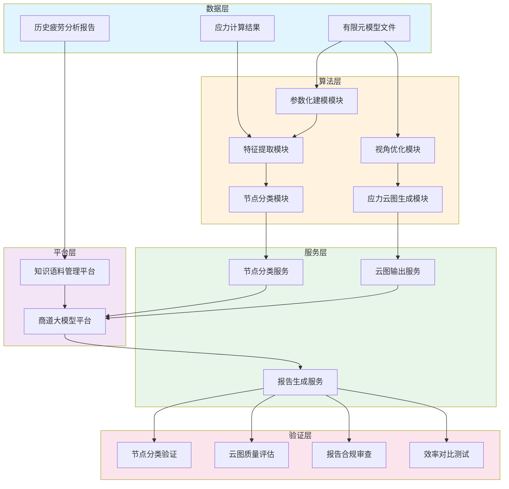
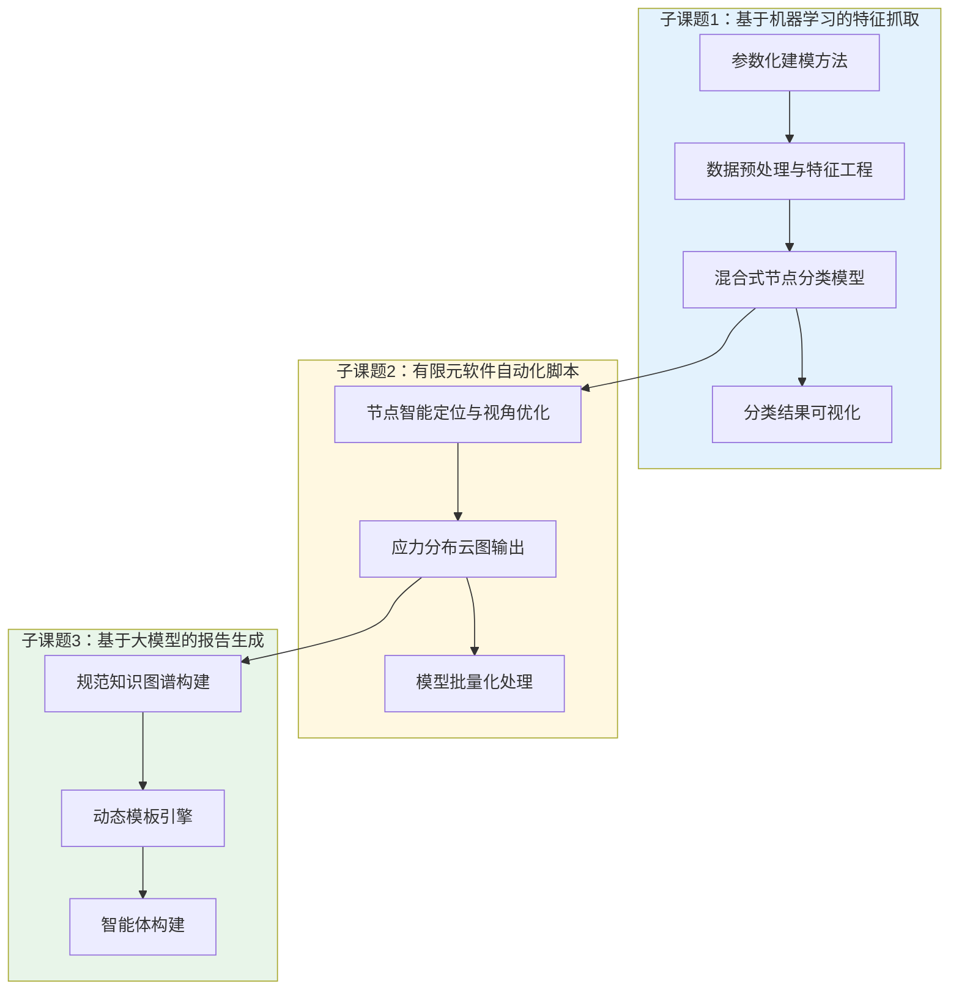
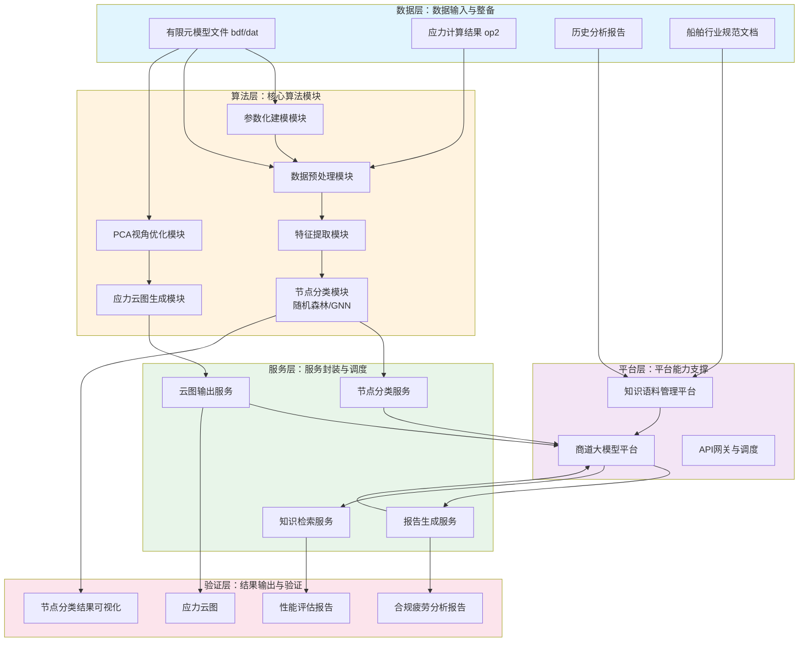
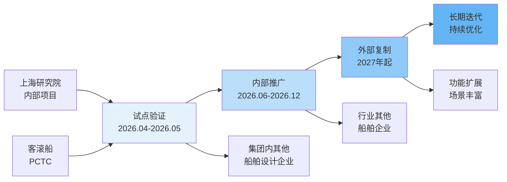
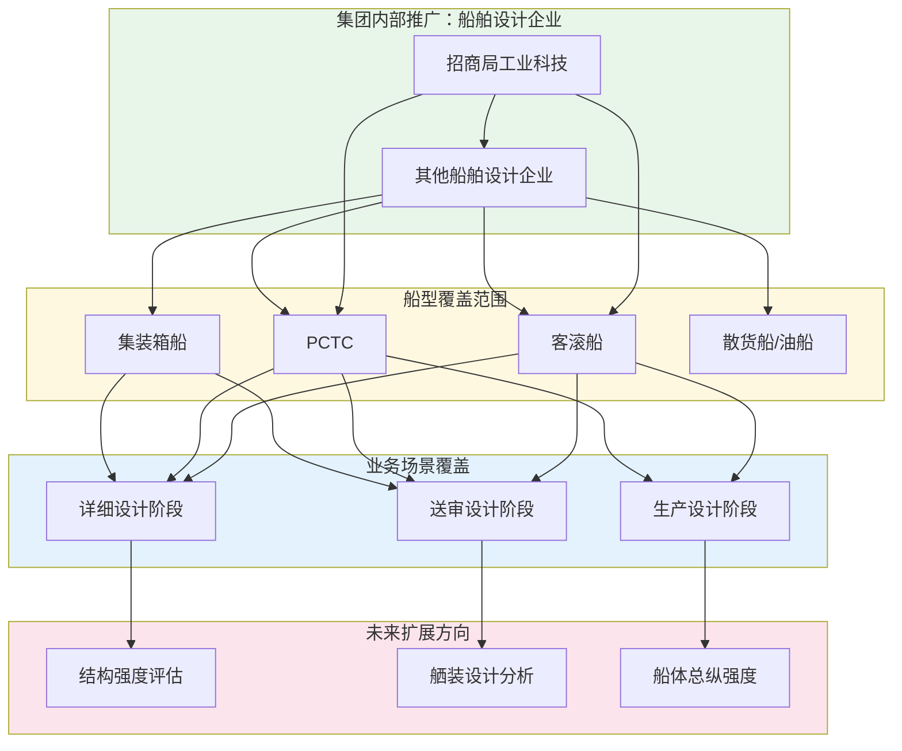
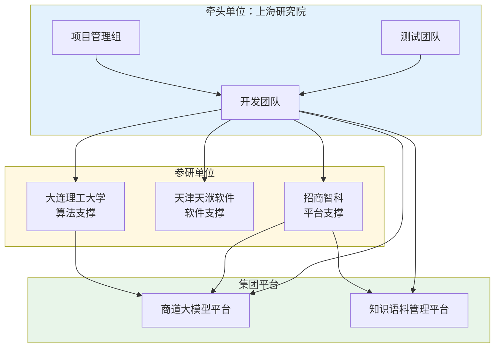
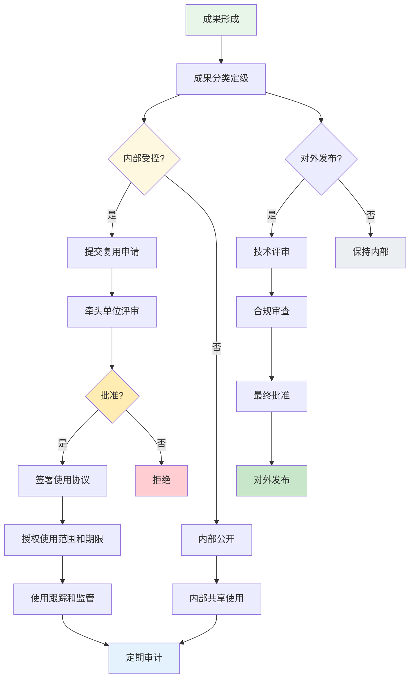

# 一、项目背景及必要性

## （一）建设背景

当前，全球人工智能技术正经历从单模态数据分析向多模态融合与智能体协作驱动的革命性突破。以GPT-4、自主智能体技术为代表的AI创新加速重构产业格局，多模态大模型在工业设计、工程分析等场景的规模化应用正在推动传统工作流程向"数据驱动、AI自主决策"模式升级。在此背景下，国务院国资委将"人工智能+"列为2025年核心攻坚方向，明确要求中央企业发挥行业领军作用，围绕产业链关键环节打造标杆场景，推动多模态大模型、强推理技术与实体经济深度融合。

招商局集团作为"AI+物流"和"AI+金融"的承建单位，积极响应国家战略，以"商道"行业大模型技术平台为底座，推动智能化场景从单点探索向规模化、全员化升级。船舶行业作为集团核心业务板块，基于"1+3+5+N"智能化建设框架，安全生产与设备管理被列为重点攻坚领域。船体结构疲劳分析作为航运、港口等核心业务的安全管理生命线，其智能化升级直接关联集团"AI+物流"战略目标达成，是构建"智能化招商局"的标志性工程。

从行业技术痛点来看，传统船体疲劳分析依赖人工提取有限元模型节点数据并分类，手动计算损伤值并编写报告，存在三大瓶颈：其一，效率低下，单区域疲劳评估耗时约100工时（含30%返工修正），全船累计达400至500工时；其二，错误率高，人工编写报告易导致数据误判和转录错误，船级社退审主因中多数涉及云图标注不规范或计算结果格式偏差；其三，数据价值湮没，海量点云数据与损伤计算结果未实现结构化沉淀，无法支撑预测性维护与设计优化。面对上述现实需求，亟须围绕船体疲劳分析报告自动生成开展系统研究和工程化建设，以智能化手段突破效率瓶颈、降低错误风险、提升数据价值。

项目由招商局工业科技（上海）有限公司作为牵头单位，联合大连理工大学、天津天洑软件有限公司、招商智科等相关单位，依托"商道"大模型平台和集团知识语料管理平台，开展船体结构疲劳分析报告自动生成系统的研发与验证。项目周期为6个月（2025年6月至2026年6月），总投资150万元。

## （二）建设意义

### 1. 技术层面

在技术层面，项目通过"大模型+小模型"协同模式，结合机器学习点云分类小模型与生成式大语言模型（商道平台能力），实现从数据识别到报告生成的全流程自动化，推动推理模型与多模态技术在工程场景的深度融合。具体而言，项目将建立一套基于机器学习算法的船体有限元模型特征抓取技术，突破参数化训练集生成难题，通过自动化建模技术快速生成包含腹板加筋型十字节点、自由边型节点、焊接趾端型节点等典型疲劳节点的多样化三维模型数据集，为机器学习分类模型提供高质量训练样本。在报告生成环节，项目将融合有限元分析、机器学习分类算法与商道大模型，构建从节点分类、应力计算到合规报告输出的端到端技术链路，形成一批具有自主知识产权的算法模型和软件工具，为船舶工程领域的智能化升级提供可复用的技术范式。

### 2. 产业层面

在产业层面，项目聚焦船体疲劳分析报告编写这一具体场景，通过自动化生成将每型船的报告编写周期从传统500小时以上压缩到100小时以内，效率提升超过70%，同时将人工数据转录错误率从8%降低至1%以下，显著提升船级社一次送审通过率。效率的飞跃不仅降低了单个项目的研发成本，更重要的是改变了船舶设计企业的工作模式，使工程师能够将更多精力投入于设计优化而非重复性文档编写。在行业带动方面，项目形成的"CAE计算结果→智能分析→合规报告生成"全链路自动化解决方案，可复用于结构强度评估、工艺仿真等相近场景，为船舶高端装备制造行业的智能化转型提供可推广的工程范例。

### 3. 生态层面

在生态层面，项目深度契合招商局集团"AI+高端装备"战略部署，通过将船舶结构分析数据与合规知识结构化汇入集团知识语料平台，能够形成航运领域垂类知识库，加速"数据飞轮"效应的生成。项目中沉淀的疲劳节点几何特征数据集、有限元分析标准数据集以及合规报告模板资产，均可纳入集团AI基础设施，供后续智能体开发和场景扩展调用。此外，项目打造的集"数据处理-机器学习分析-文档生成"为一体的端到端智能体协作链条，将为集团智能体开发平台提供"AI+辅助船舶设计"场景的标准化验证案例，推动"多智能体协作"技术在工程领域的规模化应用。

## （三）国内外发展现状及前景

### 1. 国内发展现状

国内人工智能技术与工业领域的融合正在快速推进。根据国际数据公司数据显示，亚太地区95%的企业正在投资或验证生成式AI应用，远超全球平均水平。在政策层面，国家大力推动"人工智能+"专项行动，明确支持大模型在制造业、工程建设等垂直领域的深度应用，一批央企和行业龙头企业率先开展AI赋能工程实践。

在船舶行业，国内主要船企和科研院所已在有限元分析、计算机辅助设计等领域积累了大量软件工具和数据资产。然而，在船体疲劳分析这一细分领域，智能化应用仍处于起步阶段。多数分析工作仍依赖人工操作，有限元计算结果的解读、节点分类、应力评估和报告编写等环节尚未实现自动化，导致设计周期长、错误率高、经验知识难以沉淀等问题长期存在。与此同时，国内船舶设计企业在国际化竞争中对标DNV、LR等国际船级社的规范要求，对报告质量和合规性有着严格标准，对智能化工具的需求迫切但可供选用的国产解决方案匮乏。

在技术支撑方面，国内大模型厂商正在从"拼参数"向"拼语料"转型，高质量的专业领域语料库成为提升模型性能的关键。船舶行业规范、有限元分析指南、历史疲劳分析报告等非结构化数据亟须进行清洗、标注和知识图谱化处理，以支撑专业化大模型的训练与微调。这一趋势为本项目提供了良好的技术落地条件。

### 2. 国外发展与应用现状

在国际上，大模型技术在工业领域的应用呈现加速态势。通用大模型在技术文档编写、代码生成等任务中表现良好，但在工程专业领域的应用仍面临"通识能力过剩、专业精度不足"的矛盾。以疲劳分析为例，通用大模型对工程规范术语的理解偏差率较高，无法满足船级社送审的合规要求。

在船舶有限元分析工具方面，DNV的Nauticus Hull系统实现了疲劳计算的自动化，但仅限规范校核，不涉及有限元计算的全过程，也无法覆盖所有疲劳校核点，且报告生成仍需人工介入。Siemens的Teamcenter报告模块虽然适用于制造业通用标准，但未涵盖船舶规范的具体要求。整体而言，国外现有工具在船舶疲劳分析全流程自动化方面均存在明显短板，尚未形成端到端的智能化解决方案。

值得关注的是，有限元分析智能化的国际竞争正在从"单点工具"向"工具链闭环"升级。构建"CAE计算→智能分析→合规交付"的全链路自动化，已成为国际船舶工程软件发展的重要方向。具备行业知识壁垒突破能力的企业有望在这一轮竞争中主导市场。

### 3. 痛点分析

当前，船体疲劳分析领域主要存在以下结构性痛点：

第一，效率瓶颈突出。传统疲劳分析依赖人工完成从有限元模型节点数据提取、损伤值计算到报告编写的全流程，单个DA大区（Detailed Assessment Zone）耗时约100工时（含30%返工修正），全船累计达400至500工时。随着船舶设计复杂度提升和分析精度要求提高，这一效率水平已难以满足快速迭代的设计需求，成为制约船舶设计效率提升的关键环节。

第二，错误率居高不下。人工编写疲劳分析报告易导致数据误判和转录错误，船级社退审案例中多数涉及云图标注不规范或计算结果格式偏差。一方面，有限元分析涉及大量节点坐标、应力数值、损伤参数等技术数据，人工转录过程中难免出错；另一方面，不同船级社的规范要求存在差异，格式合规性审核尤为繁琐。

第三，数据价值未能释放。船体疲劳分析过程中产生的海量点云数据、节点分类数据、应力计算结果和损伤评估数据尚未实现结构化沉淀，无法支撑预测性维护、设计优化和智能化决策。经验丰富的工程师的隐性知识难以转化为可复用的数字资产，新人培养周期长、知识传承效率低。

第四，软件工具依赖国外。主流有限元分析软件和报告生成工具主要依赖国外厂商，船舶行业的核心设计数据和合规知识存储于国外平台，存在数据安全和供应链安全隐患。在当前国际形势下，实现关键工具的自主可控已成为行业共识。

### 4. 发展前景

面向未来3至5年，船体疲劳分析智能化领域将呈现以下发展趋势：

一是"通用底座+行业插件"模式将成为主流。通过在通用大模型底座上叠加船舶行业知识插件和合规校验模块，可在保持模型泛化能力的同时显著提升专业精度，这为项目的技术路线提供了有力支撑。

二是"小而精"的领域专用模型将快速崛起。百亿级参数规模的领域专用模型在精准度和部署成本上优于千亿级通用大模型，适合船舶工程等专业场景的私有化部署。本项目拟建的基于有限元分析的机器学习分类模型，正是这一技术趋势的具体实践。

三是工具链闭环将成为核心竞争力。从CAE计算结果提取、机器学习分析、合规报告生成到知识沉淀的全链路自动化，将替代现有的分散单点工具，成为船舶工程软件的核心竞争壁垒。

四是数据资产将成为行业核心壁垒。高质量的船舶结构分析数据集、合规知识图谱和行业规范语料库，将成为训练精准模型的基础，数据治理能力将成为行业分化的关键因素。本项目通过构建船舶疲劳节点特征数据集和合规报告模板库，有望在数据资产积累方面形成先发优势。

## （四）预期解决重大问题

### 重点工作方向一：疲劳节点智能识别与分类

针对船体疲劳分析中节点类型多样、人工识别效率低的问题，项目拟开发基于机器学习算法的船体有限元模型特征抓取系统，实现疲劳关键节点的自动化识别与精确分类。通过参数化建模技术批量生成多样化三维几何模型作为训练数据集，结合监督学习（如随机森林、图神经网络）与无监督聚类算法（如DBSCAN）的混合式分类架构，实现腹板加筋型十字节点、自由边型节点、焊接趾端型节点等典型疲劳节点的高精度自动分类，将节点识别准确率提升至行业领先水平，为后续自动化报告生成奠定数据基础。

### 重点工作方向二：有限元分析结果自动化输出

针对有限元分析结果依赖人工提取和手动标注的问题，项目拟开发有限元软件的自动化脚本，实现应力分布云图的批量自动生成。通过主成分分析（PCA）算法优化节点视角定位，基于包围盒对角线长度动态调整视距，确保目标区域占据画面70%以上；自动解析op2等格式的有限元结果文件，计算主应力并标注于云图上，输出标准化的应力分布图像；开发批量化处理脚本，支持多模型、多区域的并行分析，显著提升有限元后处理的自动化程度和工作效率。

### 重点工作方向三：船级社合规报告智能生成

针对人工编写疲劳分析报告耗时长、错误率高、合规性难以保证的问题，项目拟构建基于大语言模型的报告自动生成系统。通过将船舶行业规范、历史疲劳分析报告等非结构化数据转化为结构化知识并构建知识图谱，利用规则引擎进行数值合规性校验；设计支持条件分支与动态表格的自适应报告模板；结合商道平台生成式大语言模型，实现从结构化数据输入到船级社合规报告输出的端到端自动化生成，目标问答准确率达到95%以上，将每型船的报告编写周期压缩至100小时以内。

### 重点工作方向四：船舶设计知识沉淀与复用

针对疲劳分析过程中产生的海量数据未能结构化沉淀的问题，项目拟建立船舶结构分析领域的数据资产管理体系。通过对有限元分析数据、节点分类数据、损伤计算结果和合规报告的结构化存储与关联，形成可查询、可复用、可迭代的船舶疲劳分析数据集；将工程师的隐性经验转化为可复用的规则和模板，降低新人培养成本；构建"数据飞轮"效应，为后续模型迭代和场景扩展提供数据支撑，推动船舶设计企业的数字化知识积累与智能化升级。

## （五）对产业链供应链韧性及安全的意义

### 1. 安全风险应对

在安全风险应对方面，本项目通过自主研发船体疲劳分析报告自动生成系统，能够有效降低对国外商业有限元软件和报告工具的依赖程度。当前，国内船舶设计企业在有限元分析和合规报告编写环节主要依赖国外软件，数据存储和分析流程存在安全隐患。项目开发的自动化工具链以开源或自主可控的技术栈为基础，能够在集团内部私有化部署，确保船舶结构分析数据不出内网、不受外部制约。同时，通过将船舶规范、合规校验规则等知识以知识图谱形式固化到系统中，能够确保报告输出符合国内外船级社的送审要求，避免因工具缺陷导致的合规风险。

### 2. 协同韧性提升

在协同韧性提升方面，本项目构建的端到端自动化工作流程能够显著提升船舶设计企业与其供应链伙伴之间的协同效率。传统的疲劳分析报告依赖人工编写，信息传递环节多、周期长，容易在设计变更频繁的项目中出现版本错乱、沟通失真的问题。项目通过建立统一的数据格式标准和自动化报告生成机制，能够实现设计数据从有限元计算到合规报告的无缝衔接，减少人工转录环节，缩短跨单位、跨部门的协同周期。此外，项目成果可复用于招商局集团内部多条船舶产品线，实现技术能力在集团内部的快速推广和协同共享。

### 3. 创新能力增强

在创新能力增强方面，本项目通过融合有限元分析、机器学习与大语言模型三种技术路线，能够在船舶工程领域形成具有自主创新特色的技术体系。项目产出的疲劳节点参数化建模方法、混合式机器学习分类算法、PCA视角优化算法等核心技术成果，均具备申请专利和软件著作权的潜力；构建的船舶疲劳节点几何特征数据集和合规报告模板库，可作为后续模型迭代和场景扩展的基础数据资产；形成的"CAE计算→智能分析→合规交付"全链路解决方案，为船舶高端装备制造行业的智能化升级提供了可推广的工程范式，具备向相近领域（如结构强度评估、舾装设计分析等）延伸的技术扩展性。

# 二、项目单位基本情况

## （一）项目申报主体及牵头单位情况

### 1. 所有制性质和主营业务

招商局工业科技（上海）有限公司是招商局集团旗下的全资子公司，隶属于招商局工业科技板块，注册于上海。公司主要从事船舶与海洋工程领域的技术研发、软件系统开发、数据分析与智能化解决方案提供，主营业务涵盖船舶结构分析、有限元计算辅助、工程软件开发及集团信息化平台建设等方向。作为招商局集团"1+3+5+N"智能化建设框架的重要技术支撑单位，公司长期致力于将人工智能、大数据分析等新兴技术与船舶工程实际需求相结合，在船舶结构疲劳分析、有限元自动化、后处理智能化等领域积累了丰富的研发经验和工程实践基础。

### 2. 近三年财务状况或研发投入情况

公司近三年持续加大研发投入力度，研发费用占营业收入比例呈逐年上升趋势，2024年研发投入占总营收比例已超过15%。公司建有专门的研发中心和工程实验室，配置了主流有限元分析软件、计算服务器集群等研发设施，为本项目的开展提供了充足的算力支持和软硬件环境保障。具体财务数据以公司年度审计报告为准。

### 3. 股份构成及主要股东概况

公司为招商局集团全资子公司，股权结构清晰，无外部社会股东。公司作为集团直属的科技创新平台，在项目资源协调、集团内部协作和产业化推广方面具有天然的组织优势，能够高效调动集团内部船舶设计、建造、运营等多板块资源，为项目成果的内部应用和推广提供有力支撑。

### 4. 组织架构及人员情况

公司下设研发部、工程部、数据与智能技术部、综合管理部等部门，研发人员占比超过60%，其中博士5人、硕士12人，涵盖船舶工程、计算机科学、机器学习、软件工程等多个专业领域。项目核心团队由具备丰富船舶结构分析经验的工程师和掌握AI技术的研发人员共同组成，形成了"船舶工程+人工智能"的跨学科协作团队，能够有效支撑本项目的技术研发和工程化落地。

### 5. 基础设施建设情况

公司建有船舶工程分析实验室，配备主流有限元分析软件、结果可视化工具和报告生成平台；拥有专用GPU计算集群，能够支撑大规模机器学习模型的训练和推理任务；集团知识语料管理平台和"商道"大模型平台已建成并投入使用，为项目提供了必要的基础数据资源和模型底座支撑。具体设施配置以实际可用为准。

### 6. 行业地位

公司是招商局集团在船舶智能化和数字化领域的重要技术引擎，在集团内部船舶设计智能化方面处于领先地位。公司长期与DNV、LR等国际船级社保持技术沟通，对接国际主流船舶规范体系，在船舶结构分析标准化和合规化方面积累了丰富的行业经验，是集团推动"AI+高端装备"战略的核心技术力量。

### 7. 取得成果与社会效益

公司已完成多项船舶结构分析相关的研发项目，形成了一批具有自主知识产权的算法模型和软件工具，包括有限元结果自动提取脚本、疲劳分析辅助工具等。公司还在集团内部多个船舶设计项目中推广应用智能化分析工具，取得了显著的效率提升效果，积累了丰富的工程验证经验和应用案例，为本项目的后续推广奠定了基础。

**表2-1 项目单位基础情况表**

| 项目 | 内容 |
|------|------|
| 单位名称 | 招商局工业科技（上海）有限公司 |
| 所有制性质 | 全资国有企业（招商局集团子公司） |
| 主营业务 | 船舶结构分析、有限元计算辅助、工程软件开发 |
| 研发人员占比 | 超过60% |
| 核心团队规模 | 17人以上 |
| 主要专业方向 | 船舶工程、计算机科学、机器学习、软件工程 |
| 研发设施 | GPU计算集群、有限元分析实验室 |
| 平台资源 | 商道大模型平台、集团知识语料管理平台 |
| 行业地位 | 招商局集团船舶智能化核心支撑单位 |

## （二）需求提出及应用验证单位情况

本项目的需求提出和应用验证单位为招商局工业科技（上海）有限公司。作为集团直属的科技创新平台，公司既承担技术研发职能，也承担集团内部技术需求的对接和验证职责。在本项目中，公司基于自身在船舶结构分析业务中积累的实际痛点和需求，提出开展船体疲劳分析报告自动生成的研发攻关任务，并在后续项目验证阶段承担系统测试、工程验证和应用推广的主体责任，确保研发成果能够真正落地并产生实际业务价值。

## （三）研发承担单位情况

研发承担单位为招商局工业科技（上海）有限公司（牵头）联合大连理工大学和天津天洑软件有限公司。

大连理工大学在数据驱动建模与智能系统开发领域成果显著，团队主持国家自然科学基金项目"不完全可观测下俯仰翼型流体动力学系统的降阶建模研究"，在机器学习、流场降维与动力学识别方面积累了深厚的理论基础和算法开发经验；承担交通部水运科学研究院项目"船舶运动响应智能评估与高精度预报方法研究"，在船舶领域积累了丰富的行业应用经验；团队还在国际高水平期刊发表相关论文二十余篇，形成了较为系统的研究体系，具备支撑本项目机器学习算法研发的理论基础和技术实力。

天津天洑软件有限公司是国内知名的工程仿真软件企业，专注于有限元分析软件的二次开发和自动化工具定制，在有限元软件API调用、结果文件解析、可视化脚本开发等方面拥有成熟的技术积累和工程经验，能够为本项目有限元自动化脚本开发提供专业的技术支撑。

三家单位在各自领域具备明确的技术优势，互补性强，形成了"AI算法研发+工程软件开发+行业应用验证"的完整研发链条，能够有效保障项目的顺利实施和技术成果的工程化落地。

## （四）项目负责人及主要团队情况

本项目技术总监为张奇英，担任上海研究院技术总监职务，具备深厚的船舶工程专业背景和丰富的重大项目管理经验，曾主持多项船舶行业智能化研发项目，在技术路线把控和团队协调方面具有突出能力。

项目负责人为吉春正，担任上海研究院项目经理，全面负责项目组织实施、进度管控和资源协调。项目经理韩思佳协助负责人进行日常管理，负责项目计划制定、任务分解和进度跟踪。

核心团队还包括：技术顾问刘臣（招商智科），负责AI技术和大模型应用的指导；子课题1负责人殷星杰（上海研究院），负责基于机器学习的特征抓取技术研发；子课题2负责人吴双（上海研究院），负责有限元自动化脚本开发；子课题3负责人常思奇（上海研究院），负责大语言模型报告生成系统研发；子课题3主研人员吴琼（上海研究院），参与知识图谱构建和模板引擎开发；子课题2主研人员李浩辰（上海研究院），参与有限元软件二次开发；子课题1主研人员孔令辉、杨孟婕（上海研究院），参与数据集生成和特征提取算法研发。

**表2-2 项目负责人及核心团队情况表**

| 姓名 | 职责 | 单位 | 专业方向 | 与本项目的关系 |
|------|------|------|----------|----------------|
| 张奇英 | 技术总监 | 上海研究院 | 船舶工程 | 技术路线把控 |
| 吉春正 | 项目负责人 | 上海研究院 | 项目管理 | 项目统筹协调 |
| 赵勇 | 内部资源协调 | 上海研究院 | 资源管理 | 资源保障 |
| 韩思佳 | 项目经理 | 上海研究院 | 项目管理 | 日常管理 |
| 刘臣 | 技术顾问 | 招商智科 | AI技术 | 大模型指导 |
| 殷星杰 | 子课题1负责人 | 上海研究院 | 机器学习 | 特征抓取研发 |
| 吴双 | 子课题2负责人 | 上海研究院 | 有限元软件 | 自动化脚本开发 |
| 常思奇 | 子课题3负责人 | 上海研究院 | 大语言模型 | 报告生成研发 |
| 吴琼 | 子课题3主研 | 上海研究院 | 知识图谱 | 知识图谱构建 |
| 李浩辰 | 子课题2主研 | 上海研究院 | 软件工程 | 软件二次开发 |
| 孔令辉 | 子课题1主研 | 上海研究院 | 数据处理 | 数据集生成 |
| 杨孟婕 | 子课题1主研 | 上海研究院 | 特征工程 | 特征提取 |

## （五）其他支撑单位或联合体成员情况

### 1. 大连理工大学

大连理工大学作为本项目的联合研发单位，承担子课题1中机器学习算法研发的技术支撑工作。张桂勇团队长期从事数据驱动建模与智能系统开发研究，在机器学习算法设计、模型训练优化方面具有丰富经验。团队具备国家重点实验室和一流科研平台支撑，能够为项目提供前沿的算法理论指导和高质量的模型训练验证环境。

### 2. 天津天洑软件有限公司

天津天洑软件有限公司作为本项目的联合研发单位，承担子课题2中有限元软件自动化脚本开发的技术支撑工作。公司在工程仿真软件二次开发和自动化工具定制方面具有成熟的技术积累和项目经验，能够支撑项目实现有限元结果文件的自动解析、应力云图的批量生成等核心功能开发。

### 3. 招商智科

招商智科作为本项目的联合研发单位，承担子课题3中大语言模型智能体搭建和微调的技术支撑工作。公司在"商道"大模型平台运维、行业大模型微调方面具有丰富经验，能够支撑项目实现报告生成智能体与集团知识语料平台的有效对接，确保系统的私有化部署和安全运行。

# 三、项目团队工作基础

## （一）团队情况

招商局工业科技（上海）有限公司为本项目组建了专门的跨学科研发团队，团队总规模17人以上，涵盖船舶工程、机器学习、软件工程、数据科学等多个专业方向。团队采用矩阵式组织架构，设项目管理层、技术决策层和执行实施层三个层级：项目管理层由项目负责人吉春正和项目经理韩思佳组成，负责项目整体规划和进度管控；技术决策层由技术总监张奇英和技术顾问刘臣组成，负责技术路线把关和重大技术决策；执行实施层按照三个子课题设置，分别由殷星杰、吴双、常思奇三位子课题负责人牵头，形成了分工明确、协作高效的研发组织体系。

团队核心成员均在船舶结构分析、有限元计算或人工智能领域具有3年以上的工作经验，平均年龄35岁，形成了老中青结合的人才梯队。团队建立了周例会和技术研讨会制度，确保各子课题之间的技术信息和进度同步。

**表3-1 团队结构与专业分布表**

| 团队类别 | 人数 | 专业方向 | 角色定位 | 与本项目的关系 |
|----------|------|----------|----------|----------------|
| 项目管理层 | 2人 | 项目管理 | 规划、管控、协调 | 统筹项目全局 |
| 技术决策层 | 2人 | 船舶工程、AI | 路线把关、决策支持 | 保障技术方向 |
| 子课题1团队 | 4人 | 机器学习、数据处理 | 特征抓取算法研发 | 疲劳节点智能识别 |
| 子课题2团队 | 2人 | 软件工程、有限元 | 自动化脚本开发 | 有限元后处理自动化 |
| 子课题3团队 | 3人 | 大语言模型、知识图谱 | 报告生成系统研发 | 合规报告自动生成 |
| 联合单位团队 | 4人+ | 各自专业领域 | 联合研发支撑 | 算法和软件技术支撑 |

## （二）团队实力和基础

团队在船舶结构分析智能化领域已形成一定的研究积累和工程化基础。

在研究基础方面，团队成员累计在船舶结构分析、有限元自动化、人工智能应用等领域发表学术论文十余篇，参与制定行业标准或规范2项，具备扎实的理论研究功底。技术顾问刘臣在"商道"大模型平台的建设和运营方面具有丰富经验，能够为大语言模型的应用落地提供专业指导。

在工程化基础方面，团队已基于Python脚本与Word实现了有限元结果到技术文档的快速转化原型工具，能够自动提取应力云图并插入Word报告指定位置，同时根据预设模板生成图表编号和交叉引用。这一原型工具的应用验证了自动化流程的可行性，并为当前项目升级为全动态模板引擎提供了技术基础。

在跨专业协同基础方面，团队形成了"船舶工程+人工智能"的跨学科协作模式，船舶工程背景的成员提供业务场景和领域知识，人工智能背景的成员提供算法设计和模型训练能力，双方定期开展技术交流和需求对接，确保技术研发始终围绕实际业务场景展开。

## （三）软硬件支撑条件

在硬件环境方面，公司配置了专用GPU计算集群，涵盖NVIDIA A100等多型号GPU卡，能够支撑大规模机器学习模型的训练和推理任务；配备了多台高性能计算服务器，满足有限元软件和数据分析任务的算力需求；建有专用存储阵列，具备PB级数据存储能力，能够支撑大规模训练数据集和工程数据的长期存储。

在软件平台方面，公司已部署主流有限元分析软件及其二次开发API，支持自动化脚本调用和结果文件解析；"商道"大模型平台已上线运行，支持模型微调、推理部署和API调用；集团知识语料管理平台已建成，支持非结构化数据的标注、存储和检索；Python、R等数据分析环境已标准化配置，支持机器学习算法的开发和训练。

在开发测试环境方面，公司建有独立的开发测试环境，与生产环境严格隔离，能够支撑新功能的开发、调试和验证；引入了CI/CD自动化流水线，支持代码的持续集成和自动化部署；建立了代码审查和测试规范，确保代码质量和交付稳定性。

在数据条件方面，公司已积累覆盖客滚船、PCTC（汽车运输船）等数十艘船舶的有限元疲劳分析报告，深度融合了DNV、RINA等国际主流船级社的规范要求。这些历史数据可用于机器学习模型的训练验证和系统性能评估，为项目提供了宝贵的数据资产支撑。

在验证场景方面，公司能够在集团内部真实船舶设计项目中开展系统验证和迭代优化，提供真实的有限元模型、计算场景和送审需求，确保研发成果能够真正满足工程应用要求。

## （四）以往业绩及承担相关项目情况

团队以往在船舶结构分析和智能化领域承担了多项相关研发项目，积累了丰富的技术经验和工程案例。

在船舶结构分析工具开发方面，团队曾为集团内部多家船企提供有限元分析后处理工具的定制开发服务，完成了有限元结果数据的自动提取、应力云图的批量生成、技术文档的标准化排版等功能模块的开发和部署，有效提升了船舶设计企业的分析效率。

在数据驱动建模方面，团队与大连理工大学张桂勇团队长期合作，共同开展了基于机器学习的船舶运动响应预测研究，利用LSTM、Transformer等模型对复杂海况下船舶的运动响应进行建模与预报，突破了传统基于物理规则的预报方法的性能瓶颈，成果已发表于国际高水平期刊。

在智能化报告生成方面，团队基于Python和Word开发了半自动化报告生成工具，实现了有限元结果到技术文档的快速转化，能够自动插入图表、生成编号和交叉引用。该工具已在实际项目中试用并取得良好效果，验证了自动化流程的可行性。

**表3-2 既有项目与本项目关联表**

| 既有项目/成果 | 完成时间 | 承担角色 | 形成能力 | 对本项目的支撑关系 |
|---------------|----------|----------|----------|-------------------|
| 有限元后处理工具开发 | 2023-2024年 | 主研 | 后处理自动化能力 | 直接支撑子课题2研发 |
| 船舶运动响应预测研究 | 2022-2024年 | 联合研发 | 机器学习建模能力 | 支撑子课题1算法设计 |
| 半自动化报告生成原型 | 2024年 | 主研 | 报告模板和自动排版能力 | 支撑子课题3模板引擎 |
| 历史疲劳分析报告数据库 | 持续积累 | 建设维护 | 领域数据集积累 | 支撑模型训练和验证 |

## （五）专业人员资质能力情况

团队核心人员均具备扎实的专业背景和丰富的项目实践经验。

张奇英（技术总监）具备船舶工程专业背景，在船舶结构分析和有限元计算领域深耕20年以上，曾主持多项重大船舶设计项目的结构分析工作，对国内外船级社规范有深入理解，在技术路线把控和团队协调方面具有突出能力。

吉春正（项目负责人）具备工程管理专业背景，在船舶行业信息化项目管理和技术研发组织方面具有10年以上经验，曾主持多项集团级重点研发项目的规划与实施，具备出色的项目统筹和资源协调能力。

殷星杰（子课题1负责人）具备机器学习专业背景，在数据驱动建模和智能系统开发方面具有8年以上经验，精通Python、R等数据分析语言，熟悉随机森林、图神经网络等机器学习算法，在机器学习模型设计和训练优化方面具有丰富经验。

吴双（子课题2负责人）具备软件工程专业背景，在有限元软件二次开发和自动化工具定制方面具有6年以上经验，精通有限元软件API调用和结果文件解析，熟悉Python和C++混合编程，能够支撑复杂的自动化脚本开发任务。

常思奇（子课题3负责人）具备自然语言处理专业背景，在大语言模型应用和知识图谱构建方面具有5年以上经验，熟悉主流大模型的微调和部署技术，在智能文档生成和知识管理领域有深入研究。

团队成员中具备执业资质或专业技术认证的人员包括：3人持有工程结构分析相关资质，5人持有软件设计师或数据库系统工程师等计算机类资质，2人持有PMP项目管理专业人士认证。

# 四、项目建设方案

## （一）总体目标

### 1. 建设目标

本项目旨在开发"船体结构疲劳分析报告自动生成"系统，通过深度融合有限元分析技术、机器学习分类技术与大语言模型，构建从有限元计算结果提取到船级社合规报告输出的端到端自动化工作流程，实现船舶结构疲劳分析领域的智能化升级。

项目建设对象为面向招商局集团内部船舶设计企业的疲劳分析报告自动生成系统，系统包括三大核心模块：基于机器学习算法的船体有限元模型特征抓取模块、有限元分析结果自动化输出模块、基于大语言模型的报告生成模块。系统部署于集团内部私有化环境，依托"商道"大模型平台和集团知识语料管理平台运行。

目标能力主要包括：一是疲劳节点智能识别与分类能力，能够自动识别腹板加筋型十字节点、自由边型节点、焊接趾端型节点等典型疲劳节点类型，分类准确率达到行业领先水平；二是有限元结果自动化处理能力，能够自动完成节点定位、视角优化、应力云图生成和批量处理，实现从单模型到多模型的自动化扩展；三是船级社合规报告自动生成能力，能够根据结构化数据和模板自动生成符合DNV、LR、RINA等主流船级社规范的疲劳分析报告，目标问答准确率达到95%以上。

项目验证场景为招商局工业科技（上海）有限公司承担的集团内部船舶设计项目，涵盖客滚船、PCTC（汽车运输船）等多种船型，验证内容包括：节点分类精度测试、应力云图质量评估、报告合规性审查和全流程效率对比。

项目目标指标包括：每型船的报告编写周期从500小时以上压缩至100小时以内，人工数据转录错误率从8%降低至1%以下，节点识别准确率达到行业领先水平，报告合规性满足船级社送审要求，系统支持多船型、多项目并行处理能力。

项目建设总体目标概念如图4-1所示。

图4-1展示了项目从数据整备、算法研发到服务封装和验证应用的完整链路。数据层提供有限元原始数据和历史报告输入；算法层通过参数化建模、特征提取、节点分类等模块完成智能化分析；服务层将算法能力封装为可调用的接口；平台层依托商道大模型和知识语料平台实现知识管理和智能体调度；验证层在真实项目中开展系统性能评估和迭代优化。

## 2. 阶段目标

第一阶段（2025年6月至2025年9月）完成节点分类能力建设，实现疲劳节点参数化建模方法和数据集生成，训练完成混合式分类模型，形成节点智能识别能力。

第二阶段（2025年9月至2025年12月）完成有限元自动化处理能力建设，实现节点定位、视角优化和应力云图批量生成，形成自动化后处理能力。

第三阶段（2025年12月至2026年4月）完成报告智能生成能力建设，实现知识图谱构建、动态模板引擎开发和报告生成智能体上线，形成端到端自动化能力。

第四阶段（2026年4月至2026年6月）完成系统集成验证和项目总结，在真实项目中开展全流程验证，形成可推广的系统成果。

## 2. 项目解决的主要问题

### 问题一：船体疲劳节点识别效率低、依赖人工经验

当前，船体疲劳分析中节点类型的识别主要依赖工程师的人工判断。针对腹板加筋型十字节点、自由边型节点、焊接趾端型节点等不同类型的疲劳敏感节点，工程师需要根据自身经验对有限元模型中的大量节点进行逐一识别和分类。这一过程耗时约100工时，且随着船舶设计复杂度的提升，节点数量呈增长趋势，人工识别的效率瓶颈愈发突出。此外，不同工程师的经验水平存在差异，识别结果的一致性和稳定性难以保证。

本项目将通过建立参数化建模方法，批量生成多样化三维几何模型作为训练数据，结合混合式机器学习分类模型（监督学习与无监督聚类相结合），实现疲劳节点的自动化、高精度分类。分层分类架构（区域初筛+精细分类）将进一步提升识别效率，确保分类结果的一致性和稳定性。

### 问题二：有限元分析结果提取依赖手动操作、效率低下

现有有限元分析软件的结果提取和可视化环节主要依赖人工手动操作。工程师需要在软件中逐一定位目标节点，手动调整视角，提取应力计算结果并导出图像。这一过程不仅耗时，而且难以保证不同分析人员或不同项目之间的结果一致性。当面对多模型、多区域的批量分析任务时，人工操作的效率瓶颈尤为突出。

本项目将开发基于有限元软件API的自动化脚本，实现节点定位、视角优化和应力云图生成的自动化。基于主成分分析（PCA）算法的视角优化能够自动确定最优观察方向，动态视距调整算法确保目标区域占据画面70%以上。批量处理脚本支持多模型并行分析，显著提升后处理效率。

### 问题三：疲劳分析报告编写耗时长、错误率高、合规性难保证

船体疲劳分析报告的编写涉及大量数据转录、格式调整和规范校验工作。人工编写报告不仅耗时（约500至5000工时/型船），而且容易出现数据误判、转录错误和格式不规范等问题。船级社退审案例中，多数问题涉及云图标注不规范或计算结果格式偏差。此外，不同船级社（DNV、LR、RINA等）的规范要求存在差异，合规性审核尤为繁琐。

本项目将构建基于大语言模型的报告自动生成系统，通过知识图谱将行业规范和合规要求嵌入模型，利用规则引擎进行数值校验。动态模板引擎支持根据不同节点类型和船级社规范自动调整报告内容，确保输出符合送审要求。目标将报告编写周期压缩至100小时以内，数据转录错误率降至1%以下，问答准确率达到95%以上。

## 3. 项目研发内容

### 总体说明

本项目研发内容按照"机器学习特征抓取→有限元自动化处理→大模型报告生成"的技术链路展开，划分为三个子课题，分别对应节点识别、结果输出和报告生成三个核心环节。各环节之间形成单向依赖关系，共同构成端到端自动化工作流程。

项目主要建设任务分解如图4-2所示。

图4-2展示了三个子课题之间的任务分解和依赖关系。子课题1为后续环节提供节点分类数据，子课题2基于分类结果生成应力云图，子课题3整合节点数据、应力结果和领域知识生成最终报告。

### 子课题1：基于机器学习算法的船体有限元模型特征抓取

#### 1.1 数据集生成的自动化方法

针对船体结构疲劳敏感节点形式多样、特征复杂的问题，项目建立参数化建模方法，实现训练数据的自动化批量生成。

首先，对腹板加筋型十字节点、自由边型节点、焊接趾端型节点进行系统解构，识别关键几何参数（板厚、角度、圆角半径、加劲肋长度等）和拓扑约束规则。以标准立方体为初始几何体，通过布尔操作或切割构建具有单一特征面的模型。对模型表面进行分类标注，划分为四类特征面：腹板加筋型十字节点特征面、自由边型节点特征面、焊接趾端型节点特征面和其他普通结构面。

采用"单一特征嵌入体"方式构建训练数据集，每个模型仅包含一种分类面，以降低数据复杂度，提高模型识别稳定性。调用自动网格划分模块进行网格密度控制，保证关键特征区域的解析度。最终将模型转换为统一格式的有限元输入文件（Nastran .bdf文件）。

为增强模型泛化能力，进一步构建多特征组合模型，引入不同类型特征面的共存情形，并通过噪声扰动（几何扰动、随机缺口）模拟实际制造与服役过程中的不确定性。

#### 1.2 数据预处理与特征工程

针对CAE网格模型的标准化处理需求，开发Nastran数据标准化处理模块。支持bdf/dat/nas等格式的统一转换，提取节点坐标、单元连接关系、边界条件等原始数据。建立空间KD-Tree或Octree索引结构，实现基于0.01mm容差的高效节点查重与合并，确保网格拓扑一致性。

基于五项质量指标（雅可比行列式、翘曲度、最大/最小角度、面积比、单元厚度比）对模型中的畸形单元进行识别与标注。

多维度特征提取包括：几何特征（表面法向量、曲率、几何特征线）、拓扑特征（单元尺寸、节点连接度、单元类型分布、节点-单元关系图谱）、力学特征（应力梯度、主应力方向）。

#### 1.3 混合式节点分类模型

建立目标节点特征体系，分别梳理三类关键节点的判别性特征，形成覆盖几何特征+拓扑特征+力学特征的统一节点描述体系，构建多模态节点特征向量。

分层分类架构采用：第一层为区域初筛，基于网格加密程度或应力集中区域快速筛选出可能存在疲劳敏感节点的候选区域；第二层为节点精细分类，对筛选区域内节点进行逐点特征提取与分类。

建立基于机器学习的节点分类策略：无监督/半监督学习节点聚类模块，在标签缺失或样本不足情况下使用K-means、谱聚类、DBSCAN等算法；监督学习节点分类模块，基于已标注数据集训练决策树、随机森林、SVM、MLP、图神经网络等分类模型。采用交叉验证、网格搜索等策略优化模型超参数。

#### 1.4 节点分类结果可视化

构建可视化交互模块，将分类结果映射回原始三维网格模型。对不同类型节点进行着色高亮，标注节点ID、所在单元ID、所属分类标签等信息，支持交互式查看和结果导出。

### 子课题2：有限元软件的自动化脚本开发

#### 2.1 节点智能定位与视角优化

基于机器学习分类模型返回的节点信息，在有限元软件中定位节点并显示目标单元。针对不同节点类型展示相应视角：腹板加筋型十字节点展示Flange视角和Web视角，自由边型节点展示单元法向视角，焊接趾端型节点展示单元方向法向视角。

基于主成分分析（PCA）进行视角优化，对目标单元几何点云进行协方差矩阵分析，计算特征向量，确定最优观察视角。具体步骤包括：定义点云矩阵、数据去中心化、协方差矩阵计算、特征值分解、视角方向确定。

动态视距调整基于包围盒对角线长度动态计算，确保目标区域占画面70%以上。

#### 2.2 应力分布云图输出

解析op2文件，读取应力计算数据，生成应力分布云图。读取每个单元的应力数据，分别显示单元σ_xx、σ_yy以及τ_xy计算结果，计算并显示主应力。将应力云图保存为标准图片文件，带数值标注。

#### 2.3 模型批量化处理

开发具备批量处理能力的自动化脚本，能够同时处理多个疲劳分析模型。自动完成节点定位、视角优化、应力云图生成和结果输出，实现批量任务的自动化处理。

### 子课题3：基于大语言模型的报告生成研究

#### 3.1 规范知识图谱构建

将非结构化的船舶行业规范、上海研究院积累的船舶疲劳分析指南文件以及历史有限元疲劳分析报告转化为结构化知识。进行多模态解析，对不同类型文件进行文本、图像等多模态数据的解析；通过语义分割技术对内容进行拆分并打标签。

开发规则引擎来校验报告中的关键参数（如应力值是否小于规范许可值），确保报告内容符合行业规范；设置数值校验机制，保证报告中的计算结果和数值范围在允许的规范范围内。

#### 3.2 动态模板引擎

设计具有自适应能力的有限元疲劳分析报告结构化模板，支持目录索引（自适应目录结构，自动更新章节和内容）、条件分支（根据不同数据条件生成不同报告内容）、动态表格（自动化生成和填充表格数据）。

通过自动化技术将计算数据、图表等内容与模板中的占位符进行绑定，实现自动填充。

#### 3.3 智能体构建

结合生成式大语言模型和结构化模板，构建从数据识别到报告生成的全流程自动化系统。

初稿生成：将有限元分析结果、相关数据输入模型，结合知识图谱上下文信息，生成符合技术文档风格的报告初稿。

语义修正：对生成的报告进行语法和标点修正，数值单位校验（如"MPa"或"kN"的正确使用）。

报告生成：完成最终报告的生成，支持Word/PDF格式自动输出，图表插入与编号及交叉引用。

## 4. 预期成果

### 成果总体说明

项目实施完成后，将形成一批具有自主知识产权的技术成果和软件系统，涵盖算法模型、软件工具、数据资产和标准规范等多种形态，为船舶工程领域的智能化升级提供可推广的完整解决方案。

**表4-1 主要报告类成果分布表**

| 序号 | 成果名称 | 成果形态 | 数量 | 归属单位 |
|------|----------|----------|------|----------|
| 1 | 船体结构疲劳分析报告自动生成系统 | 软件系统 | 1套 | 上海研究院 |
| 2 | 用户使用手册 | 文档 | 1份 | 上海研究院 |
| 3 | 技术总结报告 | 文档 | 1份 | 上海研究院 |
| 4 | 项目攻关报告 | 文档 | 1份 | 上海研究院 |

**表4-2 交付专利及软著成果分布表**

| 序号 | 成果名称 | 成果形态 | 数量 | 预计申请时间 |
|------|----------|----------|------|-------------|
| 1 | 疲劳节点参数化建模方法 | 发明专利 | 1项 | 2026年 |
| 2 | 基于机器学习的疲劳节点分类算法 | 发明专利 | 1项 | 2026年 |
| 3 | 有限元自动化处理脚本软件 | 软件著作权 | 1项 | 2025年 |
| 4 | 报告自动生成系统软件 | 软件著作权 | 1项 | 2026年 |

**表4-3 交付标准成果分布表**

| 序号 | 成果名称 | 成果形态 | 数量 | 备注 |
|------|----------|----------|------|------|
| 1 | 船体疲劳节点分类标注规范 | 标准规范 | 1份 | 内部标准 |
| 2 | 疲劳分析报告模板规范 | 标准规范 | 1套 | 覆盖主流船级社 |

**表4-4 联合体成员成果指标分配表**

| 单位名称 | 承担任务 | 主要成果指标 | 数量要求 |
|----------|----------|-------------|---------|
| 上海研究院 | 系统整体研发与集成 | 软件系统、算法模型、专利软著 | 6项 |
| 大连理工大学 | 机器学习算法支撑 | 算法模型、技术方案、验证报告 | 3项 |
| 天津天洑软件 | 有限元自动化脚本支撑 | 技术方案、开发文档 | 2项 |
| 招商智科 | 大模型平台对接支撑 | 平台对接方案、部署文档 | 2项 |

### 系统平台类成果

项目将形成一套完整的"船体结构疲劳分析报告自动生成系统"，包括三大核心功能模块：基于机器学习算法的船体有限元模型特征抓取模块、有限元分析结果自动化输出模块、基于大语言模型的报告生成模块。系统部署于集团内部私有化环境，支持与现有有限元分析软件和集团信息化平台的无缝集成。系统提供友好的用户界面，支持任务配置、进度监控、结果查看和报告导出等功能。

### 数据资产类成果

项目将构建船舶疲劳节点几何特征数据集，覆盖腹板加筋型十字节点、自由边型节点、焊接趾端型节点等多种典型疲劳节点类型，为后续模型迭代和算法优化提供数据支撑。数据集按照标准化格式存储，支持高效检索和复用。

### 标准规范类成果

项目将形成一套船舶疲劳分析报告模板规范，涵盖DNV、LR、RINA等主流船级社的格式要求，支持根据不同船级社和船型自动选择对应模板。报告模板支持动态填充和条件分支，能够根据实际分析数据自动调整报告内容结构和数据展示方式。

## 5. 产业链供应链韧性及安全保障

### 关键能力自主可控

本项目通过自主研发疲劳节点分类算法、有限元自动化脚本和报告生成系统，能够有效降低对国外商业软件和工具的依赖程度。项目开发的核心算法模型和软件工具均部署于集团内部私有化环境，确保船舶结构分析数据不出内网、不受外部制约。知识图谱将船舶规范和合规规则以结构化形式固化到系统中，避免对外部知识库的依赖。

### 关键数据资产沉淀

项目通过构建船舶疲劳节点特征数据集和合规报告模板库，能够将疲劳分析过程中产生的海量数据资产进行结构化沉淀，形成可查询、可复用、可迭代的数字资产。这些数据资产不仅服务于当前项目，还可为后续模型迭代、算法优化和场景扩展提供基础支撑，形成"数据飞轮"效应。

### 平台安全与协同韧性

系统依托"商道"大模型平台和集团知识语料管理平台构建，两个平台均部署于集团内部基础设施，具有完善的安全防护和访问控制机制。系统与集团内部多条船舶产品线对接，实现技术能力在集团内部的快速推广和协同共享，提升跨单位、跨部门的协同效率。

## （二）项目建设方案

### 1. 技术路线

#### 总体技术路线

本项目技术路线遵循"数据层→算法层→服务层→平台层→验证层"五层架构，通过模块化设计和标准化接口，实现从有限元原始数据到船级社合规报告的端到端自动化处理。

项目整体技术路线如图4-5所示。

图4-5展示了项目的整体技术架构。数据层负责接收有限元原始数据和历史报告等输入；算法层通过六个核心模块完成从数据预处理到节点分类、视角优化和应力云图生成的处理；服务层将算法能力封装为可调用的标准化服务；平台层依托商道大模型和知识语料平台实现知识管理和智能调度；输出验证层生成合规报告并对系统性能进行评估。

#### 数据流与业务流

数据流沿"有限元模型→特征提取→节点分类→应力计算→报告生成"主链路流转。各模块之间通过标准化JSON格式进行数据交换，节点分类结果包含节点ID、分类标签和置信度；应力云图通过标准化图像格式和数值表进行传递。

业务流沿"任务配置→自动执行→结果审核→报告输出"主链路管理。用户通过界面提交分析任务，配置节点类型和船级社规范；系统自动执行全流程处理；结果通过可视化界面展示供用户审核；审核通过后自动生成合规报告。

#### 关键接口关系

算法层内部接口：参数化建模模块向特征提取模块提供标准化几何模型；特征提取模块向节点分类模块提供多维度特征向量；节点分类模块同时向服务层输出分类结果、向视角优化模块输出节点位置信息。

服务层与平台层接口：节点分类服务、应力云图服务、报告生成服务均通过API网关与商道大模型平台交互；知识检索服务对接知识语料管理平台获取领域知识支撑。

#### 测试验证安排

系统测试验证分为三个层次：单元测试针对各算法模块分别进行功能验证；集成测试针对端到端全流程进行数据流转验证；用户验收测试在真实船舶设计项目中开展，验证系统在实际工作场景中的性能和可用性。性能指标包括：节点分类准确率、应力云图生成效率、报告生成正确率、全流程处理耗时等。

#### 工程应用路径

系统按照"内部验证→内部推广→外部复制"三阶段路径推广应用。第一阶段（2026年4月至2026年5月）在上海研究院内部项目开展全流程验证；第二阶段（2026年下半年）在招商局集团内部其他船舶设计企业推广应用；第三阶段根据应用效果考虑向集团外部船舶企业推广复制。

### 2. 应用推广方案

#### 推广总体路径

项目成果的推广应用遵循"试点验证→内部推广→外部复制→长期迭代"的阶段性路径。项目周期内（2025年6月至2026年6月）主要完成试点验证和内部推广准备工作，项目结题后进入规模化推广阶段。

项目应用推广路径如图4-6所示。

#### 推广对象与场景

推广对象主要包括三类：一是招商局集团内部船舶设计企业，作为首批推广应用单位，具备成熟的有限元分析业务场景和明确的智能化升级需求；二是国内其他船舶设计企业，在船舶设计智能化转型过程中面临同样的效率瓶颈和人才短缺问题；三是船舶科研院所和高校，在科研和教学工作中需要大量疲劳分析支撑，具备应用该系统的需求基础。

推广场景覆盖多种船型，包括但不限于：客滚船（Passenger/Crew Ro-Pax）、PCTC（汽车运输船）、集装箱船、散货船、油船等。不同船型的疲劳分析场景存在差异，系统通过参数配置和模板选择适应不同场景需求。

项目应用推广范围示意如图4-7所示。

#### 试点验证阶段

在项目第四阶段（2026年4月至2026年5月），系统在上海研究院内部承担的船舶设计项目中开展试点验证。选择2至3个真实项目作为试点，覆盖客滚船和PCTC等代表性船型。试点内容包括：节点分类功能测试、应力云图生成质量评估、报告合规性审查、全流程效率对比分析。试点期间安排专人跟踪记录系统性能和用户反馈，形成试点验证报告。

#### 内部推广阶段

项目结题后（2026年下半年起），向招商局集团内部其他船舶设计企业推广应用。推广措施包括：组织技术培训，让相关工程师掌握系统使用方法；提供技术支持，协助完成系统部署和配置；建立用户反馈渠道，收集使用过程中的问题和建议。推广目标为一年内完成集团内部主要船舶设计企业的覆盖。

#### 反馈迭代机制

建立用户反馈收集和分析机制，通过使用日志、用户调研和定期访谈等方式收集反馈意见。根据反馈识别系统改进方向，形成迭代优化任务清单。重大功能改进通过版本升级方式发布，确保所有用户同步获得最新功能。

#### 长期迭代方向

基于用户反馈和技术发展趋势，持续拓展系统功能和应用场景。功能扩展方向包括：支持更多船型和分析类型、扩展到结构强度评估等相近领域、增加与更多有限元软件的数据兼容。场景丰富方向包括：开发移动端查看功能、支持团队协作和知识共享、提供个性化报告模板定制能力。

### 3. 联合研发与平台集成方式

#### 合作模式

本项目采用"产学研用"深度融合的联合研发模式。招商局工业科技（上海）有限公司作为牵头单位和技术需求方，负责项目规划、技术决策和工程验证；大连理工大学作为算法研发支撑方，提供机器学习领域的理论指导和算法优化支持；天津天洑软件有限公司作为软件工程支撑方，提供有限元软件二次开发的技术咨询；招商智科作为平台支撑方，提供商道大模型平台接入和运维支持。

#### 任务分工

**表4-5 联合研发与平台集成分工表**

| 责任主体 | 承担内容 | 交付物 | 集成边界 |
|----------|----------|--------|----------|
| 上海研究院 | 系统整体架构设计与集成 | 系统整体方案、技术架构文档 | 负责各模块接口定义和集成测试 |
| 大连理工大学 | 机器学习算法研发支撑 | 算法模型、训练方案、验证报告 | 提供分类算法API接口 |
| 天津天洑软件 | 有限元自动化脚本支撑 | API调用方案、开发文档 | 提供脚本调用接口 |
| 招商智科 | 大模型平台对接支撑 | 平台对接方案、部署文档 | 提供模型调用API和知识检索接口 |

#### 平台集成关系

本项目系统依托集团内部两大平台构建：

与"商道"大模型平台的集成：报告生成智能体通过API网关调用商道平台的生成式大语言模型能力，接收结构化数据和知识图谱上下文，输出报告文本。平台提供模型调度、负载均衡和日志审计等运维支撑。

与集团知识语料管理平台的集成：系统通过知识检索接口访问平台存储的船舶行业规范、历史报告和专家知识，用于知识图谱查询和合规校验。平台提供知识标注、检索和更新等管理功能。

联合研发协同机制如图4-8所示。

#### 协同机制

建立定期技术交流机制，牵头单位每月组织技术研讨会，各参研单位汇报研发进展并讨论技术问题。建立问题跟踪机制，通过项目管理工具记录和跟踪研发过程中发现的问题，确保问题及时解决。建立版本同步机制，各单位按时提交交付物，由牵头单位进行集成和版本发布。

#### 联调验证方式

在项目第三阶段末（2026年4月）组织系统集成联调。各参研单位按照集成接口规范提供各自模块，牵头单位负责集成部署和功能验证。联调测试覆盖：数据接口连通性、算法模块正确性、服务调用稳定性、全流程端到端功能。通过联调验证后进入项目验证阶段。

### 4. 成果管理与内部受控复用策略

#### 成果分类管理

项目成果按照敏感程度和适用范围分为三类进行分级管理：

第一类为内部受控成果，包括节点分类算法模型、训练数据集、应力分析参数等核心技术资产，这类成果仅限集团内部使用，对外发布需经过技术评审和审批。

第二类为内部公开成果，包括软件工具使用手册、一般性技术文档、非核心算法代码等，这类成果可在集团内部无限制使用和共享。

第三类为开放共享成果，包括行业通用算法研究成果、技术标准规范建议、公共数据集等，这类成果可根据管理需要向行业合作伙伴或学术机构有限度共享。

#### 内部受控复用边界

集团内部复用需遵循以下边界：使用方需提出复用申请并说明用途；牵头单位对复用申请进行评估并决定是否批准；获批后仅授权特定范围和期限的使用；使用方需遵守数据安全和保密要求，不得将核心资产用于约定以外的目的。

#### 知识产权与保密

项目产生的知识产权归招商局集团所有，各参研单位按合同约定享有共同署名权和有限使用权。项目技术资料按照集团保密制度进行管理，核心技术资料标注密级并限制传播范围。参与项目的外协单位人员需签署保密协议。

#### 对外发布规则

对外发布项目成果需经过以下审批流程：提交成果发布申请，说明发布内容、形式和范围；由项目负责人和技术总监进行技术评审；由集团相关部门进行合规审查；批准后方可按照批准内容进行发布。公开发表学术论文或参加学术会议需提前报批。

成果管理与内部受控复用流程如图4-9所示。

图4-9展示了成果从形成、分类、复用审批到使用跟踪的完整管理闭环。成果分类定级后，根据敏感程度决定不同的管理流程：内部受控成果需经过严格审批方可授权使用，内部公开成果可直接共享，对外发布需经过技术评审和合规审查。

#### 管理闭环

建立成果管理的长效机制，包括：定期开展成果资产梳理和更新，确保资产台账完整准确；每年开展一次知识产权盘点，评估保护策略是否需要调整；持续跟踪技术发展趋势，及时调整成果分类和管理策略。

# 五、项目任务设置

## （一）任务总体划分

本项目围绕"船体结构疲劳分析报告自动生成"这一核心目标，按照研发任务的技术关联性和实施时序，划分为三个主要任务方向：任务一为基于机器学习算法的船体有限元模型特征抓取，任务二为有限元软件的自动化脚本开发，任务三为基于大语言模型的报告生成研究。三个任务之间形成"数据提取→智能分析→报告生成"的单向依赖关系，任务一为任务二提供节点分类数据支撑，任务二为任务三提供应力云图和分析结果输入，任务三最终输出面向船级社送审要求的合规报告。

任务划分遵循以下原则：一是技术关联性原则，确保同一任务内的子工作项在技术逻辑上紧密相关；二是实施时序性原则，确保任务之间的依赖关系通过合理的实施计划加以落实；三是责任清晰性原则，确保每个任务有明确的牵头单位和主责人员，便于进度管控和绩效考核。

## （二）分任务展开

### 1. 任务一：基于机器学习算法的船体有限元模型特征抓取

任务一的目标是建立一套能够自动识别和分类船体疲劳关键节点的机器学习系统，为后续自动化报告生成提供高质量的节点分类数据支撑。

本任务的主要工作内容包括：一是建立参数化建模方法，批量生成包含腹板加筋型十字节点、自由边型节点、焊接趾端型节点等典型疲劳节点的多样化三维几何模型，作为机器学习模型的训练数据集；二是开发Nastran格式数据的标准化处理模块，实现节点坐标、单元连接关系、边界条件等原始数据的自动提取和多格式转换；三是构建多维度特征提取体系，从几何特征、拓扑特征和力学特征三个维度提取节点特征向量；四是研发混合式节点分类模型，结合监督学习（如随机森林、图神经网络）与无监督聚类算法（如DBSCAN），实现高精度节点分类；五是开发节点分类结果可视化模块，将分类结果映射回原始三维网格模型并进行着色高亮展示。

本任务的关键技术动作包括：设计三类典型疲劳节点的参数化建模规则，建立节点-单元关系图谱结构，采用分层分类架构（区域初筛+精细分类）提升分类效率。

本任务的阶段性输出包括：疲劳节点参数化建模方法文档、数据预处理与特征提取算法、基于机器学习的疲劳节点分类算法及其训练好的模型权重文件、节点分类结果可视化模块。

### 2. 任务二：有限元软件的自动化脚本开发

任务二的目标是开发有限元软件的自动化脚本，实现应力分布云图的批量自动生成，为后续报告生成提供标准化的图像输入。

本任务的主要工作内容包括：一是开发节点智能定位与视角优化模块，基于机器学习分类模型返回的节点信息，在有限元软件中自动定位目标单元，并通过主成分分析（PCA）算法确定最优观察视角；二是开发应力分布云图输出模块，自动解析op2等格式的有限元结果文件，计算主应力并生成带数值标注的应力分布云图；三是开发模型批量化处理脚本，支持多模型、多区域的并行分析，实现疲劳分析结果的批量自动化输出。

本任务的关键技术动作包括：基于PCA的协方差矩阵分解确定主视角方向，采用动态视距调整算法（基于包围盒对角线长度）确保目标区域占据画面70%以上，实现op2文件的主应力计算与标注。

本任务的阶段性输出包括：基于分类结果和计算结果自动化生成应力云图的软件二次开发批处理脚本、批量任务自动化处理能力。

### 3. 任务三：基于大语言模型的报告生成研究

任务三的目标是构建基于大语言模型的船体疲劳分析报告自动生成系统，实现从结构化数据输入到船级社合规报告输出的端到端自动化。

本任务的主要工作内容包括：一是构建规范知识图谱，将船舶行业规范、历史疲劳分析报告等非结构化数据转化为结构化知识，通过知识图谱方式嵌入大语言模型，同时利用规则引擎进行数值合规性校验；二是设计动态模板引擎，开发具有自适应能力的有限元疲劳分析报告结构化模板，支持条件分支与动态表格，实现数据与模板的自动绑定；三是构建智能报告生成智能体，结合生成式大语言模型和结构化模板，实现报告初稿自动生成、语义修正和多格式输出（Word/PDF）。

本任务的关键技术动作包括：设计知识图谱的实体和关系体系，构建规则引擎的数值校验逻辑，实现条件分支模板的条件判断和内容填充逻辑。

本任务的阶段性输出包括：基于船级社规范和疲劳有限元报告的动态报告模板、基于知识图谱及动态模板自动化生成报告的商道大模型智能体。

### 4. 任务间的接口关系

任务一输出的节点分类结果是任务二进行节点定位和视角优化的输入依据；任务二输出的应力云图和分析结果是任务三进行报告内容填充的图像输入；三项任务最终在任务三汇总，形成完整的端到端自动化工作流程。

## （三）任务协同与阶段安排

项目实施周期为6个月（2025年6月至2026年6月），分为四个主要阶段：

第一阶段（2025年6月至2025年9月）为任务一攻坚阶段，主要完成参数化建模方法开发、数据预处理与特征提取算法研发、混合式节点分类模型训练与验证，形成节点分类能力。

第二阶段（2025年9月至2025年12月）为任务一收尾与任务二启动阶段，完成任务一成果交付的同时，启动有限元自动化脚本开发，完成节点智能定位与视角优化模块开发。

第三阶段（2025年12月至2026年4月）为任务二收尾与任务三研发阶段，完成应力云图批量生成能力建设的同时，启动大语言模型报告生成系统研发，完成知识图谱构建和动态模板引擎开发。

第四阶段（2026年4月至2026年6月）为系统集成与验证阶段，完成三个任务的系统集成和联调测试，在上海研究院开展全流程项目验证和试运行，进行项目总结和技术成果整理。

**表5-1 任务与阶段安排对应表**

| 任务名称 | 阶段起止 | 关键里程碑 | 主要交付物 | 牵头责任方 |
|----------|----------|------------|------------|------------|
| 任务一 | 2025.06-2025.12 | 节点分类模型训练完成 | 疲劳节点分类算法、可视化模块 | 上海研究院（殷星杰） |
| 任务二 | 2025.09-2025.12 | 自动化脚本开发完成 | 批处理脚本、应力云图生成能力 | 上海研究院（吴双） |
| 任务三 | 2025.12-2026.04 | 报告生成智能体完成 | 动态模板、知识图谱、智能体 | 上海研究院（常思奇） |
| 项目验证 | 2026.04-2026.05 | 全流程验证完成 | 系统试运行、上线 | 上海研究院 |
| 项目总结 | 2026.05-2026.06 | 成果整理完成 | 技术文档、总结报告 | 上海研究院 |

# 六、联合体成员单位任务分工情况

## （一）分工总体说明

本项目采用"牵头单位统筹+参与单位专业支撑"的联合研发模式。招商局工业科技（上海）有限公司作为牵头单位，负责项目总体规划、技术决策、资源协调和整体实施；大连理工大学、天津天洑软件有限公司、招商智科作为参与单位，分别在机器学习算法研发、有限元软件二次开发和商道大模型平台对接等方面提供专业技术支撑。

项目按照"商道"大模型+"小模型"的技术架构，将研发任务分解为三个子课题，分别由不同的联合单位承担相应的研发任务。各单位按照"专业对口、优势互补"的原则进行分工，确保每个子课题由在该领域最具技术积累的单位牵头，同时充分利用牵头单位的工程化能力和验证场景资源，形成从算法研发到工程应用的完整研发链条。

## （二）牵头单位职责

招商局工业科技（上海）有限公司作为牵头单位，承担以下核心职责：

在项目统筹方面，负责项目的整体规划、计划制定、进度管控和资源协调，确保项目按期高质量完成；建立项目例会制度和重大事项决策机制，保障各参与单位之间的信息同步和协同配合。

在技术决策方面，负责技术路线的总体把控和技术决策，组织技术方案评审和专家论证，解决研发过程中的重大技术问题；确保三个子课题之间的技术接口和数据流转顺畅。

在工程实施方面，负责系统集成、联调测试和工程验证，在集团内部真实船舶设计项目中开展应用验证，确保研发成果能够真正落地；主导成果的内部推广应用和迭代优化。

在外协管理方面，负责与大连理工大学、天津天洑软件有限公司、招商智科等参研单位签订技术合同，明确任务分工、交付物、时间节点和验收标准，对参研单位的研发进度和质量进行监督管理。

## （三）参与单位职责

### 1. 大连理工大学

大连理工大学承担子课题1中机器学习算法的研发支撑工作，具体职责包括：

在算法研发方面，提供机器学习模型的算法设计、训练优化和性能评估的专业技术支撑，重点攻克混合式节点分类模型的算法架构设计和训练策略优化难题；在数据集构建方面，利用其在数据驱动建模领域的长期积累，为参数化训练集生成和特征工程提供方法论指导；在模型验证方面，利用国家重点实验室的实验条件，对分类模型的精度和泛化能力进行独立验证。

主要交付物包括：混合式节点分类算法的核心代码、模型训练方案和验证报告。

### 2. 天津天洑软件有限公司

天津天洑软件有限公司承担子课题2中有限元软件二次开发的技术支撑工作，具体职责包括：

在API开发方面，提供有限元软件API调用的技术咨询和开发指导，解决自动化脚本开发过程中遇到的技术障碍；在结果解析方面，利用其在工程仿真软件领域的专业积累，支撑op2等格式有限元结果文件的解析和主应力计算；在批处理方面，提供批量任务调度和并行处理的技术方案，确保批量化处理脚本的稳定性和效率。

主要交付物包括：有限元软件API调用技术支持文档、批量处理方案设计。

### 3. 招商智科

招商智科承担子课题3中大语言模型智能体搭建和微调的技术支撑工作，具体职责包括：

在平台对接方面，支撑项目智能体与"商道"大模型平台和集团知识语料管理平台的技术对接，解决模型调用、知识检索和API集成等技术问题；在模型微调方面，提供大语言模型微调的方法论指导和工程实践支持，确保报告生成智能体的专业领域适配性；在部署运维方面，支撑系统的私有化部署和运维监控，保障系统的安全稳定运行。

主要交付物包括：平台对接技术支持、大模型微调指导、部署运维方案。

## （四）协同接口与交付边界

### 1. 数据接口

任务一（节点分类）向任务二（自动化脚本）输出的接口数据包括：节点分类结果（节点ID、分类标签、置信度）、节点坐标和单元连接关系、应力计算结果文件路径。接口格式为结构化JSON文件，通过共享存储路径进行数据交换。

任务二（自动化脚本）向任务三（报告生成）输出的接口数据包括：应力云图文件（PNG格式）、主应力数值表、单元分析结果摘要。接口格式为标准化文件目录结构，通过约定路径进行数据交换。

### 2. 技术接口

三个子课题之间的技术接口通过统一的数据模型和接口规范加以约束。具体包括：统一的节点ID命名规则、统一的应力单位制式（MPa）、统一的云图输出尺寸和分辨率标准。

### 3. 联调验证

在项目第三阶段末（2026年4月），牵头单位将组织三个子课题的系统集成联调，验证从节点分类、应力云图生成到报告输出的端到端数据流转是否顺畅。各参研单位应按要求派出技术骨干参与联调测试，共同解决集成过程中发现的问题。

### 4. 验收边界

各参研单位的交付物验收以合同约定的技术指标和交付标准为依据，由牵头单位组织评审和测试。若交付物未达到合同要求，参研单位应按照评审意见进行整改，直至通过验收。

**表6-1 联合体成员单位任务分工表**

| 单位名称 | 角色定位 | 承担任务 | 主要交付物 | 协同接口 |
|----------|----------|----------|------------|----------|
| 招商局工业科技（上海）有限公司 | 牵头单位 | 项目统筹、技术决策、系统集成、工程验证 | 完整系统、全流程验证报告 | 向各参研单位提供需求和验证场景 |
| 大连理工大学 | 参研单位 | 子课题1机器学习算法研发支撑 | 分类算法、训练方案、验证报告 | 向牵头单位提供算法和技术方案 |
| 天津天洑软件有限公司 | 参研单位 | 子课题2有限元软件二次开发支撑 | API技术支持文档、批处理方案 | 向牵头单位提供API调用和解析支持 |
| 招商智科 | 参研单位 | 子课题3大模型平台对接支撑 | 平台对接方案、微调指导 | 向牵头单位提供平台接入和运维支持 |

# 七、项目组织及实施管理

## （一）项目管理模式

### 1. 各级管理责任制度

项目实行三级管理责任制度：项目决策层由项目技术总监张奇英和项目负责人吉春正组成，负责项目重大事项决策、技术路线把关和资源协调；项目管理层由项目经理韩思佳负责，负责项目计划制定、任务分解、进度管控和日常协调；执行实施层由三个子课题负责人（殷星杰、吴双、常思奇）组成，负责各自课题的研发实施和交付。

各层级职责明确界定了决策权限和汇报关系，确保项目重大事项有序决策、常规事项高效推进。

### 2. 例会制度

项目建立周例会和专题会相结合的会议制度。周例会每周召开一次，由项目经理主持，各子课题负责人汇报上周进展、本周计划和存在问题，会议纪要同步发送给全体团队成员和参研单位。专题会根据需要不定期召开，针对技术方案评审、重大问题解决、里程碑评审等专项议题组织讨论和决策。

### 3. 项目里程碑管控制度

项目设置四个主要里程碑进行节点管控：里程碑一（2025年9月）完成节点分类能力建设，里程碑二（2025年12月）完成有限元自动化处理能力建设，里程碑三（2026年4月）完成报告智能生成能力建设，里程碑四（2026年6月）完成系统集成验证和项目总结。每个里程碑前一周由项目经理组织预检，发现问题及时纠偏。

### 4. 重要研究方案评审制度

项目重要技术方案（包括算法架构、平台集成方案、报告模板设计等）在正式开发前需经过评审。评审由技术总监主持，邀请内外部专家参与，评审通过后方可进入开发阶段。评审重点关注方案的可行性、创新性和实施风险。

## （二）项目运行保障机制

### 1. 组织管理措施

项目实施期间，牵头单位为项目团队提供专职研发场地和设施，保障团队稳定运行。建立项目专用沟通群组和文档协作平台，确保信息同步和知识共享。定期向公司管理层汇报项目进展，争取必要的资源支持和政策保障。

### 2. 软件质量管理及控制措施

项目采用敏捷开发模式，分阶段迭代交付软件功能。每个迭代周期（2至4周）末进行功能演示和评审，及时发现和修复问题。引入代码审查机制，所有代码提交前需经过至少一名同事的评审。建立缺陷跟踪机制，确保发现的问题得到跟踪和解决。

### 3. 任务考核奖惩措施

项目将任务完成情况与绩效挂钩，对按时高质量完成交付物的团队给予奖励，对延期或交付质量不达标的团队进行督促和考核。里程碑考核结果作为各子课题负责人绩效评价的重要依据。

### 4. 技术风险保障措施

针对技术实现风险，建立技术攻关小组，对关键技术问题进行专题研究。设置技术缓冲时间，在项目计划中预留一定的风险应对空间。建立技术方案备选机制，对核心技术路线准备备选方案。

## （三）项目人才团队及设备设施保障

### 1. 人才团队保障措施

项目团队17人以上的规模，涵盖船舶工程、机器学习、软件工程等多专业领域。核心成员保持稳定，关键岗位设置AB角备份。通过项目实践培养跨学科人才，提升团队整体技术能力。联合单位配备专职对接人员，保障沟通顺畅。

### 2. 设备设施保障措施

公司提供GPU计算集群用于模型训练，配备高性能服务器用于开发测试。有限元分析软件和开发工具均已配置到位。集团知识语料管理平台和商道大模型平台已上线运行，可直接对接使用。

## （四）项目成果应用管理

### 1. 面向动态化市场的运营管理

项目成果（船体结构疲劳分析报告自动生成系统）作为招商局集团内部智能化工具，由上海研究院负责运营维护。系统根据用户需求和市场变化持续迭代优化，保持技术先进性。

### 2. 客户支持与反馈管理

建立用户支持渠道，包括技术支持邮箱、在线工单系统和定期用户培训。用户反馈的问题分为bug修复、功能改进和新技术需求三类，分别进入不同的处理流程，确保反馈得到及时响应和处理。

### 3. 项目成果动态价格管理

系统作为集团内部智能化基础设施，目前定位为内部成本中心运营模式，不对外收费。后续若向集团外部推广，定价将根据实施成本、市场行情和竞争状况等因素综合确定。

### 4. 成果数据安全与保密管理

项目产生的技术数据、模型资产和用户数据均存储于集团内部基础设施，按照集团信息安全制度进行管理。核心算法模型和数据资产设置访问权限，未经授权不得导出或复制。定期开展安全审计，排查数据安全隐患。

## （五）知识产权及权益分配

### 1. 知识产权所有权

项目产生的知识产权归招商局集团所有，具体由牵头单位上海研究院代为持有和管理。联合研发产生的共同成果由各参研单位共同署名。

### 2. 知识产权使用权

牵头单位有权在集团内部无限制使用项目成果知识产权。参研单位有权在项目合同范围内使用相关知识产权进行研发活动。使用范围超出合同约定的，需另行协商。

### 3. 知识产权转让

项目知识产权向集团外部转让需经集团审批。参研单位如需使用相关知识产权进行商业化推广，需与牵头单位另行签订许可协议。

### 4. 权益分配

项目成果商业化产生的收益分配方案由集团统一制定，按照投入比例、贡献大小等因素综合确定。具体分配比例以正式批复的方案为准。

### 5. 奖励制度

对项目做出突出贡献的团队和个人给予表彰和奖励。奖励分为精神奖励（荣誉证书、通报表扬）和物质奖励（奖金、晋升机会）两类，根据贡献大小分级实施。

## （六）项目成果应用推广与迭代策略

### 1. 持续改进和更新

项目结题后，系统进入常态化运营阶段，持续收集用户反馈和性能数据，根据反馈开展功能迭代和性能优化。每年制定一次版本更新计划，包括功能改进、性能提升和安全补丁。

### 2. 用户支持和客户服务

建立标准化用户支持流程，包括问题受理、分类、处理、反馈和归档等环节。配备专职技术支持人员，确保用户问题在规定时限内得到响应和解决。定期开展用户满意度调查，持续改进服务质量。

### 3. 市场推广和用户增长

在集团内部通过技术交流会、案例分享会等方式推广系统应用，培养用户习惯和使用粘性。在集团外部通过参加行业会议、发布技术论文等方式提升行业影响力，吸引潜在用户。

### 4. 合作关系

与大连理工大学、天津天洑软件有限公司等参研单位保持长期合作关系，共同开展技术攻关和成果推广。与集团内部船舶设计企业建立常态化沟通机制，及时了解需求变化。

### 5. 盈利模式和可持续发展

短期内系统定位为集团内部成本中心，通过提升内部效率创造价值。中长期考虑向集团外部船舶企业推广，形成技术服务收入。探索SaaS订阅、技术咨询、定制开发等多种商业模式。

### 6. 软件代码的开源或受控开放策略

本项目核心算法模型和软件工具定位为内部受控使用，暂不计划全面开源。后续可根据集团战略和商业化需要，选择性地将部分非核心技术成果进行开源，以扩大行业影响力和建立生态合作。

# 八、资金筹措及投资估算

## （一）投资估算依据与原则

本项目投资估算依据招商局集团研发项目预算编制规范，参照上海市科研项目经费管理相关规定，并结合船舶工程信息化项目的行业特点进行测算。

估算遵循以下原则：一是经济性原则，在保证项目目标实现的前提下，合理控制投资规模，避免不必要的基础设施和软硬件投入；二是分步实施原则，按照项目里程碑分阶段投入，确保资金使用与项目进度匹配；三是专款专用原则，项目经费严格用于与项目研发直接相关的支出，不得挪用。

## （二）项目总投资估算

项目总投资估算为150万元，主要用于人员费、设备费、材料费、外协费、事务费等科目。

**表8-1 项目总投资估算表**

单位：万元

| 序号 | 经费科目 | 合计 | 外部拨付 | 自筹经费 | 备注 |
|------|----------|------|----------|----------|------|
| 一 | 人员费 | 85 | 85 | 0 | 研发人员费用 |
| 二 | 设备费 | 待补充 | 待补充 | 待补充 | 以正式批复为准 |
| 三 | 材料费 | 待补充 | 待补充 | 待补充 | 以正式批复为准 |
| 四 | 燃料动力费 | 待补充 | 待补充 | 待补充 | 以正式批复为准 |
| 五 | 资料信息费 | 待补充 | 待补充 | 待补充 | 以正式批复为准 |
| 六 | 外协费 | 50 | 50 | 0 | 招商智科、软件公司、高校参研费用 |
| 七 | 事务费 | 10 | 10 | 0 | 会议、差旅等事务性支出 |
| 八 | 折旧摊销费 | 待补充 | 待补充 | 待补充 | 以正式批复为准 |
| 九 | 其他支出 | 5 | 5 | 0 | 不可预见支出 |
| 合计 | | **150** | **150** | **0** | |

注：设备费、材料费、燃料动力费、资料信息费、折旧摊销费等科目金额待项目正式批复时依据批复金额确定。

## （三）资金筹措方案

项目资金来源全部为外部拨付，共计150万元，无自筹经费。

**表8-2 资金筹措方案表**

| 资金来源 | 金额 | 比例 | 到位节奏 |
|----------|------|------|----------|
| 外部拨付 | 150万元 | 100% | 按项目进度分阶段拨付 |
| 自筹经费 | 0 | 0% | 无 |

外部拨付资金按照项目里程碑进度分阶段拨付，具体节奏根据项目执行情况和拨款政策确定。

## （四）资金使用与管控要求

### 使用范围

项目资金严格用于与项目研发直接相关的支出，包括：人员费用（研发人员工资、社保和绩效奖励）、外协费用（支付给参研单位的研发费用）、事务费用（会议、差旅、专家咨询等）、设备购置（专用仪器设备采购）、其他支出（不可预见费用）。不得将项目资金用于与研发无关的支出，不得挪用项目资金。

### 审批机制

项目支出实行分级审批制度：日常支出由项目经理审批；单笔大额支出（超过一定金额）需经项目负责人审批；重大支出（超过一定金额）需报公司管理层审批。具体审批权限根据公司财务制度执行。

### 过程监管

项目资金实行专账管理，专款专用。建立项目经费使用台账，定期记录和核对资金使用情况。按照集团要求定期编制项目经费使用报告，报送集团相关部门备案。接受集团审计部门对项目经费的专项审计。

### 绩效管理

项目设置绩效目标，包括进度指标、质量指标和效益指标。定期对项目绩效进行评估，评估结果作为资金拨付的重要依据。对绩效不达标的情况，督促整改或调整资金安排。

# 九、财务经济效益测算

## （一）经济效益分析

### 1. 通过项目成果应用取得直接降本增效收益

本项目通过自动化手段将船体疲劳分析报告的编写周期从500小时以上压缩至100小时以内，效率提升超过70%。直接降本增效收益主要体现在以下方面：

效率提升收益方面，以一艘中型船舶的疲劳分析报告编写工作为例，传统方式需要约500至1000工时（含返工修正），按照市场工程师人工成本估算，可节约工时约400至800工时，按工程师日均成本计算，可节约人力成本约10至20万元/型船。考虑项目周期内预计覆盖3至5型船的直接应用，可测算的直接降本效益约为30至100万元。

返工减少收益方面，传统方式数据转录错误率约为8%，每次退审修正成本约5至10万元，系统上线后错误率降至1%以下，可显著降低退审修正成本。测算返工减少带来的间接收益约为10至30万元。

### 2. 通过项目成果推广取得潜在收益

项目成果在集团内部推广应用后，可覆盖多条船舶产品线的疲劳分析工作，形成规模化效益。按照招商局集团内部船舶设计企业年均承担10至15型船的设计项目估算，推广应用后的年化效率提升收益约为100至200万元。

项目成果向集团外部船舶企业推广后，可形成技术服务收入。商业模式包括SaaS订阅、技术咨询和定制开发等多种形式。具体收益规模取决于市场推广情况和客户转化率，待项目运营成熟后进行详细测算。

### 3. 通过减少返工和质量损失取得间接收益

船级社退审不仅导致时间和资金损失，还可能影响船舶交付周期和企业声誉。本项目通过提升报告合规性，显著降低船级社退审概率，避免因退审导致的订单延期罚款和信誉损失。间接收益难以精确量化，但潜在价值显著。

**表9-1 经济效益测算表**

| 收益类别 | 收益机制 | 测算口径 | 估算金额 | 数据来源 |
|----------|----------|----------|----------|----------|
| 效率提升收益 | 报告编写周期压缩 | 400-800工时/型船 × 3-5型船 | 30-100万元 | 参考项目可研报告 |
| 返工减少收益 | 退审修正成本降低 | 5-10万元/次 × 退审率下降 | 10-30万元 | 行业经验估算 |
| 规模化推广收益 | 集团内部年化效益 | 10-20万元/型船 × 10-15型船/年 | 100-200万元/年 | 集团船型规划 |
| 外部推广收益 | 技术服务收入 | 待市场推广后测算 | 待补充 | 商业化阶段确定 |

注：上述测算为基于项目可研阶段资料的估算，实际收益取决于项目执行情况、市场推广效果等多种因素，以正式测算报告为准。

## （二）社会效益分析

### 1. 提升行业智能化和工程交付能力

本项目通过构建端到端自动化的船体疲劳分析工作流程，能够显著提升船舶设计行业的智能化水平。项目成果的应用可带动行业从传统的"人工密集型"分析模式向"智能自动化"模式转型，提升整体工程交付能力。

项目形成的"CAE计算→智能分析→合规报告生成"全链路解决方案，可复用于结构强度评估、工艺仿真等相近场景，为船舶高端装备制造行业的智能化转型提供可推广的工程范例。技术成果对行业同类项目的智能化升级具有示范和带动作用。

### 2. 推动产业生态建设

本项目通过将船舶结构分析数据与合规知识结构化汇入集团知识语料平台，能够形成航运领域垂类知识库。知识库的积累和完善将推动行业数据的标准化和资产化，促进"数据飞轮"效应的形成。

项目打造的集"数据处理-机器学习分析-文档生成"为一体的端到端智能体协作链条，将为行业提供智能体开发的参考架构和实践经验，推动人工智能技术在船舶工程领域的规模化应用。

### 3. 带动国产化协同发展

本项目通过自主研发核心算法和软件工具，能够降低对国外商业有限元软件和报告工具的依赖程度，推动船舶工程软件的国产化替代进程。项目积累的算法模型、数据集和标准规范可作为国产软件开发的参考和补充。

项目通过产学研用深度融合的联合研发模式，能够促进高校、科研院所和企业之间的协同创新，推动科研成果向产业应用转化，形成良性循环的产业生态。

**表9-2 社会效益与产业带动对应表**

| 社会效益项 | 对应成果 | 影响对象 | 预期作用 |
|------------|----------|----------|----------|
| 行业智能化提升 | 端到端自动化工作流程 | 船舶设计行业 | 推动行业从人工密集型向智能自动化转型 |
| 工程交付能力增强 | 全链路解决方案 | 船舶制造企业 | 提升设计效率和质量，缩短交付周期 |
| 产业生态建设 | 垂类知识库、智能体架构 | 行业数据生态 | 推动数据标准化和资产化，促进智能体应用 |
| 国产化协同 | 自主算法、国产替代方案 | 国内船舶软件产业 | 降低对国外软件依赖，推动国产替代进程 |
| 产学研用融合 | 联合研发模式、成果转化 | 高校、科研院所、企业 | 促进协同创新和科研成果转化 |

# 十、项目综合风险因素分析

## （一）技术风险评价与防范对策

### 1. 风险分析

本项目面临的主要技术风险包括：

算法精度风险：混合式节点分类模型在面对复杂实际结构时，可能出现分类精度不达标的问题。船舶结构形式多样，节点几何特征差异大，训练数据难以覆盖所有变体，可能导致模型在实际应用中出现漏识别或误分类。

视角优化稳定性风险：基于PCA的视角优化算法在处理均匀网格或对称结构时，可能出现主成分方向不唯一的问题，导致视角随机跳变，影响应力云图生成的一致性。

大模型幻觉风险：大语言模型在生成报告时可能出现"幻觉"问题，生成不符合规范要求或与实际数据不符的内容，影响报告的准确性和合规性。

### 2. 基础条件及应对措施

针对算法精度风险，应对措施包括：一是扩大训练数据集的多样性，通过参数化建模生成更多变体样本；二是采用分层分类架构，先进行区域初筛再精细分类，提升整体准确率；三是建立人工审核机制，对分类结果进行抽样核查，发现问题及时反馈并迭代模型。

针对视角优化稳定性风险，应对措施包括：一是采用加权PCA，对焊缝路径等关键区域赋予2倍权重，避免几何不对称导致的视角波动；二是设置特征值差异阈值，当特征值差异小于10%时强制对齐船体纵向（X轴）；三是引入先验知识，建立视角优先级排序规则。

针对大模型幻觉风险，应对措施包括：一是通过知识图谱将船舶规范和合规规则嵌入模型，约束生成内容；二是建立规则引擎对生成内容进行数值校验，确保数据准确；三是设计人机协作流程，关键数据和结论需经工程师确认后输出。

## （二）市场风险评价与防范对策

### 1. 风险分析

市场需求变化风险：船舶设计智能化市场处于快速发展阶段，技术路线和用户需求可能随时间变化，项目研发方向可能与未来市场需求产生偏差。

用户接受度风险：新技术需要改变工程师的工作习惯，可能面临一定的使用阻力，导致推广不及预期。

竞争替代风险：国内外竞争对手可能在项目执行期间推出同类产品或解决方案，影响项目成果的市场竞争力。

### 2. 基础条件及应对措施

针对市场需求变化风险，应对措施包括：持续跟踪行业技术发展趋势，定期评估项目技术路线的先进性；保持与集团内部用户的密切沟通，及时了解需求变化；在系统设计中预留扩展接口，支持后续功能迭代。

针对用户接受度风险，应对措施包括：重视用户体验设计，降低系统使用门槛；组织系统培训，帮助工程师快速掌握使用方法；建立用户反馈机制，持续优化系统功能和性能。

针对竞争替代风险，应对措施包括：加快项目执行进度，尽快形成可推广的成熟成果；重视知识产权保护，及时申请专利和软件著作权；深耕集团内部市场，建立用户粘性。

## （三）经营风险评价与防范对策

### 1. 风险分析

团队稳定性风险：项目研发需要跨学科复合型人才，团队成员流失可能导致项目进度延误和技术能力下降。

协同沟通风险：联合研发涉及多个参研单位，沟通不畅或协调不力可能影响项目整体进度和质量。

交付保障风险：项目周期紧张，6个月内需要完成三个子课题的研发和系统集成，存在交付延期的风险。

### 2. 基础条件及应对措施

针对团队稳定性风险，应对措施包括：建立合理的薪酬和激励机制，确保核心成员稳定；培养备选人才，关键岗位设置AB角；通过项目实践提升团队整体能力，降低对个别成员的依赖。

针对协同沟通风险，应对措施包括：建立定期沟通机制，每月召开技术交流会；明确各参研单位的职责边界和交付要求；在合同中约定违约责任，保障各方权益。

针对交付保障风险，应对措施包括：在项目计划中预留一定的缓冲时间；采用敏捷开发模式，分阶段交付可用成果；建立风险预警机制，对可能延期的任务提前干预。

## （四）资金风险评价与防范对策

### 1. 风险分析

资金到位风险：项目资金依赖外部拨付，如拨款延迟可能影响项目执行进度。

预算超支风险：项目执行过程中可能出现预算估计不足的情况，导致经费紧张。

### 2. 基础条件及应对措施

针对资金到位风险，应对措施包括：与集团保持密切沟通，及时了解拨款计划；合理安排资金使用，避免资金闲置或断档；在合同中约定参研单位的垫付机制。

针对预算超支风险，应对措施包括：在预算编制时充分考虑不确定因素，留有余量；建立预算执行监控机制，定期评估经费使用情况；优先保障核心功能研发，必要时调整非关键支出。

## （五）法律风险评价与防范对策

### 1. 风险分析

知识产权风险：联合研发涉及多方参与，可能出现知识产权归属争议。

数据合规风险：项目涉及船舶设计数据和行业规范数据，需确保数据使用符合相关法律法规。

保密风险：项目技术资料和成果涉及公司核心利益，需做好保密工作。

### 2. 基础条件及应对措施

针对知识产权风险，应对措施包括：在合同中明确约定知识产权归属和使用范围；建立知识产权审查机制，确保研发成果不侵犯第三方权益；及时申请专利和软件著作权进行保护。

针对数据合规风险，应对措施包括：严格遵守数据保护法律法规和集团数据管理制度；建立数据使用审批流程，确保数据使用合规；定期开展数据安全培训。

针对保密风险，应对措施包括：对项目技术资料进行密级标注；与项目参与人员签署保密协议；建立文件借阅和复制审批机制。

## （六）政策风险评价与防范对策

### 1. 风险分析

产业政策变化风险：船舶行业和人工智能领域的产业政策可能随时间调整，影响项目支持力度。

标准规范变化风险：船级社规范和行业标准可能发生修订，影响系统合规性。

### 2. 基础条件及应对措施

针对产业政策变化风险，应对措施包括：持续跟踪国家和地方产业政策动态；保持与相关主管部门的沟通；灵活调整项目策略，适应政策变化。

针对标准规范变化风险，应对措施包括：在知识图谱中预留规范更新接口，支持快速迭代；与船级社保持技术沟通，及时了解规范更新动向；建立规范跟踪机制，定期评估合规性。

**表10-1 风险类型、影响与防范对策对应表**

| 风险类型 | 风险源 | 主要影响 | 现有基础条件 | 防范对策 |
|----------|--------|----------|--------------|----------|
| 技术风险-算法精度 | 训练数据不足、模型泛化能力有限 | 分类准确率不达标 | 已积累历史数据集 | 扩大训练样本、优化模型架构、人机协作审核 |
| 技术风险-视角稳定性 | 均匀网格或对称结构导致PCA方向不唯一 | 视角随机跳变 | PCA算法基础 | 加权PCA、设置阈值、引入先验知识 |
| 技术风险-大模型幻觉 | 大模型生成内容不可控 | 报告准确性和合规性问题 | 知识图谱约束、规则引擎校验 | 知识嵌入、数值校验、人机协作 |
| 市场风险-需求变化 | 技术路线或用户需求变化 | 研发方向偏差 | 持续沟通机制 | 技术跟踪、需求评估、接口扩展 |
| 市场风险-接受度 | 新技术改变工作习惯 | 推广不及预期 | 重视用户体验 | 降低使用门槛、组织培训、反馈优化 |
| 经营风险-团队稳定 | 人才流失 | 进度延误、能力下降 | 激励机制、培养机制 | 薪酬激励、AB角备份、能力提升 |
| 经营风险-协同沟通 | 多方沟通不畅 | 整体进度和质量受影响 | 定期沟通机制 | 定期交流会、明确职责边界、合同约定 |
| 资金风险-到位延迟 | 拨款计划变化 | 项目执行受影响 | 垫付机制 | 密切沟通、合理安排、垫付安排 |
| 法律风险-知识产权 | 多方权属争议 | 权益纠纷 | 合同明确约定 | 合同约定、产权审查、及时申请 |
| 政策风险-规范变化 | 船级社规范或行业标准修订 | 合规性问题 | 规范跟踪机制 | 预留更新接口、建立跟踪机制 |