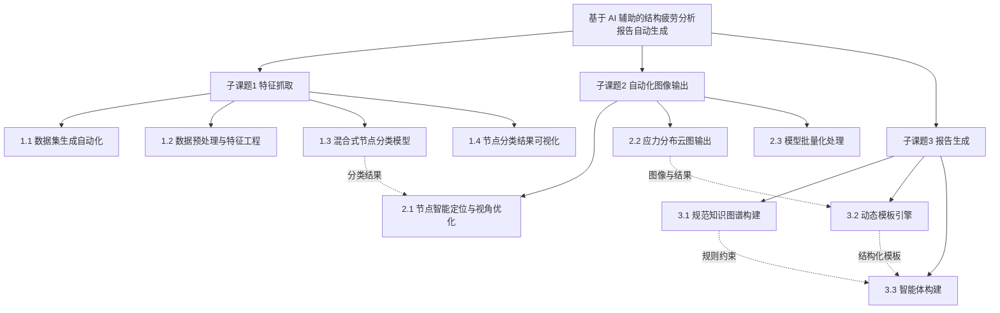

# ZS-项目可行性报告图示目录

> 本模板当前固定图示为 `图1 技术路线图`。
> 图示虽然只有 1 张，但它是第4章的关键锚点，必须与表1形成“路线 + 任务”的配对关系。

## 一、固定必出图

### 1. 图1 技术路线图
- 优先级：必出
- 位置：四、技术路线和实施方案 > （一）项目技术路线
- 作用：把项目从输入到输出的整体技术链条可视化
- 正文配套：第4章技术路线正文应控制在 1 至 2 段，然后留图
- 推荐表达目标：优先表达“总目标 -> 子课题 1 / 2 / 3 -> 子任务”的课题树，而不是通用流水线
- 默认拓扑：树状分解图 / 框图
- 推荐一级节点：项目总目标 → 子课题1 / 子课题2 / 子课题3
- 推荐二级节点：
  - 子课题1 下钻到 `1.1 / 1.2 / 1.3 / 1.4`
  - 子课题2 下钻到 `2.1 / 2.2 / 2.3`
  - 子课题3 下钻到 `3.1 / 3.2 / 3.3`
- 可选辅助箭头：在子课题之间增加“分类结果传递”“报告生成约束”“知识注入”等跨模块关系
- 可选补充节点：知识库/规范约束｜模板引擎｜质量门禁
- 主要材料来源：技术路线描述、研发内容拆分、实施方案
- 常见待补项：节点名称、术语口径、人工环节名称
- 装配要求：总稿中应置于第4章 `（一）项目技术路线` 段后，且节点名称与正文完全一致

#### 默认 Mermaid 骨架

## 二、统一规则

- `图1` 的 caption 固定，不改名
- 图中节点术语优先采用正文和第3章中已经出现的术语
- 一张图只回答“整体技术路线如何贯通”这一个问题
- 不用图去替代任务清单，任务拆分仍应由表1承载
- 默认优先还原“子课题树”，不是凭感觉画成通用 pipeline
- 如果采用 pipeline 而不是树状分解，必须有明确理由并在 figure notes 中说明
