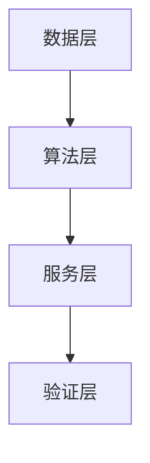

# 00-总流程与资料边界

## 适用范围

本文件适用于 `chapter-prompts/` 下全部章节模板。

## 必须遵守的流程

每次生成章节正文时，必须按以下顺序工作：

1. 先读根目录 `README.md`
2. 再读本目录中的通用规则文件
3. 再读当前章节对应的专属规则文件
4. 再读当前 `chapter-prompts/` 下对应模板
5. 最后读 `reference-materials/<project-slug>/`

若存在 `reference-materials/<project-slug>/external-research-notes.md`，则在读完本章基础参考资料后，还必须读取其中对应章节的小节。

`chapter-prompts` 负责：
- 结构
- 章次
- 输出路径
- 本章任务边界

`writing-rules` 负责：
- 文风
- 句式
- 论证顺序
- 深度门槛
- 禁止事项

两者必须同时遵守。

## 外部调研工具约束

当且仅当同时满足以下条件时，允许进入外部调研：

1. 用户未明确禁止外部调研
2. 当前章节模板中出现 `<research>` 区块

执行 `<research>` 区块时必须遵守：

- 必须优先调用 `miro-google-search` 进行检索与网页抓取。
- 默认顺序是先用 `google_search` 找来源，再用 `scrape_website` 抓取正文。
- 不得跳过检索直接凭常识扩写，也不得改用其他搜索通道替代。
- 若 `miro-google-search` 当前不可用，必须停止外部调研，并仅基于 `reference-materials/<project-slug>/` 保守写作或保留“待补充”。

## 提示词说明层与正式输出层

`chapter-prompts/` 中的以下标题只属于提示词说明层，不属于正式文稿：

- `## 执行说明`
- `## 固定骨架`
- `## 本章图表要求`
- `## 本节图表要求`
- `## 正式正文结构`

正式文稿的标题层级只以各章 `<fixed>` 中明确写死的输出层级为准，例如：

- `正式输出中的 Markdown 标题只能按以下形式出现`
- 章节固定骨架中的章名、节名、数字项

不得因为提示词里还有“正式正文结构”这一层说明标题，就把正式文稿中的章节标题整体下压一级或上抬一级。

## 用户提示词优先级

用户在本轮提示词中明确给出的以下要求，属于当前任务硬约束，优先级高于一般性写法建议：

- 全文字数或字符区间
- 单章字数或字符区间
- 单章最低字数
- 重点章节
- 是否允许外部调研
- 特殊文风或交付要求

执行原则：

- 结构、编号、图表位置等仍以 `chapter-prompts/` 和模板为准。
- 但篇幅、重点章节和最低字数等当前任务要求，必须直接服从用户本轮提示词。
- 若用户提示词给出了总字数与重点章节最低字数，生成时必须先保证重点章节达标，再保证总量达标。

## 整本生成规则

当任务目标是“生成完整公文”而不是单章写作时，默认执行方式固定为：

1. 先读取根目录 `README.md`
2. 再读取 `writing-rules/` 下通用规则
3. 再按章读取 `chapter-prompts/` 与对应章节规则
4. 再结合 `reference-materials/<project-slug>/` 逐章写入 `generated-drafts/<project-slug>/`
5. 第四章必须按 `ch04-项目建设方案/` 子目录拆分生成
6. 全部章节完成后，再装配 `generated-drafts/<project-slug>/完整文稿.md`

整本生成时，默认按“逐章处理”的内部顺序执行，即使外部只给出一条总提示词，也不得跳过分章写作过程。

若用户提示词给出全文章数/章节字数要求，整本生成时还必须同步执行：

1. 先从用户提示词中拆出总字数区间、重点章节目标字数和最低字数
2. 再按章节生成时显式控制篇幅，避免写完后再被动补字
3. 第一章、第四章等有最低字数要求的重点章节，未达门槛前不得视为完成
4. 若总字数不足，应优先在既定章节内补充论证深度、机制、验证、图表说明和结构化展开，不得新增计划外节次凑字数

## 资料优先级

事实来源优先级固定如下：

1. `reference-materials/<project-slug>/` 中用户明确给出的项目事实
2. 用户提供的正式项目文档、附件、预算、计划、单位材料
3. 公开权威资料

禁止用公开资料覆盖以下项目事实：

- 项目名称
- 单位名称
- 团队信息
- 经费
- 周期
- 任务划分
- 成果清单
- 指标口径

## 参考资料使用原则

- 长参考资料不是要求每一章平均使用，而是要求按章节任务边界定向取材。
- 每章只提取与本章论证直接相关的事实、数据、单位、任务、成果和图表信息。
- 当参考资料本身是一份完整项目文档时，不得把它直接照抄、顺抄或轻度改写后输出；必须按当前模板结构重新组织。
- 若参考资料的章节结构与当前模板不同，以 `产业链项目指南/完整科研项目模板.docx` 和 `chapter-prompts/` 为准重组内容。
- 如果当前章节还带有 `<research>` 区块，且用户未禁止外部调研，则在消化 `reference-materials/<project-slug>/` 后，还必须按上面的 `miro-google-search` 约束补充检索，再进入正式写作。

## 外部调研输出归档

若当前任务触发了外部调研，则调研得到的可消费材料必须先归档到：

- `reference-materials/<project-slug>/external-research-notes.md`

归档要求：

- 按章节分别记录
- 只记录可核对的公开事实、标准、政策、行业现状、国外产品/平台、公开案例
- 写清来源名称、时间和可回写的小节
- 不得把未经核实的推测、总结性口号或项目假设写入调研文件

正式写作时，应优先消费该文件中对应章节的条目，而不是重复临时拼接检索结论。

## 外部调研适用边界

外部调研只能用于补充以下“公共事实”：

- 政策文件、标准规范、公开监管要求
- 行业现状、技术趋势、国内外对比、国外代表性产品或平台
- 公开的法律、合规、数据安全、知识产权通用要求
- 与项目主题直接相关的公开方法论、行业共性问题和公开案例

外部调研不得用于补充以下“项目事实”：

- 项目名称、项目定位、项目目标、项目周期
- 牵头单位、参与单位、负责人、团队分工
- 经费、预算、资金来源、配套安排
- 任务划分、阶段计划、验收指标、推广范围
- 成果清单、专利软著名称、标准名称、权益分配
- 内部管理制度、审批流程、复用规则、定价规则

若缺口属于“项目事实缺口”，只能：

- 写“待补充”
- 写“以正式材料为准”
- 或按已知边界做保守表述

不得通过外部调研把项目事实补成看似完整的方案。

## 输出边界

正式输出只允许写入：

- `generated-drafts/<project-slug>/...`

正式输出中不得保留：

- `<fixed>`
- `<write>`
- `<research>`
- 提示语
- 内部说明
- “请写”“请调研”“按此处补充”之类操作语

## 图表输出格式

所有章节中的图表，统一直接内联写入 `generated-drafts/<project-slug>/...` 对应章节文件，不再像旧 `workspace/figures/`、`workspace/tables/` 流程那样拆成散件文件。

图示格式固定为：

1. 先在正文中写正常引图句，例如 `项目总体技术路线如图4-5所示。`
2. 紧接一个 fenced code block，info string 固定为 `mermaid`
3. Mermaid 代码块后必须有 1 段解释文字，说明该图回答什么问题、与正文哪部分对应

示意格式：

````md
项目总体技术路线如图4-5所示。



图4-5对应展示了项目从数据整备、算法研发到服务封装和应用验证的完整链路。
````

表格格式固定为：

1. 先有正常引表句，例如 `项目总投资估算见表8-1。`
2. 紧接表标题行，格式固定为 `**表8-1 项目总投资估算表**`
3. 紧接普通 Markdown 表格
4. 如表格信息量较大，表后补 1 段解释文字

示意格式：

````md
项目总投资估算见表8-1。

**表8-1 项目总投资估算表**

| 费用科目 | 金额 | 备注 |
|----------|------|------|
| 设备费 | 待补充 | 以正式批复为准 |
````

补充要求：

- 图用 Mermaid，不转成伪图片描述，不写“此处插图”占位。
- 表用普通 Markdown 表格，不转成项目符号列表，不写伪表。
- 图前表前必须有引出句，图后表后应有必要解释，不能只孤立贴一个代码块或表格。
- 没有精确数据时，不得伪造数值型图表；可以退化为结构示意图、关系图、流程图或保守口径表格。

## 缺失信息处理

资料不足时：

- 可以保留“待补充”
- 可以使用保守表述
- 可以写“以正式批复/正式确认材料为准”

禁止：

- 编造金额
- 编造比例
- 编造团队人数
- 编造周期
- 编造验收指标
- 编造市场数据

## 字数统计口径

当用户提示词给出“字数”或“中文字符”要求时，默认按“中文正文字符”理解，并遵守以下口径：

- 标题、正文、图前引出句、图后解释段、表前引出句、表后说明计入主要字数
- Mermaid 代码块本身不作为正文字数主体验证对象
- Markdown 表格的结构符号本身不作为正文字数主体验证对象
- 不得把大量字数压力转嫁给纯表格或纯 Mermaid 代码块

若用户另行指定统计口径，以用户指定为准。

## 结构红线

- 不得改章名
- 不得改编号
- 不得新增计划外节次
- 不得把模板中的固定骨架删掉
- 不得把chapter-prompts中的结构要求替换成自定义结构
